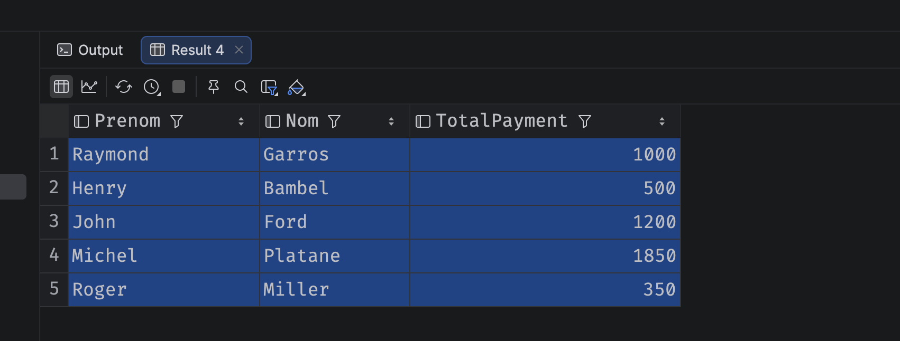

# 13 `CTE` Common Table Expression

## Syntaxe de base

```sql
WITH CTE_Name AS
(
	SELECT ...
    FROM ...
    WHERE ...
)

SELECT ...
FROM CTE_Name
```

C'est une table virtuelle créé pour la requête et pouvant être utilisée plusieurs dans celle-ci.

Elle sert à simplifier en plusieurs requête une requête particuliérement compliquée, et aussi à réutiliser le code `sql` commun à plusieurs requêtes.


## Exemple

```sql
-- Common table Expression
WITH CTE_Total_Payments AS (
    SELECT UtilisateurId, SUM(Payment) AS TotalPayment
    FROM Cotisation
    GROUP BY UtilisateurId
)

-- Main Query
SELECT Prenom, Nom, TotalPayment
FROM CTE_Total_Payments
JOIN Utilisateur
ON Utilisateur.Id = CTE_Total_Payments.UtilisateurId
```



> `ORDER BY` ne peut pas être utilisé dans une `CTE`.


## Plusiuers `CTE`

### Syntaxe

```sql
WITH CTE_One AS (
 ...
), CTE_Two AS (
	...
)
```


### Exemple

```sql
WITH CTE_Total_Payments AS (
    SELECT UtilisateurId, SUM(Payment) AS TotalPayment
    FROM Cotisation
    GROUP BY UtilisateurId
), CTE_Last_payment AS (
    SELECT UtilisateurId, MAX(PaymentDate) AS LastDate
    FROM Cotisation
    GROUP BY UtilisateurId
)

SELECT Prenom, Nom, TotalPayment, Cotisation.Payment As LatestPayment, LastDate
FROM CTE_Total_Payments
JOIN Utilisateur
	ON Utilisateur.Id = CTE_Total_Payments.UtilisateurId
JOIN CTE_Last_payment
	ON CTE_Last_payment.UtilisateurId = Utilisateur.Id
JOIN Cotisation
	ON Cotisation.UtilisateurId = Utilisateur.Id
WHERE Cotisation.PaymentDate = CTE_Last_payment.LastDate
```

