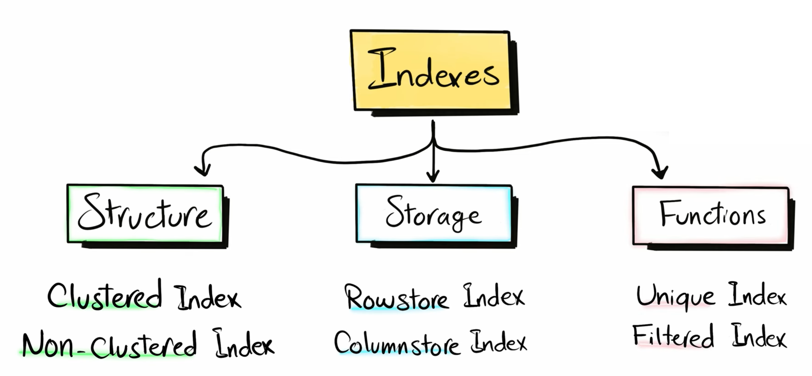
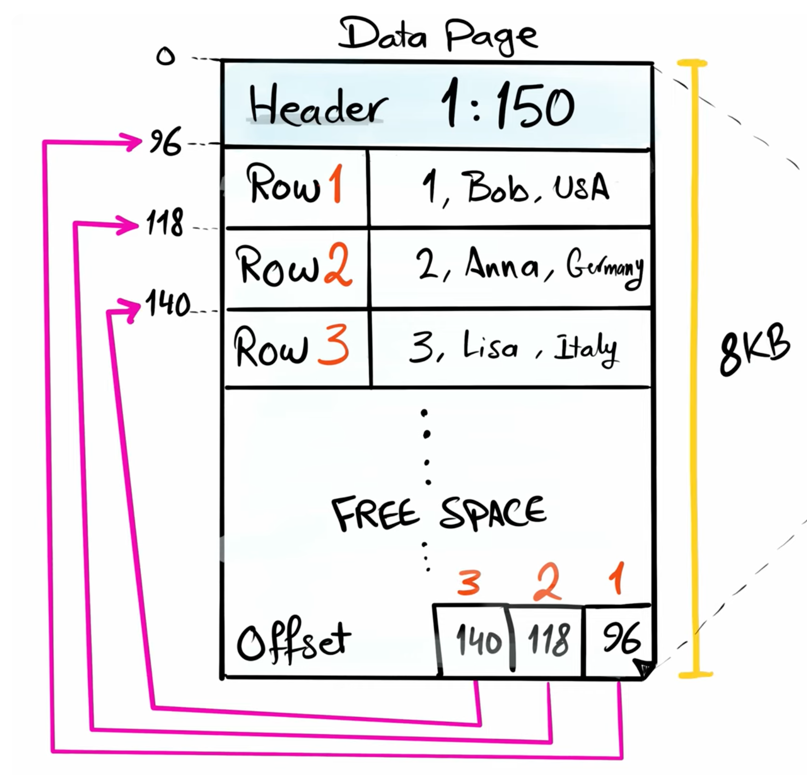
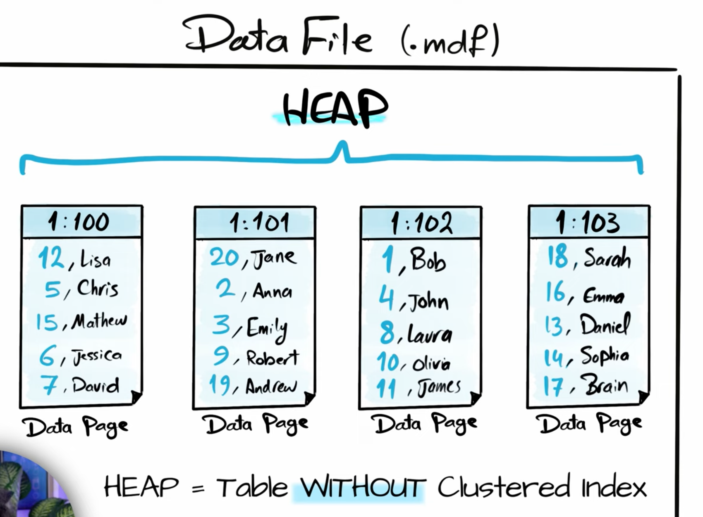

# Les `Index`

## Trade-Off = Compromis

Certain `index` sont meilleurs en **écriture** d'autre en **lecture**, il faut donc bien choisir son `index`.

## Stockage en `DB`

On a des `data file`  (`.mdf`) qui contiennent des `pages`.

La `page` est une unité de base, elle fait 8192 octets (8KB).

Si on n'a pas d'`index`, les `pages` forme un `heap`, les données ne sont pas ordonnées, les `pages` d'un `heap` sont simplement chaînées mais pas ordonnées.

## Une `page`

Le `header` contient l'id du fichier suivi de l'id de la page : `1:150`.

En bas on a un raccourci vers l'adresse de chaque enregistrement.

## Le `heap`

Sans `index` les données sont insérées dans le désordre.

L'ensemble des `pages` sans `index` sont appelées `heap` (tas).

L'insertion est très `rapide`, mais la lecture peut devenir très `lente`.

### `heap` => écriture `rapide` : lecture `lente`

Pour chercher l'enregistrement avec l'`id 14`, la `DB` doit parcourir chaque page et chaque enregistrement, ce n'est pas optimisé. Ce procédé s'appelle `Full Table Scan`.

## `Clustered Index`

