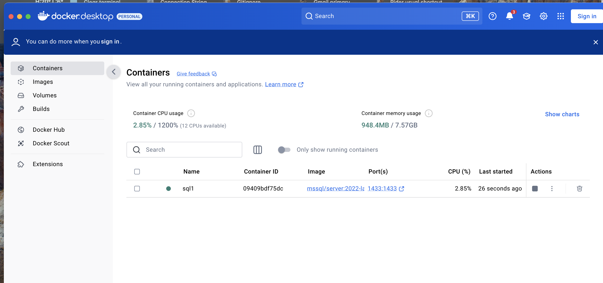
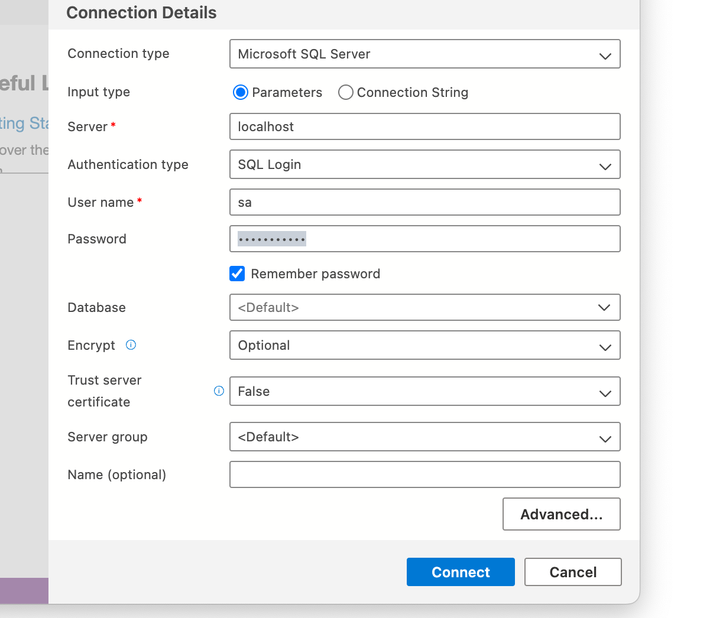

# Installer `mssql` sur `Mac` avec `Docker`

## 1. Dans le terminal télécharger l'image `Docker`:

```bash
docker pull mcr.microsoft.com/mssql/server:2022-latest
```


## 2. Créer un conteneur `Docker`

```bash
docker run -e "ACCEPT_EULA=Y" -e "MSSQL_SA_PASSWORD=Huk@r99_Dba" \
   -p 1433:1433 --name sql1 --hostname sql1 \
   -d \
   mcr.microsoft.com/mssql/server:2022-latest
```


## 3. Allumer et éteindre `mssql` via `Docker Desktop`




## 4. Se connecter avec `Azure Data Studio`




