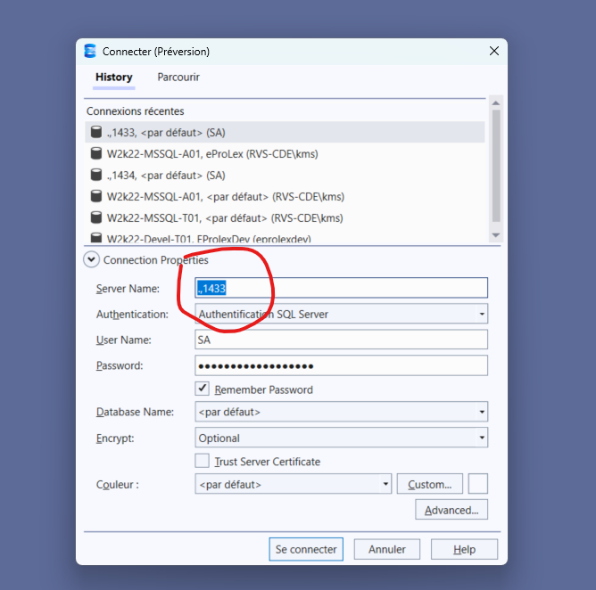
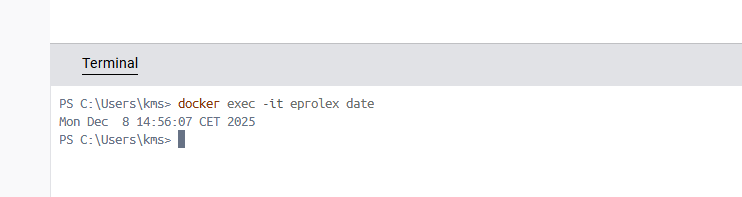

# Installer `mssql` sur `Mac` avec `Docker`

## 1. Dans le terminal télécharger l'image `Docker`:

```bash
docker pull mcr.microsoft.com/mssql/server:2022-latest
```


## 2. Créer un conteneur `Docker`

```bash
docker run -e "ACCEPT_EULA=Y" -e "MSSQL_SA_PASSWORD=Huk@r99_Dba" \
   -p 1433:1433 --name sql1 --hostname sql1 \
   -d \
   mcr.microsoft.com/mssql/server:2022-latest
```


## 3. Allumer et éteindre `mssql` via `Docker Desktop`


## 4. Se connecter avec `Azure Data Studio`




#### Sur `Windows` , le `localhost` s'écrit `.,1433`


## Problème du changement d'heure

On veut pouvoir régler l'heure du conteneur comme `heure belge`.

### 1. Checker la date du conteneur



On est dans le terminal de `Docker Desktop`.

```bash
docker exec -it <monconteneur> date
```


### 2. Ouvrir un bash en mode `root`

```bash
docker exec -u 0 -it eprolex bash
```

> Le `-u 0` force l’exécution en tant que **root** (UID 0).


### 3. Modifier le fuseau horaire du conteneur

```bash
apt-get update && apt-get install -y tzdata 

ln -fs /usr/share/zoneinfo/Europe/Brussels /etc/localtime 

dpkg-reconfigure -f noninteractive tzdata

date
```

#### 🧩 1. Installer le paquet **tzdata** : `apt-get install`

```
apt-get update && apt-get install -y tzdata
```

#### ✔️ Ce que ça fait

- **`apt-get update`**
   Met à jour la liste des paquets disponibles dans le conteneur (comme “rafraîchir le catalogue”).

- **`apt-get install -y tzdata`**
   Installe le paquet **tzdata**, qui contient :

  - la liste des fuseaux horaires du monde (`/usr/share/zoneinfo/...`)
  - les règles de changement d’heure (DST)

  Le `-y` signifie *accepte automatiquement* (pas de questions demandées).

#### 🎯 Pourquoi on en a besoin ?

Sans `tzdata`, le conteneur n’a **aucune information de fuseau horaire**, donc il reste en UTC.


#### 🧩 2. créer un lien symbolique : `ln`

```
ln -fs /usr/share/zoneinfo/Europe/Brussels /etc/localtime
```

#### ✔️ Ce que ça fait

- **`ln -fs`** = crée un lien symbolique (comme un raccourci)
  - `-f` : force le remplacement du fichier existant
  - `-s` : crée un lien symbolique plutôt qu’une copie réelle
- **`/usr/share/zoneinfo/Europe/Brussels`**
   C’est le fichier qui définit le fuseau horaire Bruxelles (CET/CEST).
- **`/etc/localtime`**
   C’est *le fichier que Linux lit* pour savoir quel fuseau utiliser.

#### 🎯 Pourquoi on le fait ?

On dit à Linux :
 👉 *“Utilise le fuseau horaire Europe/Brussels comme fuseau système.”*


#### 🧩 3. Appliquer la nouvelle `timezone` : `dpkg-reconfigure`

```
dpkg-reconfigure -f noninteractive tzdata
```

#### ✔️ Ce que ça fait

- Demande à Linux de **reconfigurer les paramètres de fuseau**.
- Applique proprement la nouvelle `timezone`.
- Regénère éventuellement des fichiers internes utilisés par les services.

L’option :

- **`-f noninteractive`** signifie : *ne pose aucune question à l’utilisateur* — indispensable dans un conteneur.

#### 🎯 Pourquoi on le fait ?

Sans cette commande, le système **ne prend pas toujours en compte** la nouvelle `timezone`.
 Cette étape "finalise la configuration".


#### 🧩 4. Affiche l’heure : `date`

```
date
```

#### ✔️ Ce que ça fait

Affiche l’heure actuelle **selon le fuseau configuré**.

Tu peux vérifier immédiatement que l’heure :

- est correcte
- suit bien Europe/Brussels
- n’est plus en retard d’une heure

------

### ✅ Résumé ultra simple

| Ligne                                         | Rôle                                      |
| --------------------------------------------- | ----------------------------------------- |
| `apt-get update && apt-get install -y tzdata` | Installe les fichiers de fuseaux horaires |
| `ln -fs ... /etc/localtime`                   | Choisit le fuseau Europe/Brussels         |
| `dpkg-reconfigure ... tzdata`                 | Applique correctement le fuseau           |
| `date`                                        | Vérifie que tout fonctionne               |


