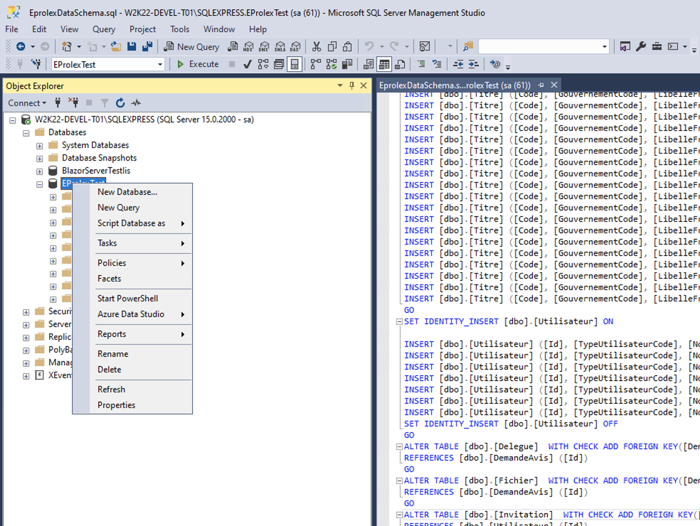
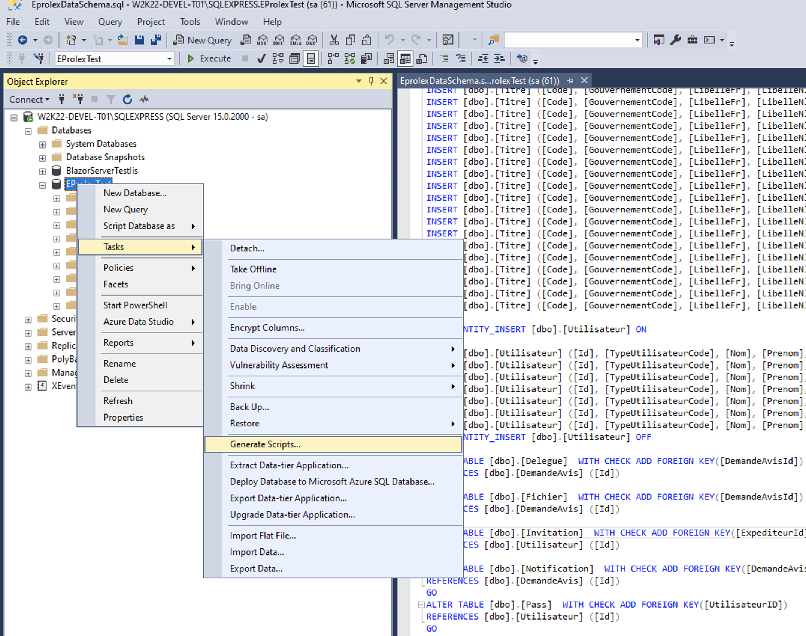
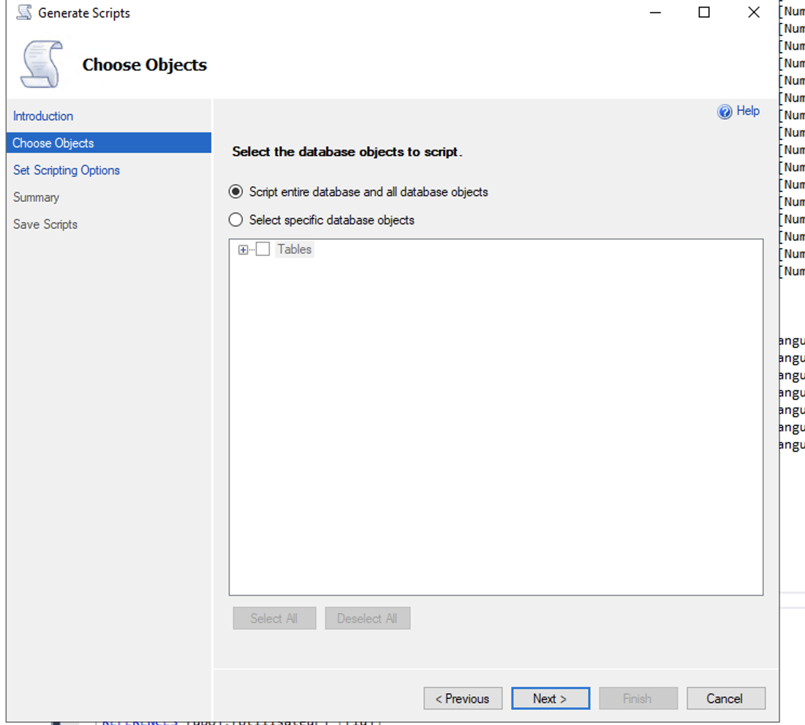
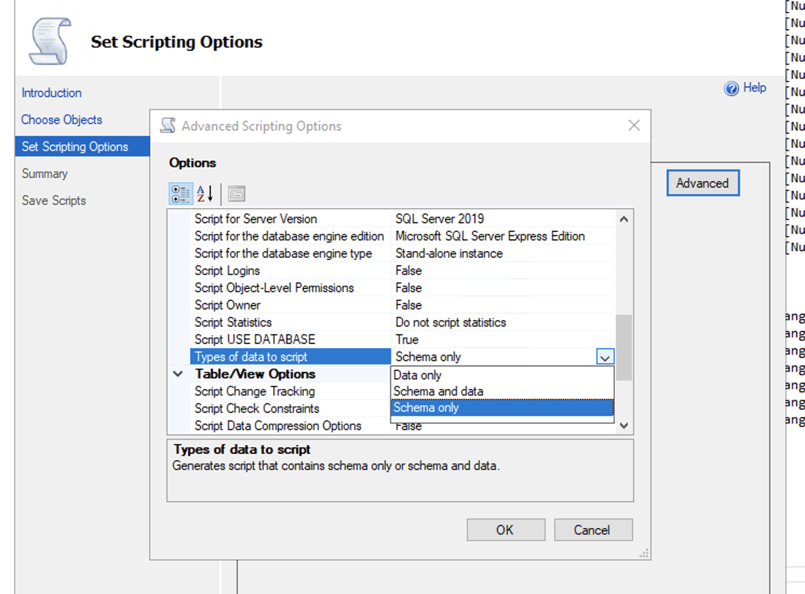

# 01 `Dump` de la structure et des données d'une `DB`

On doit faire un click droit sur la `DB` aller dans `tasks/generate script`.

Là on choisie une ou plusieurs table et dans l'écran d'après dans les options avancées on précise données et schéma.

### 1. `Tasks`

### 2. `Generate scripts`

### 3. `Choose objects`

### 4. `Schema and Data`

Il faut cliquer dans `advanced` pour avoir accès à cette option.

