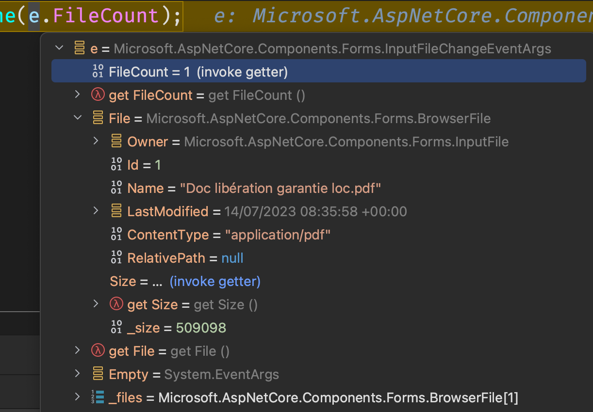
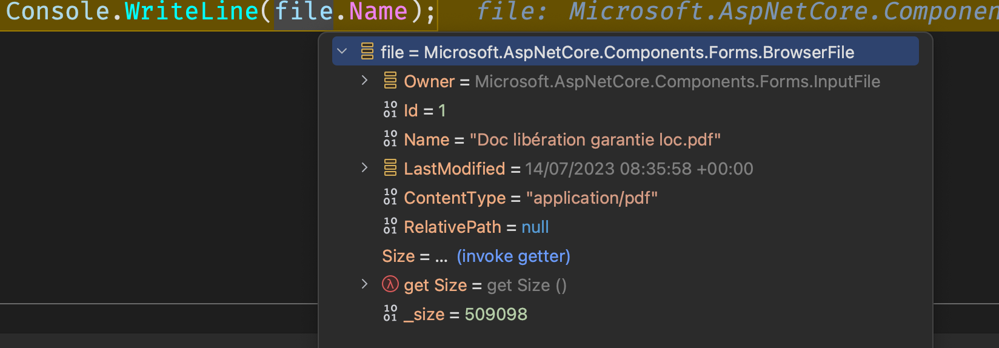
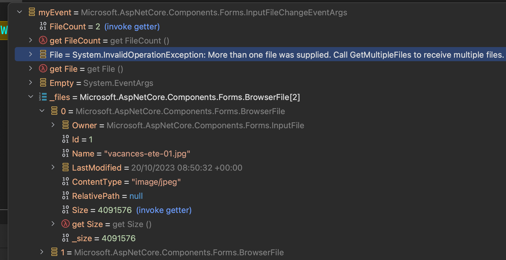
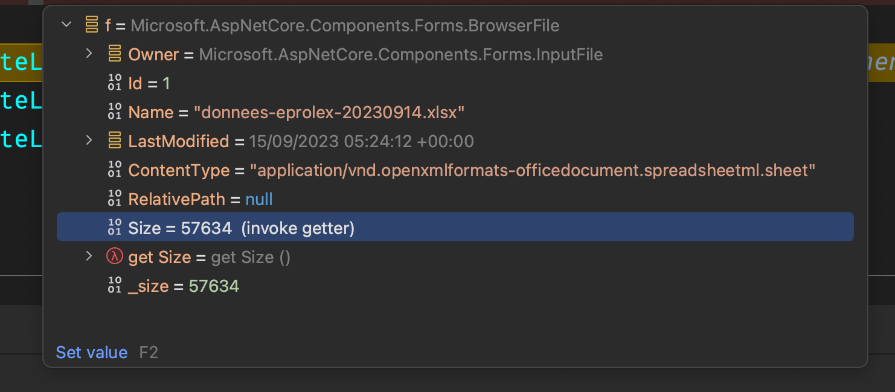

# 01 `File` upload


## `InputFile`

### Avec un seul fichier

```ruby
@page "/"

<InputFile OnChange="LoadFiles"/>

@code {
    private void LoadFiles(InputFileChangeEventArgs e)
    {
        var myEvent = e;

        Console.WriteLine(e.FileCount);
    }
}
```



On récupère le `IBrowserFile` avec la propriété `File` :

```cs
var file = e.File;
Console.WriteLine(file.Name);
```




### Avec plusieurs fichiers : `multiple`

```cs
<InputFile OnChange="LoadFiles" multiple />
```

Qui va être transformé en :

```html
<input multiple type="file" _bl_2>
```

```cs
@code {

    private void LoadFiles(InputFileChangeEventArgs e)
    {
        var myEvent = e;

        Console.WriteLine(myEvent.FileCount);
    }
```



`FileCount` : le nombre de fichiers sélectionnés

Pour accéder au tableau de `BrowserFiles` on a la méthode `GetMutiplefiles`.


### Itérer sur le tableau de `IBrowserFile`

```cs
foreach (var file in myEvent.GetMultipleFiles())
{
    IBrowserFile f = file;

    Console.WriteLine("Name :" + f.Name);
    Console.WriteLine("Size :" + f.Size);
    Console.WriteLine("Content Type :" + f.ContentType);
}
```

```
Name :donnees-eprolex-20230914.xlsx
Size :57634
Content Type :application/vnd.openxmlformats-officedocument.spreadsheetml.sheet

Name :Ticket_40507139.pdf
Size :99172
Content Type :application/pdf

Name :vacances-ete-01.jpg
Size :4091576
Content Type :image/jpeg
```




