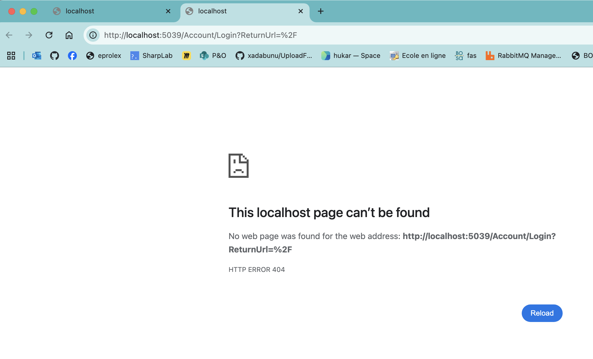

# 01. Mise en place de l'authentification


## Le `Router`

On doit utiliser le `AuthorizeRouteVIew` à la place de `RouteView`.

```ruby
<Router AppAssembly="typeof(Program).Assembly">
    <Found Context="routeData">
    
        <AuthorizeRouteView 
			RouteData="routeData" 
			DefaultLayout="typeof(Layout.MainLayout)"/>
    
        <FocusOnNavigate RouteData="routeData" Selector="h1"/>
    </Found>
</Router>
```


## La méthode d'authentification

On doit ensuite déterminer la méthode d'authentification, cela se fait dans `builder.Services` :

```cs
builder.Services.AddAuthentication(
    CookieAuthenticationDefaults.AuthenticationScheme
).AddCookie();
```


## L'attribut `[Authorize]`

Pour protéger une page on utilise un `attribut` d'authorisation :

```ruby
@page "/"

@attribute [Authorize]

<PageTitle>Home</PageTitle>

<MudText Typo="Typo.h3" GutterBottom="true">Hello, world!</MudText>
```

Si on va sur la page, `Not Authorized` s'affiche si on vient d'une page non protégée.

Si on recharge la page, on est redirigé vers `/Account/Login` :




## Création d'une page de `Login`

On doit créer une page de `login` avec un formulaire.

On doit créer des `endpoints` pour `signin` et `signout` et les joindre avec `HttpClient`.
