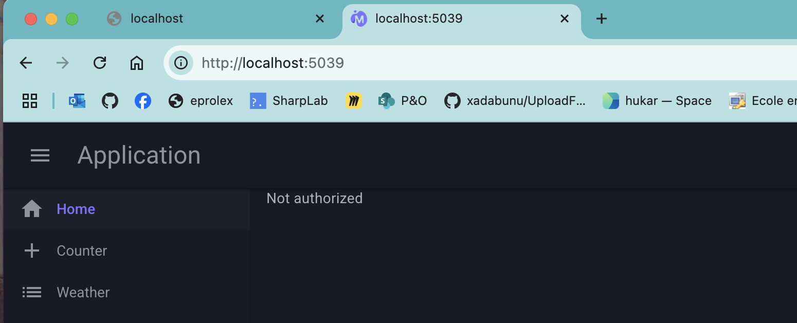
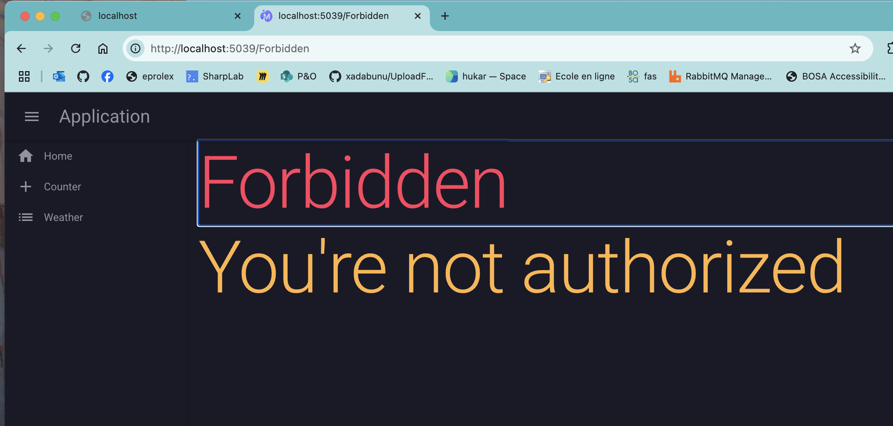

# 02. Le `router`


## `<NotAuthorized>`

Si on entre dans l'application par une page non protégé par un attribut `[Authorize]`, la nature de `Blazor Server`(`SignalR`) qu'il n'y aura pas de redirection automatique vers `/Login` car le `middleware` (`UseAuthentication`) n'est plus appelé.

Dans `AuthorizeRouteView` un comportement par défaut est d'afficher `Not authorized` :



Il existe deux `RenderFragment` qui nous permettent de customiser ce comportement :

### `Authorizing` : si authentification asynchrone

### `NotAuthorized` : affichant un composant de notre choix si l'authentification échoue

```ruby
<AuthorizeRouteView RouteData="routeData" DefaultLayout="typeof(Layout.MainLayout)">
    <Authorizing>
        ... auth is coming ...
     </Authorizing>
    <NotAuthorized>
        forbidden access
    </NotAuthorized>
</AuthorizeRouteView>
```

On peut créer un petit composant redirigeant vers une page `Forbidden par exemple` :

`RedirectToForbidden.razor`

```ruby
@inject NavigationManager Navigation


@code {
    protected override void OnInitialized()
    {
        Navigation.NavigateTo("/Forbidden");
    }
}
```

puis dans le `Router`:

```ruby
<AuthorizeRouteView RouteData="routeData" DefaultLayout="typeof(Layout.MainLayout)">
    <NotAuthorized>
        <RedirectToForbidden/>
    </NotAuthorized>
</AuthorizeRouteView>
```



