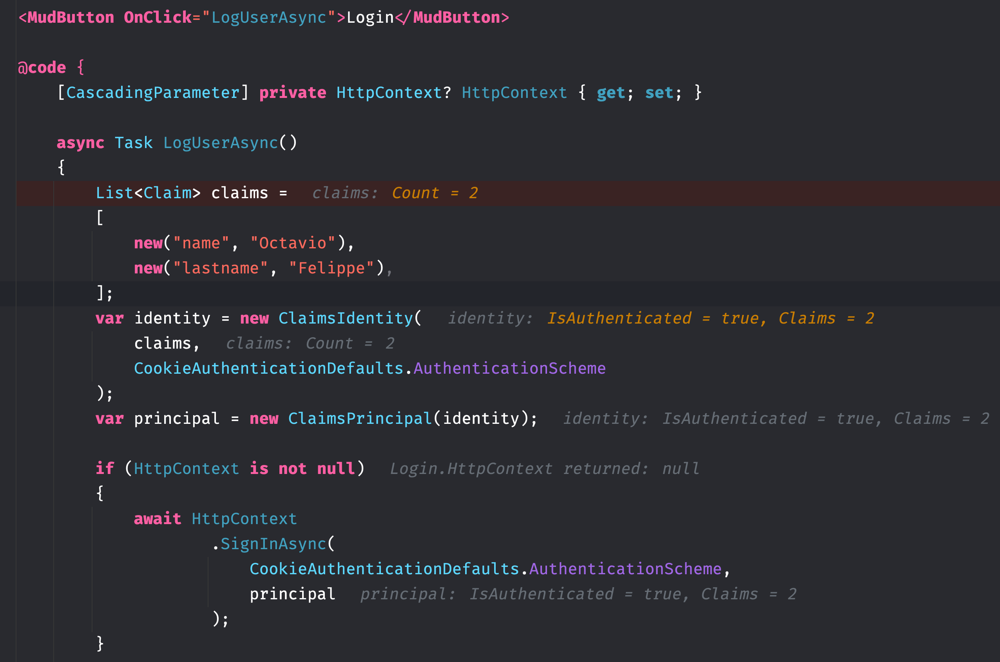

# 04. `Endpoints` de login

>## Problème avec `HttpContext`
>
>Il faut éviter `HttpContext` si le rendu n'est pas statique (`SSR`) 
>
>[doc microsoft https://learn.microsoft.com/fr-fr/aspnet/core/blazor/components/httpcontext?view=aspnetcore-9.0 ]
>
>
>
>On voit qu'un composant voulant gérer le `SigninAsync` ne pourra pas car `HttpContext` est `null`.


## `Signin` endpoint : `SignInAsync`

> Pour que cela fonctionne, il faut utiliser un formulaire classique en `method=post` cf fiche `login-component`.

```cs
app.MapPost("/signin", async (
            [FromQuery] string returnUrl, 
            [FromForm] int id, 
            [FromForm] string name, 
            HttpContext context) =>
{
    List<Claim> claims =
    [
        new("id", $"{id}"),
        new("name", name),
    ];

    var identity = new ClaimsIdentity(
        claims, 
        CookieAuthenticationDefaults.AuthenticationScheme
    );

    var principal = new ClaimsPrincipal(identity);

    await context.SignInAsync(
        CookieAuthenticationDefaults.AuthenticationScheme, 
        principal
    );

    return Results.Redirect(returnUrl);
});
```


### ! Toujours fournir `authentication scheme` à `ClaimsIdentity`

C'est `HttpContext` qui permet le `SignIn` en appelant la méthode `SignInAsync`.


## `Signout` endpoint : `SignOutAsync`

```cs
app.MapGet("/signout", async ([FromQuery] string returnUrl, HttpContext context) =>
{
    await context.SignOutAsync(
        CookieAuthenticationDefaults.AuthenticationScheme
    );

    return Results.Redirect(returnUrl);
});
```

