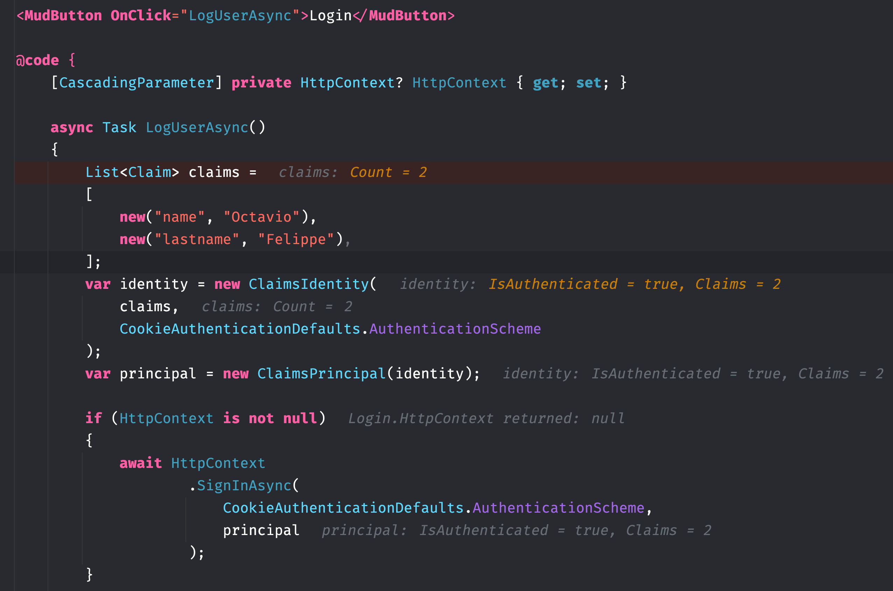

# 04. Login

## Problème avec `HttpContext`

Il faut éviter `HttpContext` si le rendu n'est pas statique (`SSR`) 

[doc microsoft https://learn.microsoft.com/fr-fr/aspnet/core/blazor/components/httpcontext?view=aspnetcore-9.0 ]

On voit qu'un composant voulant gérer le `SigninAsync` ne pourra pas car `HttpContext` est `null`.
