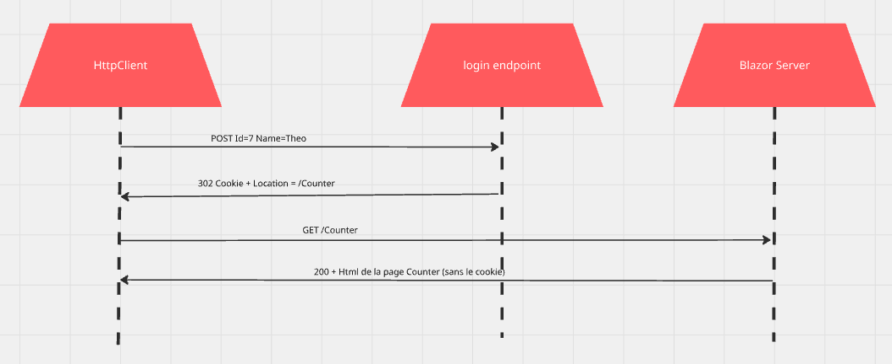
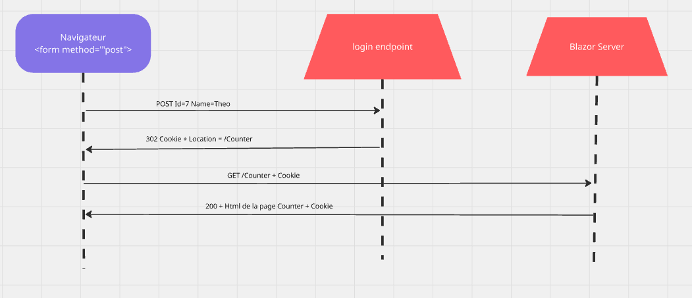

# 04.5 `Login` page


## Pourquoi cela ne fonctionne pas avec `HttpClient`

On pourrait faire un `Formulaire`  (ici juste un `bouton` de connexion) géré programmatiquement depuis le server `Blazor` :

```ruby
@foreach (var utilisateur in utilisateurs)
{
        <MudButton
            Variant="Variant.Filled"
            Color="Color.Secondary"
            OnClick="() => LogUtilisateur(utilisateur)">
            Log @utilisateur.Name
        </MudButton>

}
```

```cs
async Task LogUtilisateur(Utilisateur utilisateur)
{
    var client = Factory.CreateClient("id-api");

    await client.PostAsJsonAsync(
        $"signin2?ReturnUrl={ReturnUrl}", 
        utilisateur
    );
}
```

On a cette séquence :



Le `Cookie` est renvoyé à l'application `Blazor` mais jamais au navigateur et ne sera pas non plus placé dans la requête `GET` de redirection. L'utilisateur ne pourra pas se connecter.

Le navigateur n'est jamais contacté et l'utilisateur reste sur la même page.

> ## Réglage du `Redirect` automatique
>
> ```cs
> builder.Services.AddHttpClient("id-api", options =>
> {
>     options.BaseAddress = new Uri(
>         builder.Configuration["BaseUrl"] ?? throw new Exception("appSettings baseUrl is mandatory")
>     );
> }).ConfigurePrimaryHttpMessageHandler(() => new HttpClientHandler { AllowAutoRedirect = false }); // par défaut true
> ```


## Solution : `<form method="POST">`



Ici le `Cookie` est bien envoyé au navigateur et celui-ci le joint à chacune de ses requêtes.

```ruby
@foreach (var utilisateur in utilisateurs)
{
    <form 
    	method="post" 
    	action="@($"/signin?ReturnUrl={ReturnUrl}")">
        
        <AntiforgeryToken/>
        
        <Input type="hidden" name="Id" value="@utilisateur.Id"/>
        <Input type="hidden" name="Name" value="@utilisateur.Name"/>

        <MudButton
            Variant="Variant.Filled"
            ButtonType="ButtonType.Submit"
            Color="Color.Info">
            signin @utilisateur.Name
        </MudButton>
    </form>
}
```

La redirection va recharger la page et créer une nouvelle session `SignalR` dans `Blazor` en lui passant le `Cookie` d'authentification.

`<AntiforgeryToken/>` fonctionne très bien et est obligatoire. Il ajoute un champ caché :

```html
<input type="hidden" name="__RequestVerificationToken" value="CfDJ8JhGZH6ErBFKsQ7MKmlSBgPizUr9q80oUTr7Ir-UQyTo2tw7pdIcd_p7G_DQ1xAw6qXGnEBRqogabXK9cIhCMiBGmhhQoTrsf9G5h3G5Js3NqaBkQ6ytbbqJceb0x3Qspzx3FYMvKiLP-8RN7nNYiEqiylWcPtlPakGCSEoZf_zQwCQ5EF_QgGJ5wenAFs4Xlg">
```

Le `middleware` associé est placé dans `program.cs` :
```cs
app.UseAntiforgery();
```


> # 📌 **Construction d'`URL`** avec `NavigationManager`
>
> | Élément                | Type   | Renvoie               | Exemple                                     |
> | ---------------------- | ------ | --------------------- | ------------------------------------------- |
> | `Uri`                  | string | URL complète courante | `https://localhost:5001/orders?x=1`         |
> | `BaseUri`              | string | Racine de l’app       | `https://localhost:5001/`                   |
> | `ToAbsoluteUri()`      | Uri    | URL absolue           | `/products` → `https://…/products`          |
> | `ToBaseRelativePath()` | string | Chemin relatif        | `https://…/products/list` → `products/list` |
> | `NavigateTo()`         | void   | Change l’URL          | `NavigateTo("/login")`                      |

