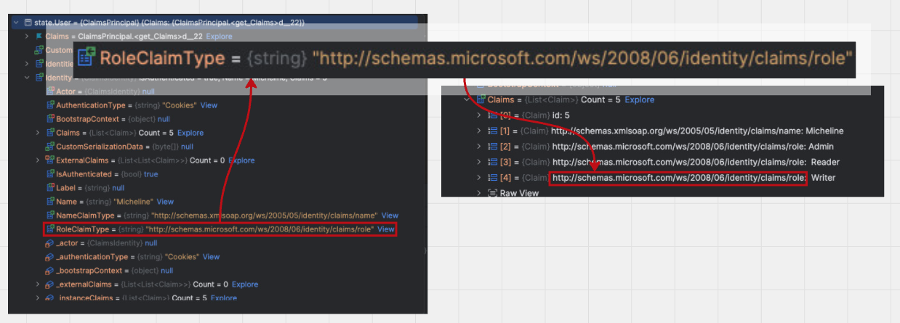
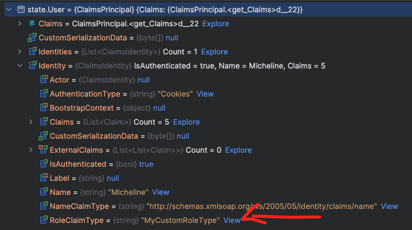

# 06 Les `rôles`

Ce sont tout simplement des claims :

```cs
new Claim(ClaimTypes.Role, "Admin");
new Claim(ClaimTypes.Role, "Colaborator");
```

Il faut préciser `ClaimTypes.Role`.



`RoleClaimType` définit quelle `claim` est utilisée pour valeur de `rôle`.

Sa valeur par défaut est `ClaimTypes.Role`, c'est à dire :

```cs
public const string Role = "http://schemas.microsoft.com/ws/2008/06/identity/claims/role";
```

On peut modifier ce qui définit les rôles dans le constructeur de `ClaimsIdentity` :

```cs
var identity = new ClaimsIdentity(
                claims,
                CookieAuthenticationDefaults.AuthenticationScheme,
                null,
                roleType: "MyCustomRoleType"
            );
```




## Utiliser les rôles

### Protéger une page entière

```ruby
@page "/counter"

@attribute [Authorize(Roles = "Admin")]
```


### Protéger une partie de page

```xml
<AuthorizeView Roles="Admin">
    <MudText Class="pa-4 ma-4" Typo="Typo.body1" Color="Color.Success">
        Admin Role
    </MudText>
</AuthorizeView>
```

On peut renseigner plusieurs rôles :

```xml
<AuthorizeView Roles="Writer,Reader">
    <MudText Class="pa-4 ma-4" Typo="Typo.body1" Color="Color.Success">
        Writer or Reader
    </MudText>
</AuthorizeView>
```

Les `Writer` ou les `Reader` pourront voire cette partie. Bien sûr ceux qui ont les deux rôles aussi.


## `Authorized` et `NotAuthorized`

On peut séparer l'affichage des personnes autorisées ou non :

```xml
<AuthorizeView Roles="Writer">
    
    <Authorized>
        <MudText Class="pa-4 ma-4" Typo="Typo.body1" Color="Color.Success">
            Writer Role Area
        </MudText>
    </Authorized>
    
    <NotAuthorized>
        <MudText Class="pa-4 ma-4" Typo="Typo.body1" Color="Color.Error">
            You're not a writer
        </MudText>
    </NotAuthorized>
    
</AuthorizeView>
```


## Récupérer les rôles dans le `code`

```cs
@code {
    [CascadingParameter] public Task<AuthenticationState>? StateTask { get; set; }

    List<string> roles = [];

    protected override async Task OnInitializedAsync()
    {
        if (StateTask is not null)
        {
            var state = await StateTask;

            var user = state.User;

            var roleClaims = user.Claims
                .Where(c => c.Type == ClaimTypes.Role);
            roles = roleClaims.Select(c => c.Value).ToList();
        }
    }
}
```

On peut ensuite les afficher :

```xml
<AuthorizeView>
    <Authorized>
        <MudText Class="pa-4 ma-4" Typo="Typo.body1" Color="Color.Primary">
            Hello vous êtes connecté @context.User.Identity?.Name <br/>
            <ul>
                Vos rôles sont :
                @foreach (var r in roles)
                {
                    <li>@r</li>
                }
            </ul>
        </MudText>
    </Authorized>
    // ...
```

