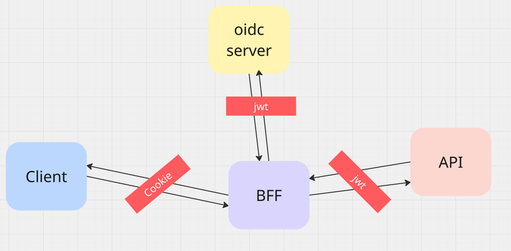

# 01 Introduction

## `Authentication`  : first

qui êtes vous ? Prouvez qui vous êtes.

C'eest la phase de `login`.

## `Authorization`  : then

que pouvez-vous faire ? Êtes-vous autoriser à aller dans cette pièce ?

Dans `Blazor`, les `authorizations` vous donnet accès à certain `component`, certaine `actions` (editer, supprimer) et à certain `endpoint`.

## `BFF` pattern `B`ackend `F`or `F`rontend

Le pattern `BFF` permet de ne jamais communiquer de `token` au `browser`, à la place d'utiliser un simple `cookie`.

Dans une `Blazor Web App` le `client` et le serveur `BFF` sont réunis dans une même application, ce qui simplifie les choses.