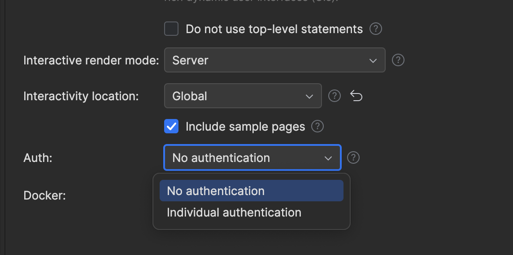
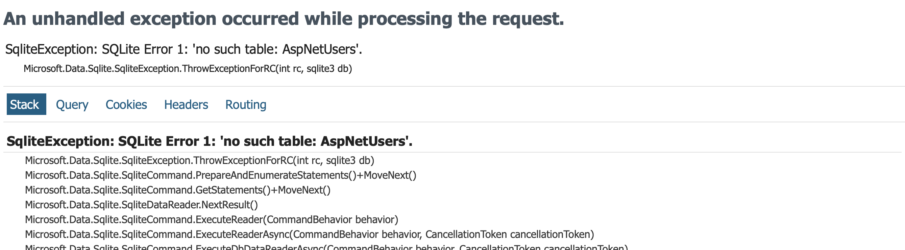
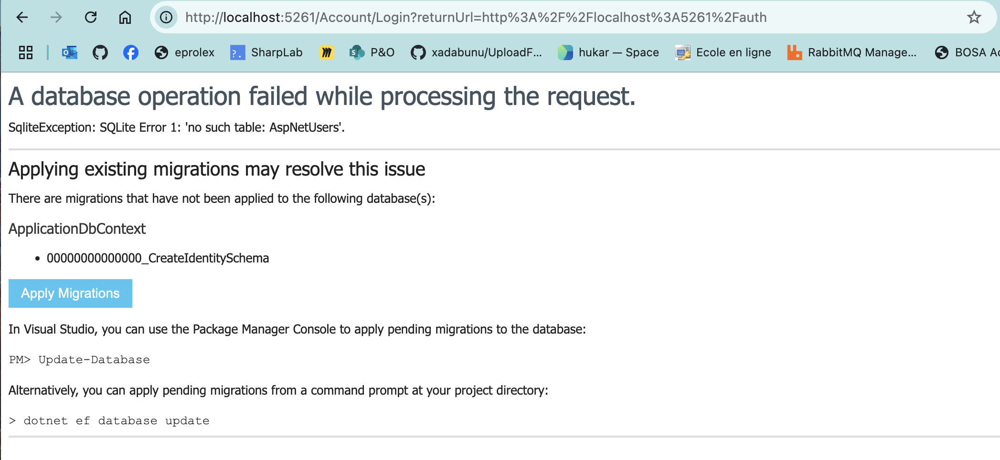

# 02 Template avec `Auth` intégré


## Ajout dans une application

Il est possible d'ajouter `identity` dans une application `Blazor` dans les réglages de celle-ci avec `Individual authentication`:




## `Database` et `Migration`

Le template utilise `Entity Framework` et `Sqlite` pour gérer les `utilisateurs`.

```ruby
builder.Services.AddDbContext<ApplicationDbContext>(
    options => options.UseSqlite(connectionString)
);
```

On peut faire une migration manuelle, mais un `service` nous propose de le faire à notre place si on a oublié :

```ruby
builder.Services.AddDatabaseDeveloperPageExceptionFilter();
```

Sans cette ligne :



Avec :



Il propose aussi la commande :

```bash
dotnet ef database update
```

ou d'appuyer sur le bouton `Apply Migration`.


## Confirmation par `email`

```ruby
builder.Services.AddIdentityCore<ApplicationUser>(options => options.SignIn.RequireConfirmedAccount = true)
    .AddEntityFrameworkStores<ApplicationDbContext>()
    .AddSignInManager()
    .AddDefaultTokenProviders();
```

Si on veut désactiver la confirmation par `email` on tape : `RequireConfirmedAccount = false`.

C'est plus facile pour les test.


## Le `router`

```react
<Router AppAssembly="typeof(Program).Assembly">
    <Found Context="routeData">
        <AuthorizeRouteView RouteData="routeData" DefaultLayout="typeof(Layout.MainLayout)">
            <NotAuthorized>
                <RedirectToLogin/>
            </NotAuthorized>
        </AuthorizeRouteView>
        <FocusOnNavigate RouteData="routeData" Selector="h1"/>
    </Found>
</Router>
```

On a le composant `AuthorizeRouteView` qui fonctionne avec le système d'authentification et d'autorisation. Si un composant n'est pas autorisé, il appelle le composant `RedirectToLogin`

```CS
@code {

    protected override void OnInitialized()
    {
        NavigationManager.NavigateTo(
            $"Account/Login?returnUrl={Uri.EscapeDataString(NavigationManager.Uri)}",
			forceLoad: true
		);
    }

}
```

Ce composant redirige vers l'`url` `account/login` (qui est une page `Blazor`).


## Page sous `authorization`

Le template a un exemple de page protégée par l'`authorization`, c'est la page `Auth.razor` :

```ruby
@page "/auth"

@using Microsoft.AspNetCore.Authorization

@attribute [Authorize]

<PageTitle>Auth</PageTitle>

<h1>You are authenticated</h1>

<AuthorizeView>
    Hello @context.User.Identity?.Name!
</AuthorizeView>
```

On observe l'attribut `@attribute [Authorize]` qui protège la page.


