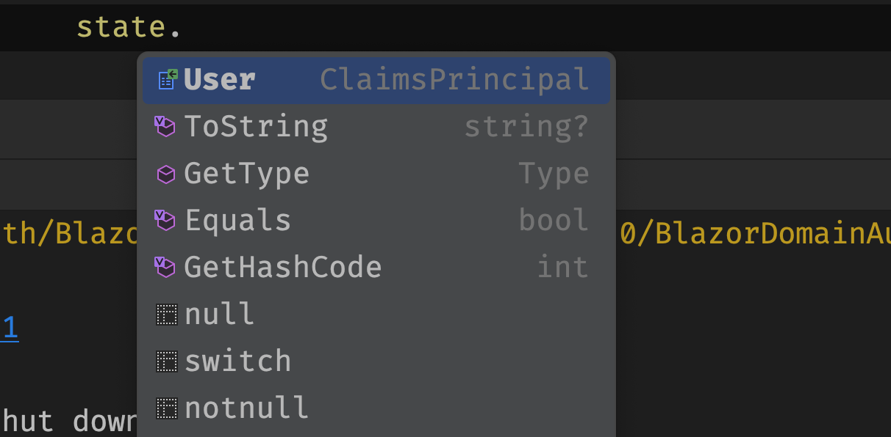
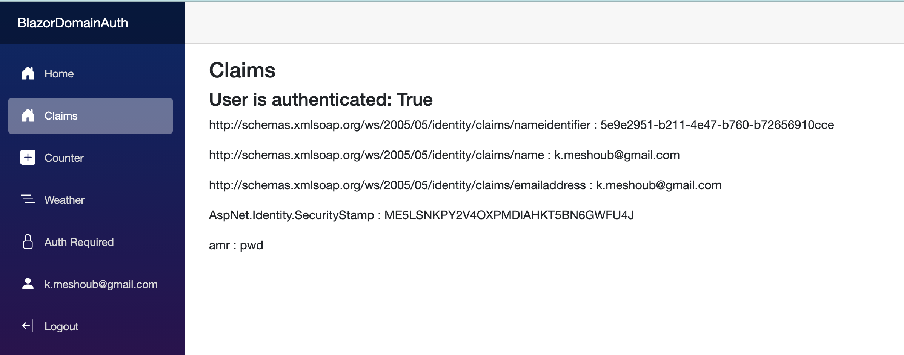
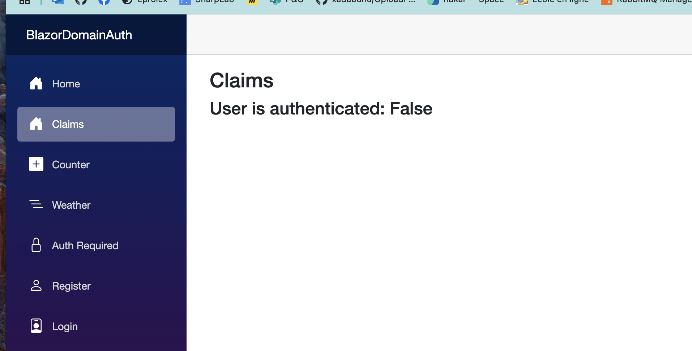
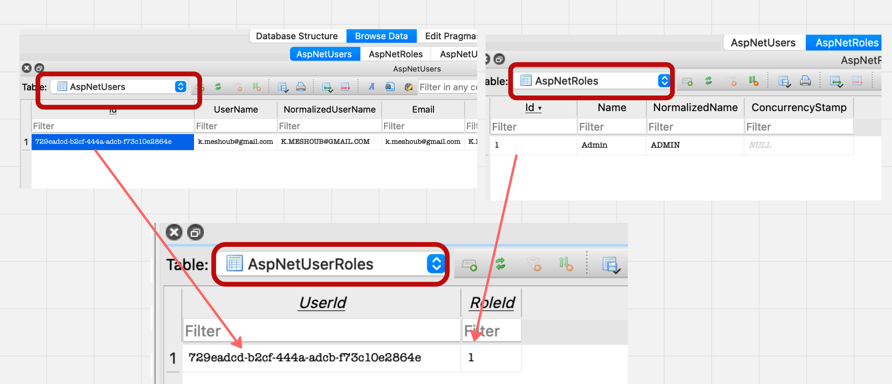

# 03 `Authorization` dans `Blazor`

## Les `Claims`

Dans `Program.cs` on voit qu'un service a été ajouté :

```ruby
builder.Services.AddScoped<AuthenticationStateProvider, IdentityRevalidatingAuthenticationStateProvider>();
```

`AuthenticationStateProvider` et son implémentation par `Identity` : `IdentityRevalidatingAuthenticationStateProvider`


### Création d'un `page` pour afficher les `Claims`

```ruby
@page "/claims"
@using System.Security.Claims 

@inject AuthenticationStateProvider AuthenticationState

<h3>Claims</h3>
    
@if (_user?.Identity is not null)
{
    <h4>User is authenticated: @_user.Identity.IsAuthenticated</h4>
}

@foreach (var claim in _claims)
{
    <p> @claim.Type : @claim.Value</p>
}

@code {
    IEnumerable<Claim> _claims = [];
 	ClaimsPrincipal? _user;

    protected override async Task OnInitializedAsync()
    {
        var state = await AuthenticationState
        	.GetAuthenticationStateAsync();
        
        _user = state.User;
        _claims = _user.Claims;
    }
}
```



Le `state` contient uniquement le `User` (`ClaimsPrincipal`).

La récupération du `state` est `asynchrone`.



Si je `Logout` (bouton en bas) j'obtiens :




## Les `roles`

Les `roles` sont des `claims`.

On doit les insérer manuellement en `DB` :



Ensuite on active les `rôles` dans `Program.cs` :

```ruby
builder.Services.AddIdentityCore<ApplicationUser>(options => options.SignIn.RequireConfirmedAccount = false)
    .AddRoles<IdentityRole>() // <= ici
    .AddEntityFrameworkStores<ApplicationDbContext>()
    .AddSignInManager()
    .AddDefaultTokenProviders();
```


