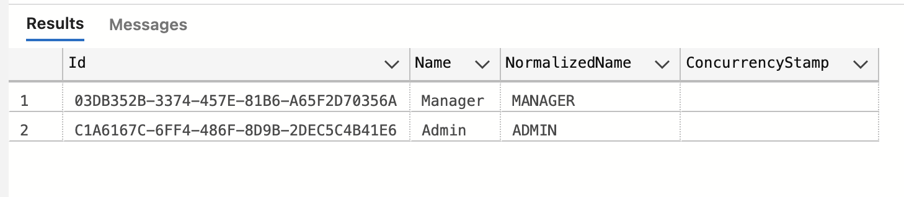
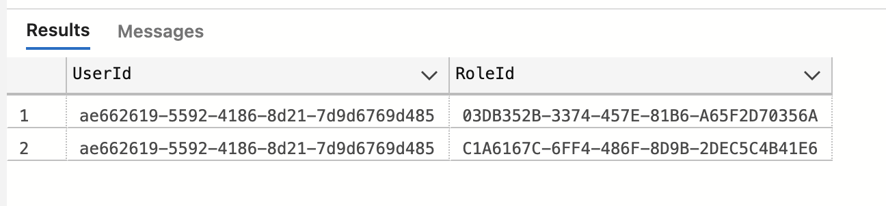
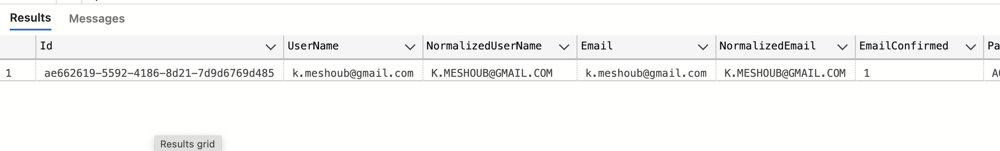
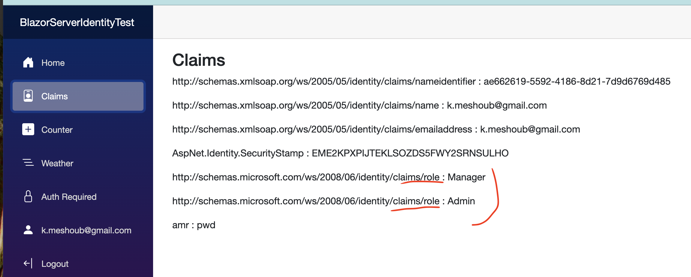

# 04 Les `roles`

Les `rôles` sont en fait des `claims`.


## Créer un `rôle` en `DB`

```sql
INSERT INTO [dbo].[AspNetRoles]
(
 [Id], [Name], [NormalizedName], [ConcurrencyStamp]
)
VALUES
(
 NEWID(), 'Manager', 'MANAGER', ''
)
```



On ajoute d'abord un `rôle` manuellement dans la table `AspNetRoles`, puis toujours manuellement on associe un `user` dans la table de jointure `AspNetUserRoles` :

```sql
INSERT INTO [dbo].[AspNetUserRoles]
( 
 	[UserId], 
    [RoleId]
)
VALUES
( 
 	'ae662619-5592-4186-8d21-7d9d6769d485', 
    '03DB352B-3374-457E-81B6-A65F2D70356A'
)
```



On trouve le `UserId` dans la table `AspNetUsers`




## Ajouter les `rôles` aux `Claims`

`Program.cs`

```ruby
builder.Services.AddIdentityCore<ApplicationUser>(options => options.SignIn.RequireConfirmedAccount = true)
    .AddRoles<IdentityRole>() // <= ici
    .AddEntityFrameworkStores<ApplicationDbContext>()
    .AddSignInManager()
    .AddDefaultTokenProviders();
```


