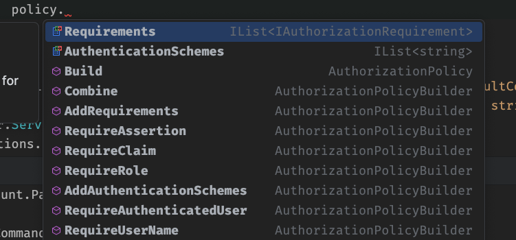
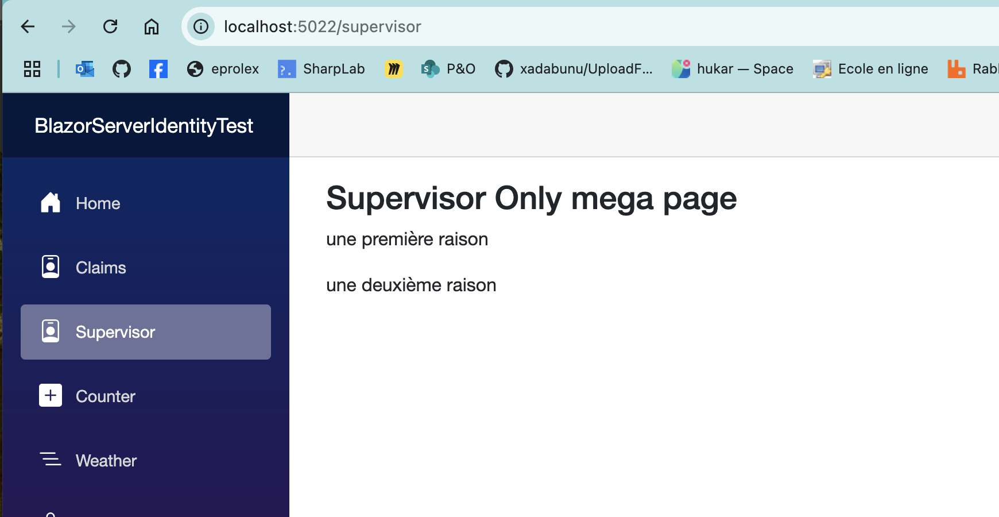
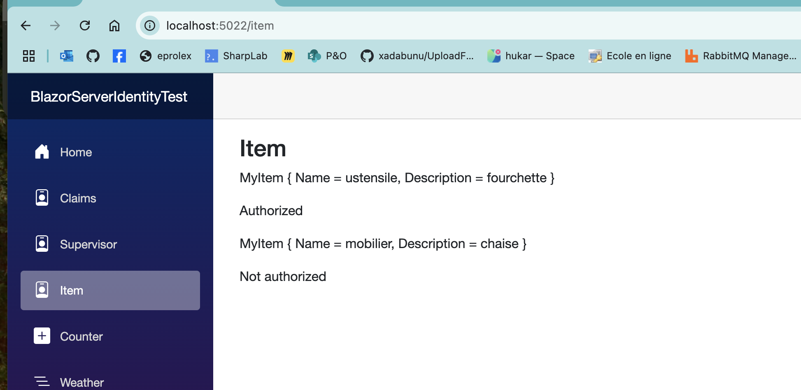

# 05 Policies

Une `Policy` es un ensemble de règles (`rules`), qui mises ensemble créé une nouvelle `règle`.


## `AddAuthorization`



```ruby
builder.Services.AddAuthorization(
    options => {
		options.AddPolicy(
            "RequireAdminRole", // policy name
            policy => {
            	policy.RequireRole("Admin");
            }
        );
    }
);
```

```ruby
builder.Services.AddAuthorization(options =>
{
    options.AddPolicy("AdminAndManagerRoleOnly", policy =>
    {
        policy.RequireRole("Admin")
            .RequireRole("Manager");
    });
});
```


## Dans une `page` : `@attribute [Authorize]`

```ruby
@attribute [Authorize(Policy = "AdminAndManagerRoleOnly")]
```


## Créer son propre `Requirement`

```ruby
public class PassRequirement : IAuthorizationRequirement { }

public class PassSupervisorRequirementHandler(UtilisateurPassRepositoy repo) : AuthorizationHandler<PassRequirement>
{
    protected override Task HandleRequirementAsync(
        AuthorizationHandlerContext context,
        PassRequirement requirement
    )
    {
        var id = context.User.FindFirst(ClaimTypes.NameIdentifier)?.Value;
        
        if(id is null) context.Fail();

        if (Guid.TryParse(id, out var guid))
        {
            var passes = repo.GetPasses();
            var utisateurPasses = passes.Where(p => p.UtilisateurId == guid);

            if (utisateurPasses.Any(p => p.Role == "Supervisor"))
            {
                context.Succeed(requirement);
                
                return Task.CompletedTask;
            }
        }
        
        context.Fail(new AuthorizationFailureReason(this, "une première raison"));
        context.Fail(new AuthorizationFailureReason(this, "une deuxième raison"));

        return Task.CompletedTask;
    }
}
```

L'utiliser dans `Program.cs`

```ruby
builder.Services.AddAuthorization(options =>
{
    options.AddPolicy("SupervisorOnly", policy =>
    {
        policy.Requirements.Add(new PassRequirement());
    });
});
```

```ruby
builder.Services.AddTransient<IAuthorizationHandler, PassSupervisorRequirementHandler>();
```


### Utilisation dans une `page`

```ruby
@attribute [Authorize(Policy = "SupervisorOnly")]
```


#### `IAuthorizationService`  et  `AuthenticationStateProvider`

Plutôt que de permettre ou d'interdire l'entièreté de la `page`, on peut utiliser `IAuthorizaionService` pour contrôler l'accès aux resources :

```ruby
@inject IAuthorizationService AuthorizationService
@inject AuthenticationStateProvider AuthenticationState

@if (result is not null && result.Succeeded)
{
    <p>Secret for Supervisor</p>
}
else
{
    @foreach (var failure in result?.Failure?.FailureReasons)
    {
        <p>@failure.Message</p>
    }
}
    

@code {
    AuthorizationResult? result;

    protected override async Task OnInitializedAsync()
    {
        var state = await AuthenticationState.GetAuthenticationStateAsync();

        result = await AuthorizationService.AuthorizeAsync(state.User, "SupervisorOnly");   
    }
}
```



Ou bien si la personne peux y accéder :


## Créer un `Requirement` basé sur une `resource`

```cs
public record MyItem(string Name, string Description);
```

`ItemRequerement.cs`

```ruby
public class ItemRequirement : IAuthorizationRequirement { }

public class ItemRequirementHandler : AuthorizationHandler<ItemRequirement, MyItem>
{
    private readonly IEnumerable<string> itemsForBoulangerie = ["ingredient", "ustensile", "cuisson"];
    
    protected override Task HandleRequirementAsync(AuthorizationHandlerContext context, ItemRequirement requirement, MyItem resource)
    {
        var isAuthenticated = context.User.Identity is not null && context.User.Identity.IsAuthenticated;
        var hasCorrectRole = context.User.HasClaim(c => c.Value == "Boulanger");
        var itemAllowed = itemsForBoulangerie.Contains(resource.Name);
        
        if (isAuthenticated && hasCorrectRole && itemAllowed)
        {
            context.Succeed(requirement);
        }

        return Task.CompletedTask;
    }
}
```


### Enregistrement du `requirement`

`Program.cs`

```ruby
builder.Services.AddAuthorization(options =>
{
   options.AddPolicy("ItemAllowed", policy =>
    {
        policy.AddRequirements(new ItemRequirement());
    });
});

builder.Services.AddSingleton<IAuthorizationHandler, ItemRequirementHandler>();
```

>Il n'y a aucun conflit à proposer plusieurs implémentation pour `IAuthorizationHandler` :
>
>```ruby
>builder.Services.AddSingleton<IAuthorizationHandler, PassSupervisorRequirementHandler>();
>builder.Services.AddSingleton<IAuthorizationHandler, ItemRequirementHandler>();
>```
>
>


### Utilisation dans un `component`

```ruby
@page "/Item"

@inject AuthenticationStateProvider StateProvider
@inject IAuthorizationService AuthService


<h3>Item</h3>

<p>@itemOne</p>
@if (resultOne is not null && resultOne.Succeeded)
{
    <p>Authorized</p>
}
else
{
    <p>Not authorized</p>
}

<p>@itemTwo</p>
@if (resultTwo is not null && resultTwo.Succeeded)
{
    <p>Authorized</p>
}
else
{
    <p>Not authorized</p>
}


@code {
    MyItem itemOne = new ("ustensile", "fourchette");
    MyItem itemTwo = new ("mobilier", "chaise");

    AuthorizationResult? resultOne;
    AuthorizationResult? resultTwo;

    protected override async Task OnInitializedAsync()
    {
        var state = await StateProvider.GetAuthenticationStateAsync();
        var user = state.User;

        resultOne = await AuthService.AuthorizeAsync(user, itemOne, "ItemAllowed");
        resultTwo = await AuthService.AuthorizeAsync(user, itemTwo, "ItemAllowed");
    }
}
```



Comme `ustensile` fait partie des `items` autorisés `resultOne.Successed` est égal à `true`.
