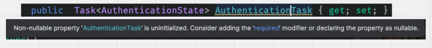

# 06 `AuthenticationStateProvider`

### `Provider.GetAuthenticationStateAsync`

```ruby
@page "/super-heroes"

@inject HeroesRepository Repo
@inject AuthenticationStateProvider Provider

<h3>SuperHeroe</h3>

@foreach (var hero in heroes)
{
    <p>[ @hero ]</p>
}

@code {
    IEnumerable<SuperHeroe> heroes = [];

    protected override async Task OnInitializedAsync()
    {
        var state = await Provider.GetAuthenticationStateAsync();

        if (state.User.Identity?.IsAuthenticated ?? false)
        {
            heroes = Repo.GetAll();
        }   
    }
}
```


### `CascadingAuthenticationState`

`Program.cs`

```ruby
builder.Services.AddCascadingAuthenticationState();
```

On n'a plus besoin d'injecter le service `AuthenticationStateProvider` :

```ruby
@code {
    IEnumerable<SuperHeroe> heroes = [];
    
    [CascadingParameter] 
    public required Task<AuthenticationState> AuthenticationTask { get; set; }

    protected override async Task OnInitializedAsync()
    {
        var state = await AuthenticationTask;

        if (state.User.Identity?.IsAuthenticated ?? false)
        {
            heroes = Repo.GetAll();
        }     
    }
}
```

`required` permet de ne plus avoir un `warning` sur `Non-Nullable Property`.




### Utilisation avec `IAuthorizationService`

```ruby
@inject IAuthorizationService AuthService

<h3>SuperHeroe</h3>

@foreach (var hero in heroes)
{
    <p>[ @hero ]</p>
}

@code {
    IEnumerable<SuperHeroe> heroes = [];
    [CascadingParameter] 
    public required Task<AuthenticationState> AuthenticationTask { get; set; }

    protected override async Task OnInitializedAsync()
    {
        var state = await AuthenticationTask;

        var result = await AuthService.AuthorizeAsync(
            state.User, "AdminAndManagerRoleOnly"
        );
        
        if (result.Succeeded)
        {
            heroes = Repo.GetAll();
        }    
    }
}
```


