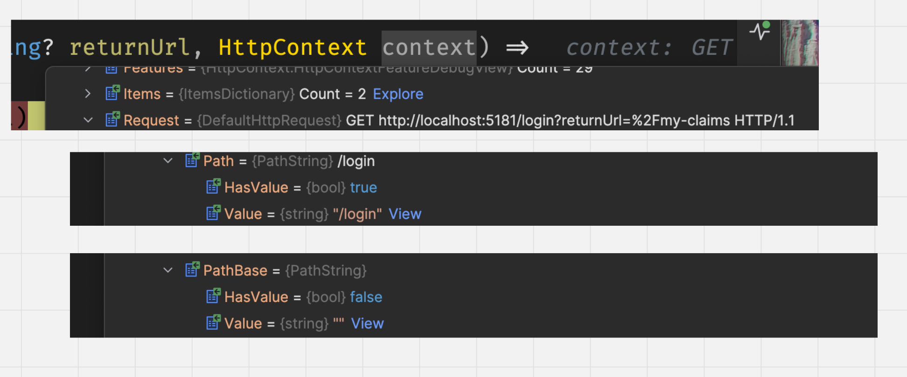
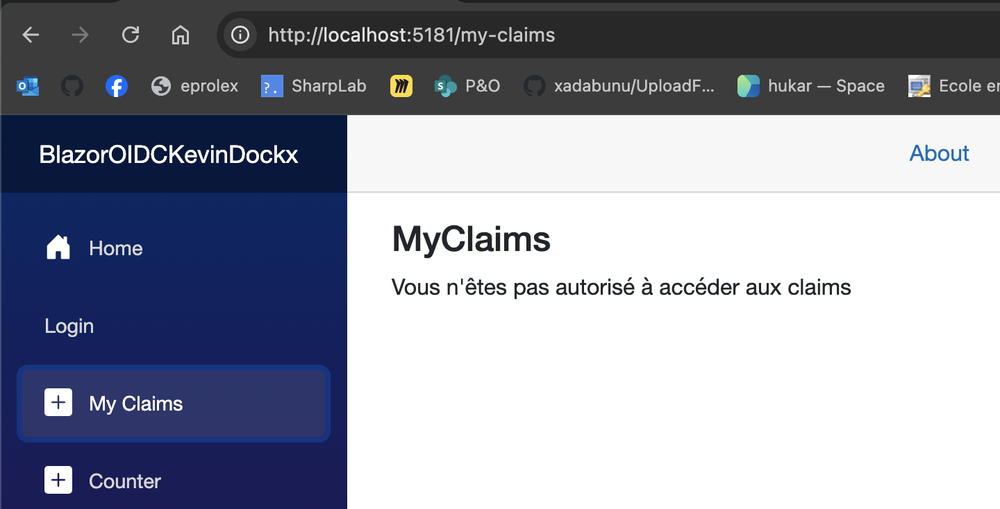
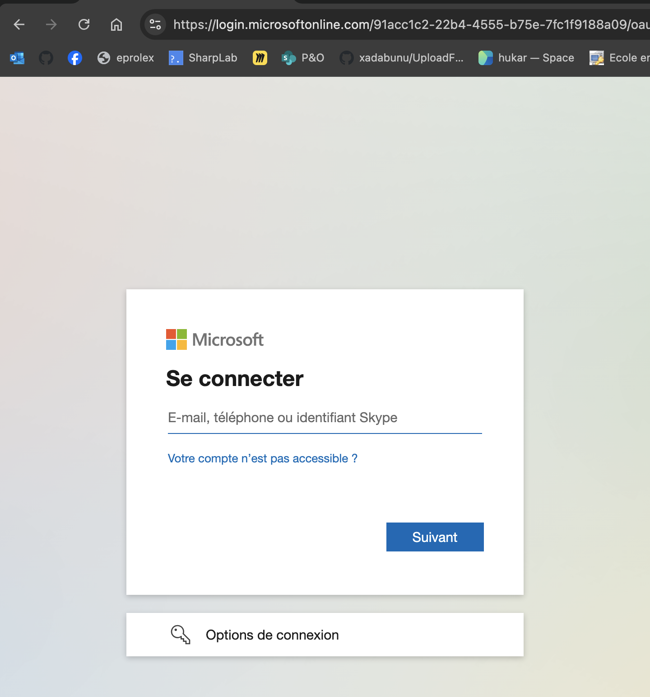
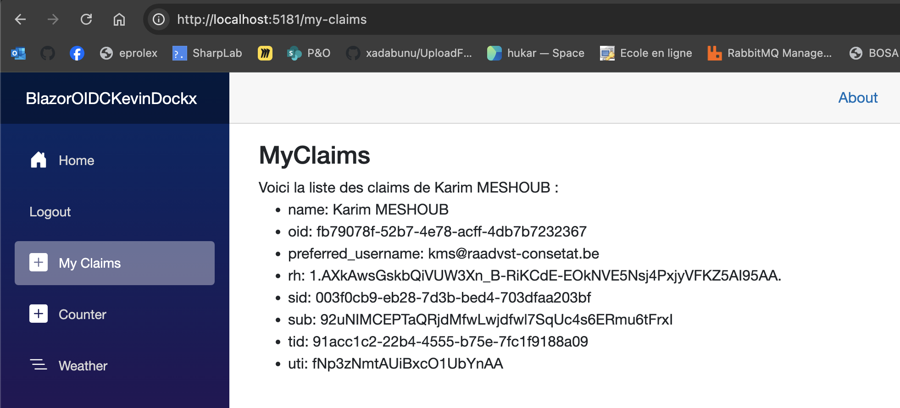
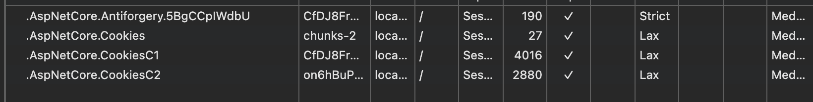

# 03 `Login` endpoint


## Implémentation

J'utilise toujours le pattern `method extension` pour organiser mes `endpoints`.

```cs
app.MapGet("/login", ([FromQuery] string? returnUrl, HttpContext context) =>
{
	if (string.IsNullOrEmpty(returnUrl) 
        || !Uri.IsWellFormedUriString(returnUrl, UriKind.Relative))
    {
        returnUrl = "/";
    }
    
    // notre DefaultChallengeScheme est entraId
    return TypedResults.Challenge(new AuthenticationProperties {
        RedirectUri = returnUrl
    });
}).AllowAnonymous();
```


> ## Prévenir les attaques `Open Redirect`
>
> On vérifie que l'`url` passée est une `url` locale pour éviter les redirections sur d'autres sites.
>
> ```cs
> // Contrôle de l'URL de redirection
> string basePath = string.IsNullOrEmpty(context.Request.PathBase)
>  ? "/" : context.Request.PathBase;
> 
> if(string.IsNullOrEmpty(returnUrl))
> {
>  // si returnUrl n'est pas fournis on prend basePath
>  returnUrl = basePath;
> }
> else if(!Uri.IsWellFormedUriString(returnUrl, UriKind.Relative))
> {
>  // si returnUrl n'est pas une url relative on la transforme
>  // en url relative (risque d'une redirection malicieuse)
>  returnUrl = new Uri(returnUrl, UriKind.Absolute).PathAndQuery;
> }
> else if(returnUrl[0] != '/')
> {    
>  returnUrl = $"{basePath}{returnUrl}";
> }
> ```
>
> 
>
> ### Contenu de `context.Request.PathBase`
>
> 
>
> 
>
> ### Explication du code avec `Uri`
>
> ```cs
> const string urlOne = "http://mondomain.be/user/data?name=hukar";
> const string urlTwo = "/user/data";
> const string urlThree = "n'impoprte la ouiqu!!";
> 
> Uri.IsWellFormedUriString(urlOne, UriKind.Relative)); // False
> Uri.IsWellFormedUriString(urlOne, UriKind.Absolute); // true
> 
> Uri.IsWellFormedUriString(urlTwo, UriKind.Relative); // true
> Uri.IsWellFormedUriString(urlTwo, UriKind.Absolute); // false
> 
> Uri.IsWellFormedUriString(urlThree, UriKind.RelativeOrAbsolute); // false
> 
> new Uri(urlOne, UriKind.Absolute).PathAndQuery); // /user/data?name=hukar
> ```
>
> 


## Démo

On  créé une page `MyClaims.razor` pour tester

```react
@page "/my-claims"

@using System.Security.Claims


<h3>MyClaims</h3>

<AuthorizeView>
    
    <NotAuthorized>
        <p>Vous n'êtes pas autorisé à accéder aux claims</p>
    </NotAuthorized>

    <Authorized>
        <p>Voici la liste des claims de @state?.User.Identity?.Name :</p>
        <ul>
            @foreach (var claim in claims)
            {
                <li>@claim.Type: @claim.Value</li>
            }
        </ul>
    </Authorized>
    
</AuthorizeView>

@code {
    [CascadingParameter] public Task<AuthenticationState>? AuthenticationStateTask { get; set; }
    AuthenticationState? state;
    IEnumerable<Claim> claims = [];

    protected override async Task OnInitializedAsync()
    {
        if (AuthenticationStateTask is not null)
        {
            state = await AuthenticationStateTask;

            claims = state.User.Claims;
        }
    }
}
```


### Code du bouton de `Login`

```react
<AuthorizeView>
            <NotAuthorized>
                <div class="nav-item px-3">
                    <NavLink 
                        class="nav-link" 
                        href="@($"login?returnUrl={Uri.EscapeDataString(new Uri(Navigation.Uri).PathAndQuery)}")">
                        Login
                    </NavLink>
                </div>
            </NotAuthorized>

            <Authorized>
                <div class="nav-item px-3">
                    <NavLink class="nav-link" href="logout">
                        Logout
                    </NavLink>
                </div>
            </Authorized>

        </AuthorizeView>
```

```cs
Uri.EscapeDataString(new Uri(Navigation.Uri).PathAndQuery)
```



Lorsqu'on appuie sur le bouton `Login` on est redirigé vers `Entra Id` :



Puis une fois l'authentification réalisé par `Entra Id` on est redirigé de nouveau vers la page protégée :



Des `cookies` sont envoyé au navigateur :




