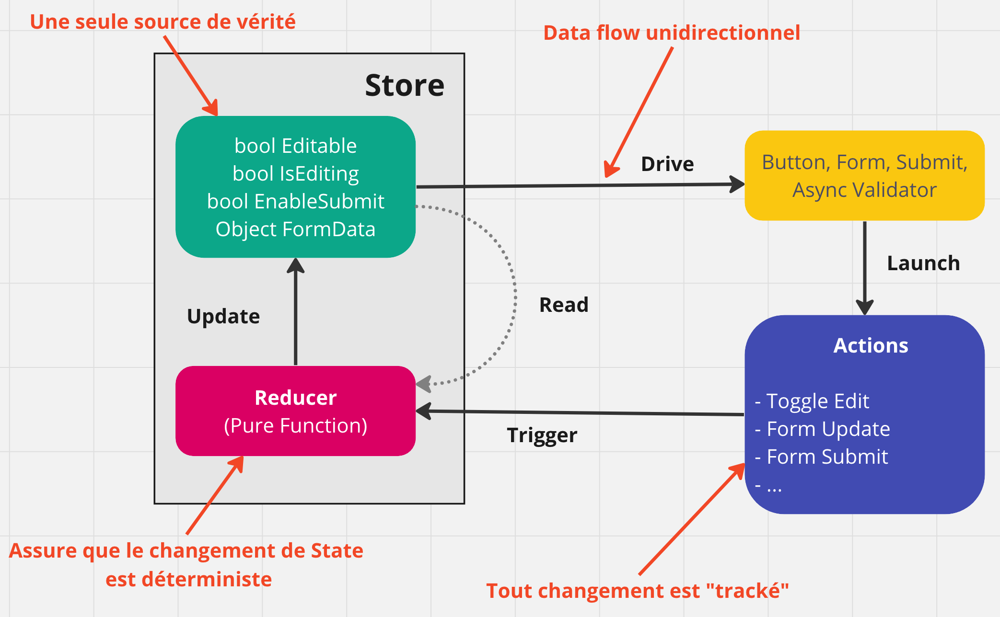
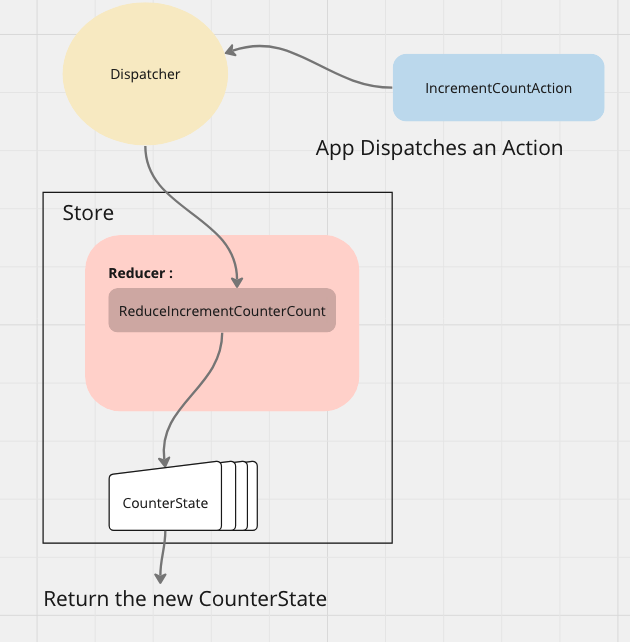

# 01 Les concepts de base

## `Redux` schéma




## `State`, `Actions` et `Reducers`


### Mise en place

On crée une `application console`.

On ajoute le package `Fluxor`

```bash
dotnet add package Fluxor
```

On va activer l'injection de dépendance et `Fluxor` dans `Program.cs`

```cs
var services = new ServiceCollection();

services.AddScoped<App>();

services.AddFluxor(options => options.ScanAssemblies(typeof(Program).Assembly));

IServiceProvider serviceProvider = services.BuildServiceProvider();

var app = serviceProvider.GetRequiredService<App>();

app.Run();
```

> Il faut ajouter le package `Microsoft.Extensions.DependencyInjection` pour avoir accès à `BuildServiceProvider`.
>
> Apparemment ce package n'est pas installé avec `Fluxor`.

`Fluxor` charge avec lui `Microsoft.Extensions.DependencyInjection.Abstractions `

Il scanne l'`assembly` pour trouver le code relié à `Fluxor`: `States`, `Reducers`, etc.

On crée la classe `App`:

```cs
public class App
{
    public void Run()
    {
        
    }
}
```


### Injection du `Store` dans `App`

```cs
public class App
{
    private readonly IStore _store;

    public App(IStore store)
    {
        _store = store;
    }
    
    public void Run() {
        Console.Clear();
        Console.WriteLine("Initializing Store");
        _store.InitializeAsync().Wait();
    }
}
```


### `CounterState`

On crée un dossier `Store` et dedans un dossier `CounterUseCase`.

Dans `/Store/CounterUseCase/CounterState.cs`

```cs
[FeatureState]
public class CounterState
{
    public int ClickCount { get; }

    public CounterState() { }

    public CounterState(int clickCount)
    {
        ClickCount = clickCount;
    }
}
```

`[FeatureState]` permet au `State` d'être découvert automatiquement.

Le `State` doit être `Immutable`.

Il vaut mieux plusieurs `State` par `Use Cases` plutôt qu'un gros `State` monolithique.

> ## Version alternative avec `: Feature<T>`
>
> Si on veut utiliser la simplicité des record pour représenter son state, on peut utiliser une version sans attribut qui ne nécessitte pas de classe ni de constructeur à définir.
>
> On remplace son `CounterState` par :
>
> ```cs
> namespace FluxorTestConsole.Store.CounterUseCase;
> 
> public record CounterState(int ClickCount);
> ```
>
> Et on ajoute une `classe` : `CounterFeature` qui hérite de `Feature<T>`:
>
> ```cs
> public class CounterFeature : Feature<CounterState>
> {
>     public override string GetName() => nameof(CounterState);
> 
>     protected override CounterState GetInitialState() => new CounterState(9);
> }
> ```
>
> On est obligé d'implémenter deux méthodes :
>
> - `GetName`
> - `GetInitialState`


## Afficher le `State` dans notre `App`

```cs
public class App
{
    private readonly IStore _store;
    private readonly IState<CounterState> _counterState;

    public App(IStore store, IState<CounterState> counterState)
    {
        _store = store;
        _counterState = counterState;
        _counterState.StateChanged += CounterState_StateChanged;
    }
    
    public void Run()
    {
        Console.Clear();
        Console.WriteLine("Initializing Store");
        _store.InitializeAsync().Wait();
    }
}
```

L'`App` n'accède pas directement au `State` mais au `Feature<State>`.

C'est un `Wrapper` autour du `State`, le rendant accessible via `Value` et proposant un gestionnaire d'événement `StateChanged`.

On ajoute une méthode affichant le `State` dès que celui-ci est modifié:

```cs
private void CounterState_StateChanged(object sender, EventArgs e)
{
    Console.WriteLine("");
    Console.WriteLine("===================> Counter State");
    Console.WriteLine($"Click Count: {_counterState.Value.ClickCount}");
    Console.WriteLine("<=================== Counter State");
    Console.WriteLine("");
}
```


## `Dispatching` (expédier) une `Action` pour indiquer l'intention de changer le `State`

Dans le dossier `Store` on va créer une classe représentant notre action.

> Elle ne fait pas partie d'un `UseCase` dans la documentation mais est directement placée à la racine de `Store`.

Cette classe peut rester vide.

`IncrementCounterAction.cs`

```cs
namespace FluxorTestConsole.Store.CounterUseCase;

public class IncrementCounterAction { }
```

Ou plus simple encore avec un `record` :

```cs
public record IncrementCounterAction;
```


Dans `App.cs` on injecte une instance de `IDispatcher`.

```cs
public class App
{
    private readonly IStore _store;
    private readonly IState<CounterState> _counterState;
    private readonly IDispatcher _dispatcher;

    public App(IStore store, IState<CounterState> counterState, IDispatcher dispatcher)
    {
        _store = store;
        _counterState = counterState;
        _dispatcher = dispatcher;
        _counterState.StateChanged += CounterState_StateChanged;
    }
```

Utilisation du `Dispatcher`:

```cs
var action = new IncrementCounterAction();
_dispatcher.Dispatch(action);
```

Dans la méthode `Run`:

```cs
public void Run()
{
    Console.Clear();
    Console.WriteLine("Initializing Store");
    _store.InitializeAsync().Wait();

    string? input = "";

    do
    {
        Console.WriteLine("1 : To Increment Counter");
        Console.WriteLine("x : To Qit");
        Console.WriteLine("> ");

        input = Console.ReadLine();

        switch (input)
        {
            case "1":
                var action = new IncrementCounterAction();
                _dispatcher.Dispatch(action);
                break;
            case "x":
                Console.WriteLine("Program Terminated");
                return;
        }

    } while (true);
}
```


## Réagir sur l'`Action` pour modifier le `State` : `Reducer`

On va créer une nouvelles `class` dans le même dossier `Stor/CounterUseCase`

`Reducers.cs`

```cs
using Fluxor;

namespace FluxorTestConsole.Store.CounterUseCase;

public static class Reducers
{
    [ReducerMethod]
    public static CounterState ReduceIncrementCounterAction(
        CounterState state,
        IncrementCounterAction action) => new CounterState(clickCount: state.ClickCount + 1);
}
```

ou plus simplement avec les `record`:
```cs
[ReducerMethod(typeof(IncrementCounterAction))]
    public static CounterState ReduceIncrementCounterAction(CounterState state) 
        => state with { ClickCount = state.ClickCount + 1 };
```

On utilise l'écriture simplifiée `[ReducerMethod(typeof(IncrementCounterAction))]` pour ne pas le passer inutilement en paramètre.


> ## ! `IState<TState>` et `TState`
>
> Lorsqu'on utilise le `State` dans l'application, on utilise `IState<TState>` et du coup l'écriture avec `Value`:
> ```cs
> _counterState.Value.ClickCount
> ```
>
> `Value` expose l'objet `State` ici `CounterState` sous-jacent.
>
> Par contre dans un `Reducer` on utilise directement le `State` et donc il n'y a pas de propriété `Value`:
>
> ```cs
> new CounterState(clickCount: state.ClickCount + 1);
> ```


### Si l'`Action` ne transmet pas de paramètre

On a une forme d'écriture simplifiée:

```cs
[ReducerMethod(typeof(IncrementCounterAction))]
public static CounterState ReduceIncrementCounterAction(CounterState state) =>
    new CounterState(clickCount: state.ClickCount + 1);
```


## Plusieurs `Reducer`

On peut écrire autant de méthode `Reducer` que l'on veut dans autant de `classes` que l'on veut.

Le nom de la classe ou de la méthode ne compte pas, seul l'attribut `[ReducerMethod]` et une signature correcte compte.


## `Pure Function`

>1. Sa valeur de retour doit être la même pour les mêmes arguments.
>2. Son évaluation n'a pas d'effet de bord.

Les `Reducers` doivent être créé dans des `static class` pour éviter toute injection de dépendances.

S'il y a un besoin d'utiliser des services tiers, c'est qu'il faut plutôt créer un `Effect`.


