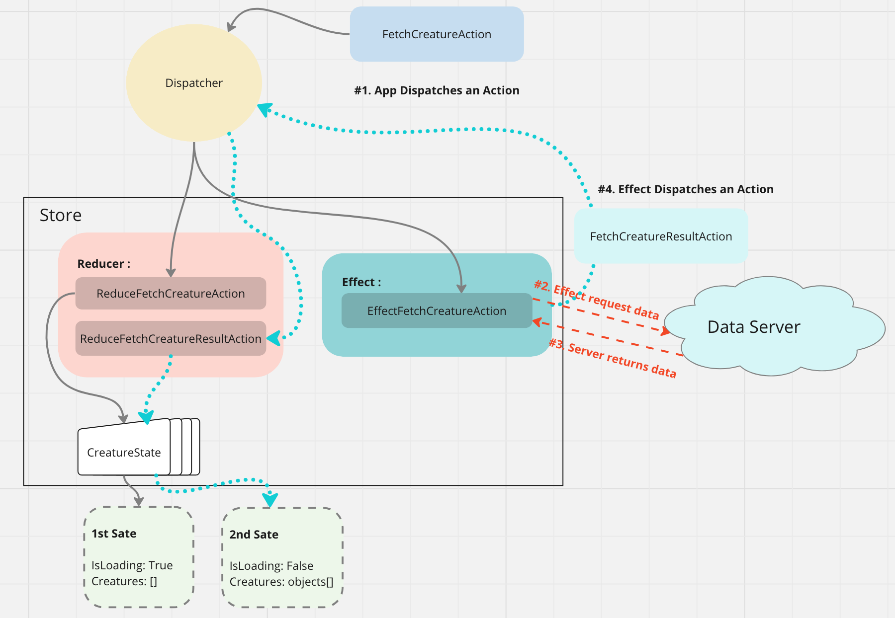

# 02. `Effects`

Le `flux` du `state` est supposé être immutable. Le `state` est remplacé par des `Pure Function`, qui ne prennent que la valeur de leurs paramètres pour construire le nouveau `State`.

Il faut donc un mécanisme capable de gérer l'accès à d'autre source de données, comme des `web services`, et qui ensuite les `Reduce` pour construire notre `State`.

C'est un `Effect` qui va réaliser l'appel à un service avant de réduire (`Reducing`) le résultat en un `State`.


## Nouveau `State` : `CreatureState`

Dans `Store/CreatureUseCase`

`CreatureState.cs`

```cs
public record CreatureState(bool IsLoading, IEnumerable<Creature> Creatures);
```

Et une classe `CreatureFeature`:

```cs
public class CreatureFeature : Feature<CreatureState>
{
    public override string GetName() => nameof(CreatureState);

    protected override CreatureState GetInitialState() => new CreatureState(
        IsLoading: false,
        Creatures: Enumerable.Empty<Creature>());
}
```


## `FetchCreaturesAction` et `Reducers`

On va créer une `classe` (ou un `record`) vide.

```cs
public record FetchCreatureAction;
```

et une `static class` : `Reducers`:

```cs
public static class Reducers
{
    [ReducerMethod(typeof(FetchCreatureAction))]
    public static CreatureState ReduceFetchCreatureAction(CreatureState state) 
        => state with { IsLoading = true, Creatures = Enumerable.Empty<Creature>() }
}
```

> Contrairement à la documentation `Creatures` ne peut pas être `null` car on teste plus loin :
>
> ```cs
> if (!_creatureState.Value.Creatures.Any())
> {
>     Console.WriteLine("--- No creature");
>     // ...
> ```
>
> Si on initialise à `null` on a l'exception : `ArgumentNullException:`

## Envoyer l'`Action` : `Dispatch`

On `Dispatch` l'`Action` de cette façon :

```cs
var fetchCreatureAction = new FetchCreatureAction();
_dispatcher.Dispatch(fetchCreatureAction);
```


## Gestionnaire d'`Effects` : `Effects Handler`

l'`Effects Handler` ne peut pas modifier le `State` directement.

Il est déclenché lorsque que l'`Action` qui lui est propre est `Dispatchée` dans le `Store`.

Un `Effects Handler` peut être écris de trois manières différentes:


### 1.  `[EffectMethod]` sans paramètre dans la méthode

Comme pour `[ReducerMethod]`, on utilise `[EffectMethod(typeof(Action))]` :

```cs
[EffectMethod(typeof(FetchCreatureAction))]
public async Task HandleFetchCreatureAction(IDispatcher dispatcher)
{
    var creatures = await _creatureService.GetCreatures();
    dispatcher.Dispatch(new FetchCreatureResultAction(creatures));
}
```

L'`Effect` reçoit un `Dispatcher` pour prévenir quand les données sont chargées.

On passe les données `creatures` au constructeur de l'`Action`:

```cs
new FetchCreatureResultAction(creatures)
```


### 2. En décorant des méthodes d'instance ou `static` :

> ## ! L'ordre des arguments compte : `action` puis `dispatcher`

```cs
public class Effects
{
    private readonly ICreatureService _creatureService;

    public Effects(ICreatureService creatureService)
    {
        _creatureService = creatureService;
    }

    [EffectMethod]
    public async Task HandleFetchCreatureAction(FetchCreatureAction action, IDispatcher dispatcher)
    {
        var creatures = await _creatureService.GetCreatures();
        dispatcher.Dispatch(new FetchCreatureResultAction(creatures));
    }
}
```


### 3. En héritant de `Effect<TAction>`

Le `TAction` représente l'action qui déclenche cet `Effect`.

```cs
public class FetchCreatureEffect : Effect<FetchCreatureAction>
{
    private readonly ICreatureService _creatureService;

    public Effects(ICreatureService creatureService)
    {
        _creatureService = creatureService;
    }

    public async Task HandleFetchCreatureAction(FetchCreatureAction action, IDispatcher dispatcher)
    {
        var creatures = await _creatureService.GetCreatures(creatures);
        dispatcher.Dispatch(new FetchCreatureResultAction());
    }
}
```

On supprime alors `[EffectMethod(...)]`.

À garder à l'esprit

1. Un attribut `[EffectMethod]` peut être déclaré sur une méthode `static` ou d'`instance`.
2. Si I'`Effect` est déclaré sur une méthode d'instance, la classe propriétaire sera aussi instanciée.
3. Les dépendances injectées peuvent être partagées entre plusieurs `[EffectMethod]`, ils peuvent partagés par exemple une propriété `CancellationToken`.

### La méthode `2` est conseillée


## `Réduire` le résultat dans un `State`

On crée l'`Action` :

```cs
public record FetchCreatureResultAction(IEnumerable<Creature> Creatures);
```

On ajoute une nouvelle méthode à notre classe `Reducers`:

```cs
[ReducerMethod]
public static CreatureState ReduceFetchCreatureResultAction(
	CreatureState state,
    FetchCreatureResultAction action
) => state with { IsLoading = false, Creatures = action.Creatures }
```

Soit l'ensemble de mes `Reducers` :

```cs
public static class CreatureReducers
{
    [ReducerMethod(typeof(FetchCreatureAction))]
    public static CreatureState ReduceFetchCreatureAction(CreatureState state)
        => state with { IsLoading = true, Creatures = Enumerable.Empty<Creature>() };

    [ReducerMethod]
    public static CreatureState ReduceFetchCreatureResultAction(
        CreatureState state,
        FetchCreatureResultAction action
    ) => state with { IsLoading = false, Creatures = action.Creatures };
}
```


## Résultat

```bash
Initializing Store
1 : To Increment Counter
2 : To Fetch Creature
x : To Qit
> 
2

=========================> Creature State
IsLoading: True

--- No creature
<========================== Creature State

1 : To Increment Counter
2 : To Fetch Creature
x : To Qit
> 

=========================> Creature State
IsLoading: False

Name: Routin, Gender: Male, Age: 64, Magical Type: Ice
Name: Minnidou, Gender: Male, Age: 89, Magical Type: Carbon
Name: Wutu, Gender: Female, Age: 77, Magical Type: Fire
Name: Roumouni, Gender: Female, Age: 26, Magical Type: Diamond
<========================== Creature State
```




