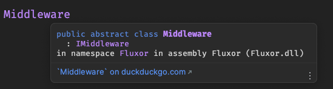

# 03 `Middleware`

Un `middleware` vous permet de vous connecter à différents points d'exécution de la durée de vie du `Store`.

Cela nous permet d'exécuter des traitements additionnels sans se demander quelle `Action` est `Dispatchée` ou quel `State` est `Affecté`.


## Créer le `middleware` : `LoggingMiddleware`

On crée une `class` : `LoggingMiddleware` dans le dossier `Middlewares/Logging`.

`LoggingMiddleware.cs`

```cs
using Fluxor;

namespace FluxorTestConsole.Store.Middlewares.Logging;

public class LoggingMiddleware : Middleware
{
    private IStore _store;

    public override Task InitializeAsync(IDispatcher dispatcher, IStore store)
    {
        _store = store;
        Console.WriteLine(nameof(InitializeAsync));
        return Task.CompletedTask;
    }
}
```

La `class` : `Middleware` fait partie de `Fluxor`:



On accède aux différents `hook` grâce à l'`override` de l'interface `IMiddleware` :

```cs
Task InitializeAsync(IDispatcher dispatcher, IStore store);

void AfterInitializeAllMiddlewares();

bool MayDispatchAction(object action) => true;

void BeforeDispatch(object action) { }

void AfterDispatch(object action) { }

void OnInternalMiddlewareChangeEnding() { }
```


## Enregistrer le `middleware`

Dans `Program.cs`

```cs
services.AddFluxor(
	o => o.ScanAssemblies(typeof(Program).Assembly)
    	  .AddMiddleware<LoggingMiddleware>()
);
```


## Enrichir `LoggingMiddleware`

```cs
public class LoggingMiddleware : Middleware
{
    private IStore _store;

    public override Task InitializeAsync(IDispatcher dispatcher, IStore store)
    {
        _store = store; 
        Console.WriteLine(nameof(InitializeAsync));
        return Task.CompletedTask;
    }
    
    public override void AfterInitializeAllMiddlewares()
        => Console.WriteLine(nameof(AfterInitializeAllMiddlewares));

    public override bool MayDispatchAction(object action)
    {
        Console.WriteLine(nameof(MayDispatchAction) + ObjectInfo(action));
        return true;
    }

    public override void BeforeDispatch(object action)
        => Console.WriteLine(nameof(BeforeDispatch) + ObjectInfo(action));

    public override void AfterDispatch(object action) 
        => Console.WriteLine(nameof(AfterDispatch) + ObjectInfo(action));

    private string ObjectInfo(object obj)
        => ": " + obj.GetType().Name + " " 
        + JsonSerializer.Serialize(obj, new JsonSerializerOptions { WriteIndented = true });
}
```

La première `Action` `dispatchée` lorsqu'un `Store` est initialisé, est `StoreInitializeAction`:

```bash
Initializing Store
InitializeAsync
AfterInitializeAllMiddlewares
MayDispatchAction: StoreInitializedAction {}
BeforeDispatch: StoreInitializedAction {}
AfterDispatch: StoreInitializedAction {}

```

```bash
1 : To Increment Counter
2 : To Fetch Creature
x : To Qit
> 
1
MayDispatchAction: IncrementCounterAction {}
BeforeDispatch: IncrementCounterAction {}
AfterDispatch: IncrementCounterAction {}

```


## `Store.Features`

Avec un peu de code en plus on peut intéragir avec toutes les `Feature<T>` contenues dans le `Store`:

```cs
public override void AfterDispatch(object action)
{
    foreach (var feature in _store.Features)
    {
        Console.WriteLine($"********* {feature.Key.ToUpper()} :");
        Console.WriteLine(nameof(AfterDispatch) + ObjectInfo(feature.Value));
        Console.WriteLine();
    }
}

private string ObjectInfo(object obj)
    => ": " + obj.GetType().Name + " " + JsonSerializer.Serialize(
        obj, 
        new JsonSerializerOptions { WriteIndented = true }
        );
```

```bash
1 : To Increment Counter
2 : To Fetch Creature
x : To Qit
> 
1
********* CREATURESTATE :
AfterDispatch: CreatureFeature {
  "MaximumStateChangedNotificationsPerSecond": 0,
  "State": {
    "IsLoading": false,
    "Creatures": []
  }
}

********* COUNTERSTATE :
AfterDispatch: CounterFeature {
  "MaximumStateChangedNotificationsPerSecond": 0,
  "State": {
    "ClickCount": 10
  }
}
```

