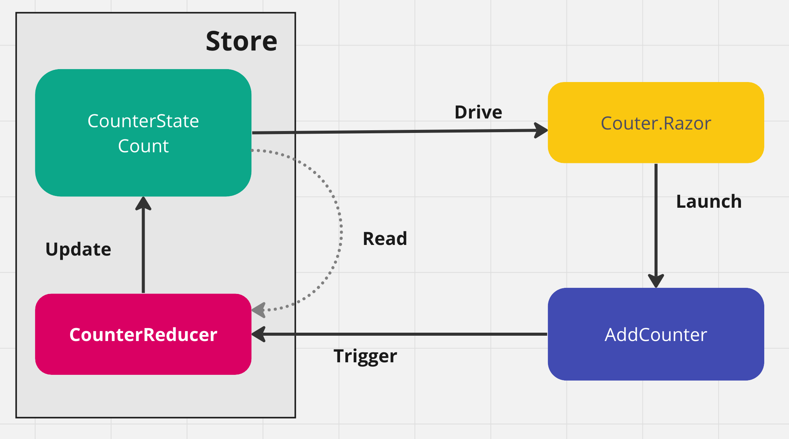
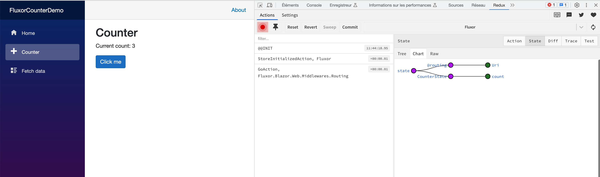
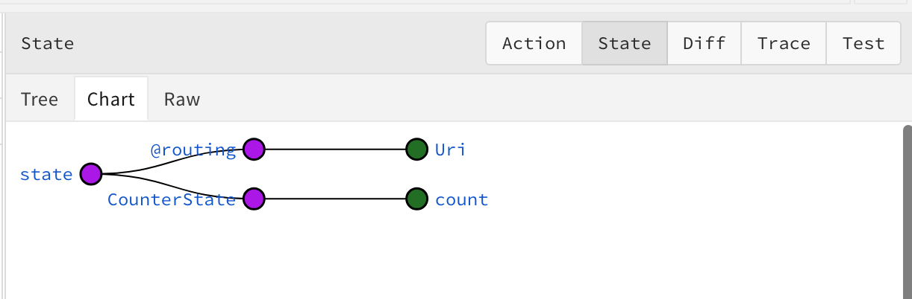

# Demo de `Fluxor`

## By Chris Clement

https://www.youtube.com/watch?v=sAyH-O0dFaI&t=45s&ab_channel=SSWTV%7CVideosfordevelopers%2Cbydevelopers


## Le `counter` avec `Fluxor`




## Ajouter le package `Fluxor.Blazor.Web`

```bash
dotnet add package Fluxor.Blazor.Web
```

```bash
dotnet add package Fluxor.Blazor.Web.ReduxDevTools
```


Dans `App.razor`

```cs
<Fluxor.Blazor.Web.StoreInitializer/> // <- ceci

<Router AppAssembly="@typeof(App).Assembly">
    // ...
```

Dans `Program.cs`

```cs
using Fluxor;

// ...

builder.Services.AddFluxor(options =>
{
 options
   .ScanAssemblies(typeof(Program).Assembly)
   .UseReduxDevTools();
});
```


### L'extension `Chrome` des `Redux Dev Tools`

https://chrome.google.com/webstore/detail/redux-devtools/lmhkpmbekcpmknklioeibfkpmmfibljd


## `CounterState`

On crée un dossier `Store` et dedans le `record` : `CounterState`:

`Store/CounterState.cs`

```cs
namespace FluxorCounterDemo.Store;

public record CounterState
{
    public int Count { get; init; }
}

// Ou plus simplement

public record CounterState(int Count);

public class CounterFeatureState : Feature<CounterState>
{
    public override string GetName() => nameof(CounterState);

    protected override CounterState GetInitialState() => new CounterState(0);
}
```





On peut ainsi suivre l'état du `state` grâce aux outils de dev de `Chrome`.


## Création de l'`Action` : `AddCounterAction`

Toujours dans le dossier `Store`:

`AddCounterAction.cs`

```cs
namespace FluxorCounterDemo.Store;

public record AddCounterAction();
```


## Création du `Reducer` : `CounterReducer`

Toujours dans `Store`:

C'est une `Pure Function`, on la met dans une `static class` pour ne pas avoir de context d'instance pouvant modifier l'état des valeurs de la `méthode`.

On crée un `Reducer` pour chaque `Action`.

`CounterReducer.cs`

```cs
namespace FluxorCounterDemo.Store;

[ReducerMethod]
public static class CounterReducer
{
    public static CounterState OnAddCounter(
        CounterState state, AddCounterAction action)
    {
        return state with { Count = state.Count }
    }
}
```

> ### ! Il est obligatoire de mettre l'attribut `[ReducerMethod]`, sinon le `Reducer` n'est pas trouvé.

## Utilisation dans le `Composant`

```ruby
@inherits Fluxor.Blazor.Web.Components.FluxorComponent
```

En héritant de `FluxorComponent`, on a plus besoin d'appeler manuellement `StaeHasChanged`, `Fluxor` le fait pour nous lorsque nécessaire.

On ajoute ensuite plusieurs directive

```ruby
@using Fluxor

@inject IState<CounterState> CounterState
@inject IDispatcher Dispatcher
```

```cs
@code {
    private int currentCount = CounterState.Value.Count;
    
    private void IncrementCount()
    {
        Dispatcher.Dispatch(new AddCounterAction);
    }
}
```


