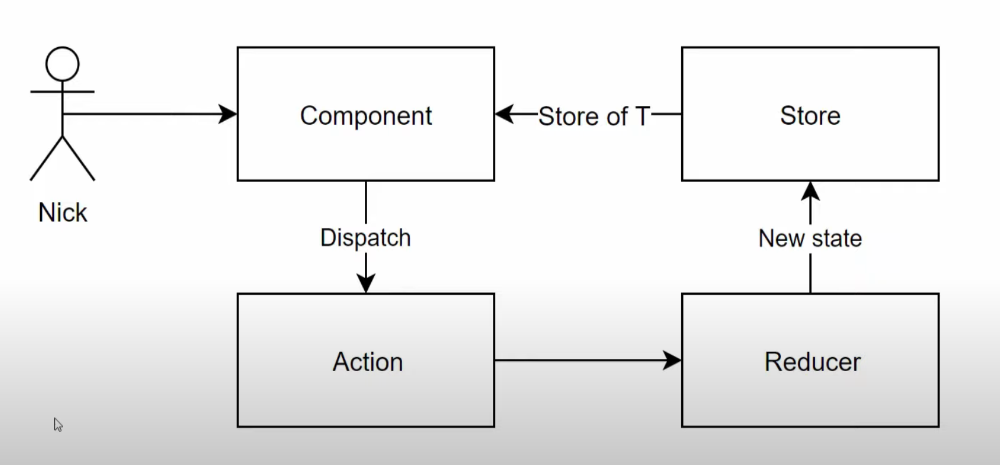

# `Fluxor` par Nick Chapsas

https://www.youtube.com/watch?v=k_c-ErPaYa8&ab_channel=NickChapsas


## Présentation



C'est une approche totalement prédictive, le `Reducer` est une `Pure Function` et garantie que le `State` n'est jamais muté, à la place, il est remplacé par un `new state`.

Le `Component` ne gère plus ses données, cette tâche est déléguée au `Store`.

Le `Component` à la place, lance une `Action` (`Dispatch`) qui choisira le bon `Reducer` pour envoyer le nouveau `State` au `Store`.


## Mise en place de `Fluxor`

```bash
dotnet add package Fluxor.Blazor.Web
```

Dans `Program.cs`

```cs
using Fluxor;

// Ajouter ceci
var currentAssembly = typeof(Program).Assembly;
builder.Services.AddFluxor(options => options.ScanAssemblies(currentAssembly));

// Cette ligne existe déjà est doit être la dernière
await builder.Build().RunAsync();
```

Dans `App.razor`

au début du fichier:

```html
<Fluxor.Blazor.Web.StoreInitializer/>

<Router AppAssembly="@typeof(App).Assembly">
    <Found Context="routeData">
        // ...
```

