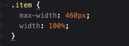
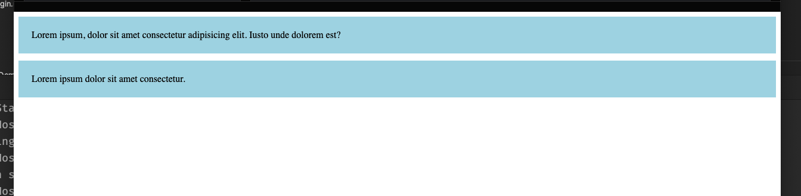
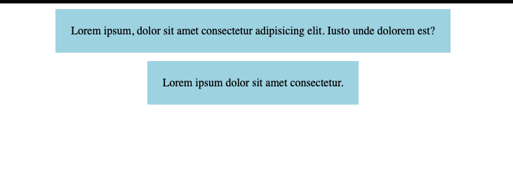
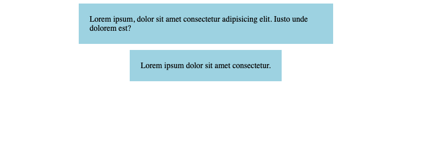
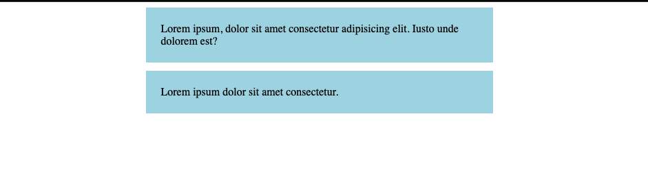

# AB `Flexbox` Tips


## Donner une `max-width` avec `flex-direction: column`



Si je crée une pile `flexbox`:

```html
<div class="container">
  <div class="item">
    Lorem ipsum, dolor sit amet consectetur adipisicing elit. Iusto unde dolorem est?
  </div>
  <div class="item">
    Lorem ipsum dolor sit amet consectetur.
  </div>
</div>
```

```css
.container {
  display: flex;
  gap: 12px;
  flex-direction: column;
}

.item {
  padding: 22px;
  background-color: lightblue;
}
```




En ajoutant `align-items: center`, les éléments prennent la taille de leur contenu:

```css
.container {
  /* ...*/
  align-items: center;
}
```




Je voudrai maintenant pouvoir régler une largeur maximum.

```css
.item {
  /* ... */
  max-width: 460px;
}
```



Le plus grand élément se rétrécie mais je veux maintenant que le plus petit prenne la taille de `max-width`:

```css
.item {
  /* ... */
  max-width: 460px;
  width: 100%;
}
```



### Il faut utiliser `max-width` avec `width: 100%`

