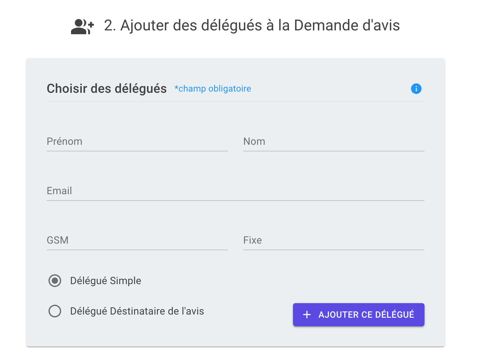
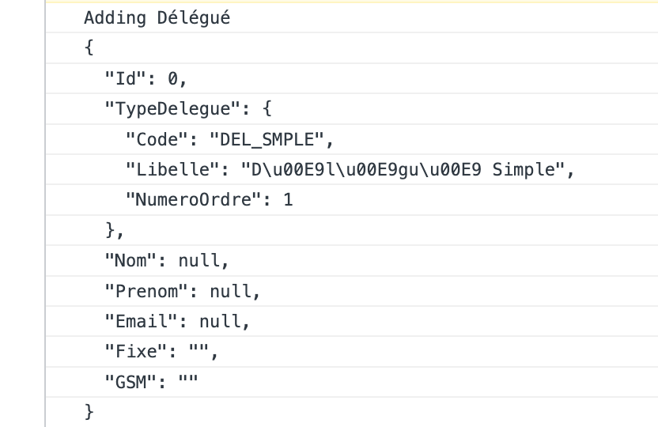

# mdu-06.1 `ResetAsync`


## Validation de formulaire après envoie

```html
<MudForm
    @ref="_form"
    Model="_delegue"
    Validation="_validator.ValidateValue">

	// Plein de composant de formulaire

    <MudButton
        OnClick="AddDelegue">
        Ajouter ce Délégué
    </MudButton>
    
</MudForm>
```

```cs
private async Task AddDelegue()
{
    await _form.Validate();

    @if (_form.IsValid)
    {
        // Process Delegue

        _delegue = new Delegue(); // reset delegue
    }
}
```


La validation du composant `MudRadioGroup` est déclenchée de manière intempestive.

La raison est que ce composant ne possède pas l'attribut `OnlyValidateIfDirty`:


On voit que l'attribut est en bleu ce qui signifie que le composant ne le contient pas.


### `_form.ResetAsync`

On doit donc remettre la validation à zéro de manière programmatique et manuellement:

```cs
private async Task AddDelegue()
{
    await _form.Validate();

    @if (_form.IsValid)
    {
        // Process Delegue

    	await _form.ResetAsync(); // <- ici
        _delegue = new Delegue();
    }
}
```


Ici la validation est aussi remise à zéro une fois le `Delegue` traité.


### `_delegue = new Delegue()`

```cs
private async Task AddDelegue()
{
    await _form.Validate();

    @if (_form.IsValid)
    {
        // Process Delegue

    	await _form.ResetAsync(); // <- ici
        // _delegue = new Delegue();
    }
}
```

Je commente `_delegue = new Delegue()`.

Si je ne remets pas à zéro manuellement le `Model`, la valeur du `MudRadioGroup` n'est pas affectée par `ResetAsync ` :



On voie qu'il y a toujours une sélection après l'envoie.

Les champ ne sont aussi pas tous remis à zéro de manière correcte et on voit que certain champ texte sont mis à null au lieu de `string.Empty` :



Il faut donc pour un fonctionnement sans bug mettre à la fois `_form.ResetAsync` et `_delegue = new Delegue()`:

```cs
await _form.ResetAsync(); 
_delegue = new Delegue();
```

