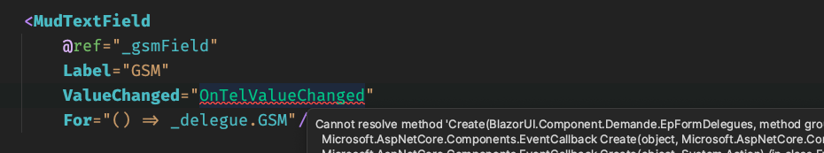
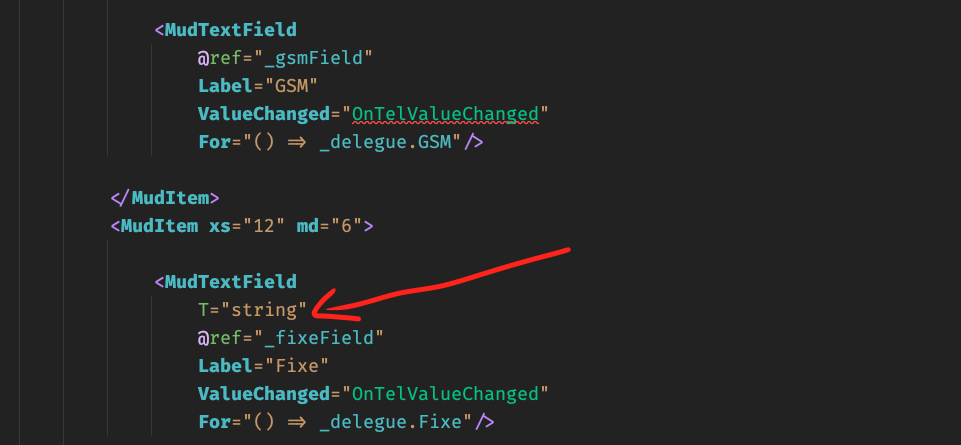

## mud-09 `MudTextField`


## Utiliser `ValueChanged` plutôt que `@bind-Value`

Si on a de la logique à exécuter lorsque la valeur d'un champ `MudTextField` change, il faut utiliser `ValueChanged` plutôt que `@bind-Value`.



```cs
public void OnTelValueChanged(string telValue)
{
    // LOGIQUE   
}
```

Cependant cela génère une erreur car il faut préciser le `Type` du champ:

