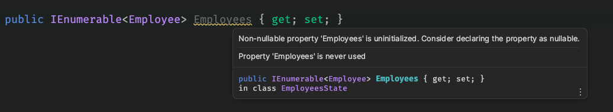
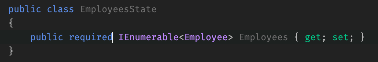

# 02 Créer son `Store`

## `EmployeesStor`

On va d'abord créer un projet `classlib` : `EmployeesStore`:

```bash
dotnet new classlib -o EmployeesStore
```

On doit ajouter une référence vers le projet `Model`.

```bash
dotnet sln add EmployeesStore 

dotnet add EmployeesStore reference Models
```


## `EmployeeState`

Il vaut mieux avoir plusieurs `State` spécifiques, plutôt qu'un gros `State` gébnéraique pour toute l'`app`.

`EmployeesState`

```cs
public class EmployeeState
{
    public IEnumerable<Employee> Employees { get; set; }
}
```

On utilise `IEnumerable` plutôt que `List`, car cette interface n'expose qu'un `Enumerator` et aucune méthodes capables de modifier la collection.


### `required`

En l'état, un `warning` apparaît:



On peut utiliser le nouveau mot clé `required` pour obliger qu'une valeur soit fournie à l'instanciation:



On veut aussi que cette valeur soit attribuer une seule fois à la création de l'objet, on utilise le mot clé `init`:

```cs
public required IEnumerable<Employee> Employees { get; init; }
```

On ne peut attribuer une valeur que dans le `contructeur` ou dans l'`objet initialiseur`.

On veut pouvoir utiliser le mot clé `with` pour facilement faire une copie de l'objet, pour ceci on doit utiliser un `record` plutôt qu'une `class`:

```cs
public record EmployeesState
{
   public static readonly EmployeesState InitialState = new() { 
       Employees = Enumerable.Empty<Employee>()
   };
    
    public required IEnumerable<Employee> Employees { get; init; }
}
```

`Enumerable.Empty<T>`

## Création d'une `Action`

On va ajouter un dossier `Actions` et dedans le record  `EmployeesLoaded`:

```cs
public record EmployeesLoaded(IEnumerable<Employee> Employees);
```

On utilise un `record` car il est immuable.


## Création d'un `Reducer`

On créé une nouvelle `class` : `EmployeesReducers`.

Cette `class` est `static`.

```cs
public static class EmployeesReducers
{
    // Reducers
}
```

Dedans chaque `Reducer` est aussi `static` et une `Pure Function`.

```cs
public static EmployeesState HandleEmployeesLoaded(EmployeesLoaded action, EmployeesState state)
{
    return state with { Employees = action.Employees };
}
```


## Création du `service` : `StoreService`

```cs
public class StoreService
{
    private EmployeesState _state;
    
    public EmployeesState State => _state;
    
    public StoreService()
    {
        _state = EmployeesState.InitialState;
    }
    
    public EventHandler? SateChanged;
    
    public void ApplyAction<T>(T action) where T : class
    {
        _state = action switch
        {
                EmployeesLoaded employeesLoaded 
                    => EmployeesReducers.HandleEmployeesLoaded(EmployeesLoaded, _state),
                _ => throw new InvalidOperationException("this action type is not handled")
        };
        
        StateChanged?.Invoke(this, new EventArgs());
    }
}
```

Syntaxe du `switch` avec `=>` en `pattern matching` (ici sur le type de `action`).

## Enregistrer le `StoreService`

Dans `Program.cs`$

```cs
builder.Services.AddSingleton<StoreService>();
```


## Utiliser le `StoreService`

dans le composant `EmployeesList`

```cs
[Inject] private StoreService { get; set; } = default!;

private List<Employee>? employees;

protected override async Task OnInitializedAsync()
{
    if (employees is null)
    {
        if(StoreService.State.Employees.Any())
        {
            employees = StoreService.State.Employees.ToList();
        }
        
        using var client = ClientFactory.CreateClient("ApiClient");
        
        employees = await client.GetFromJsonAsync<List>Employee>>("api/employees");
        
        if(employees is not null)
        {
            StoreService.ApplyAction(new EmployeesLoaded(employees));
        }
    }
}
```

`Any()` renvoie `true` s'il y a au moins un élément, sinon `false`.


