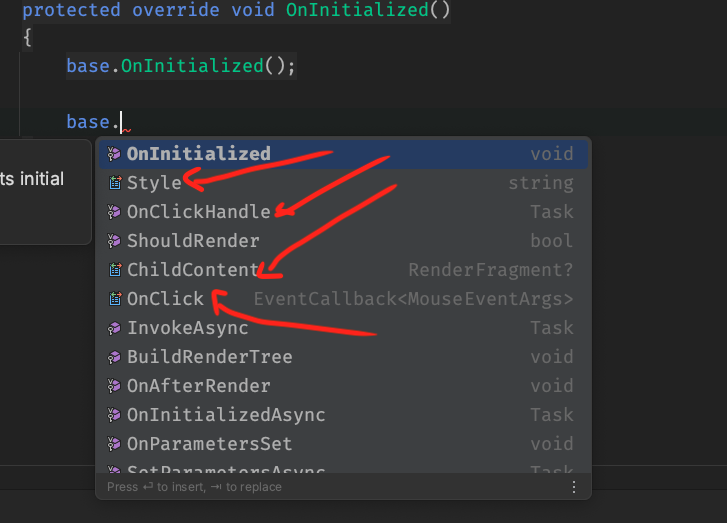
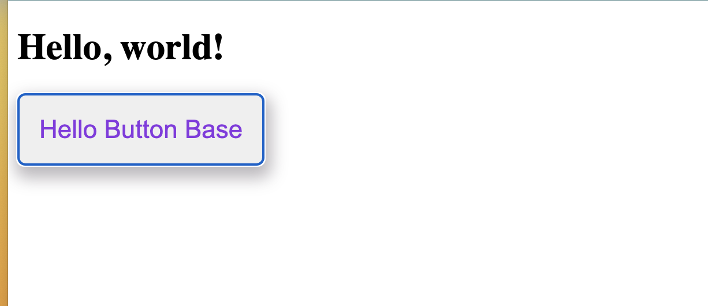
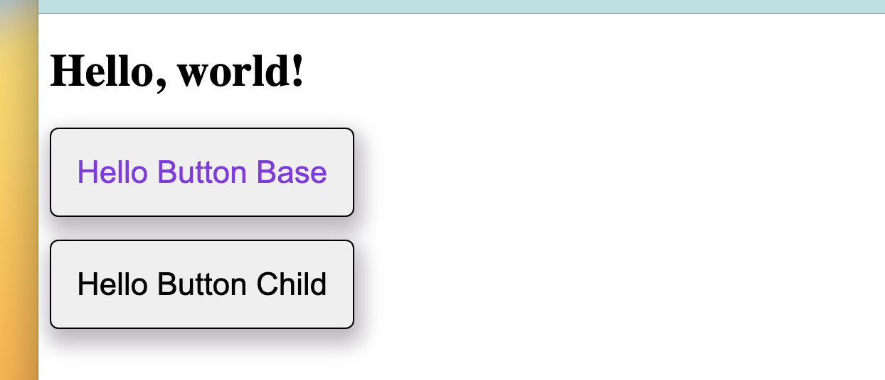
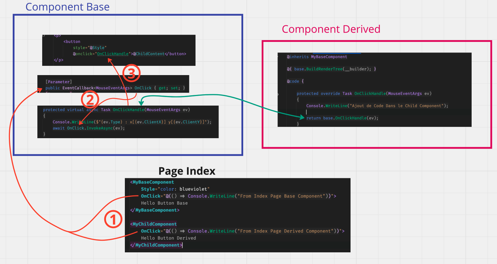
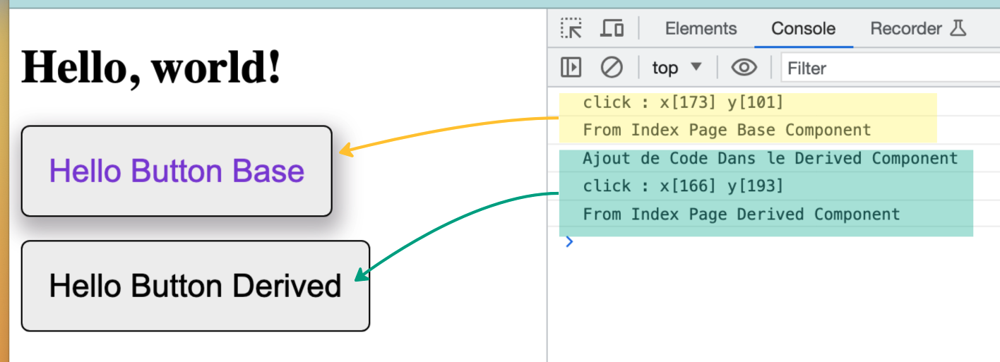

# 12 Hériter d'un `Component`

```html
@inherits MyBaseComponent
```

On peut hériter d'un autre composant et ainsi avoir accès à ses propriétés et ses méthodes.


## Hériter du `component` parent

On a un `component` de base :

`MyBaseComponent`

```ruby
<p>
    <button
        style="@Style"
        @onclick="OnClickHandle">@ChildContent</button>
</p>

@code {
    private string _defaultStyle = "";
    
    [Parameter]
    public EventCallback<MouseEventArgs> OnClick { get; set; }
    [Parameter]
    public string Style { get; set; } = string.Empty;
    [Parameter]
    public RenderFragment? ChildContent { get; set; }

    protected virtual async Task OnClickHandle(MouseEventArgs ev)
    {
        Console.WriteLine($"{ev.Type} : x[{ev.ClientX}] y[{ev.ClientY}]");
        await OnClick.InvokeAsync(ev);
    }
}
```

On crée un `component` héritié :

`MyChildComponent`

```ruby
@inherits MyBaseComponent

@code {
    
}
```



On voit qu'on accès aux propriétés définies dans le parent (ainsi que celle de `ComponentBase` ).


## Rendu du `Component` de `Base`

Si on ajoute ces deux `components` à la `page index`, on obtient:

```ruby
@page "/"

<h1>Hello, world!</h1>

<MyBaseComponent
    Style="color: blueviolet"
    OnClick="@(() => Console.WriteLine("From Index Page"))">
    Hello Button Base
</MyBaseComponent>

<MyChildComponent>Hello Button Child</MyChildComponent>
```



Le `derived component`  ne s'affiche pas :

### Il faut utiliser `base.BuildRenderTree(__builder)`

pour rendre le `component` de `Base`.

```ruby
@inherits MyBaseComponent

@{ base.BuildRenderTree(__builder); }

@code {

}
```




## `override` le gestionnaire d'événement

En créant une méthode gérant l'appelle aux `EventCallback` passées en argument, on peut `overrider` cette méthode et ajouter du code à exécuter en plus du code de `Component Base` dans le `Component Derived`:



On a ainsi enrichi le comportement du `Base Component`:

