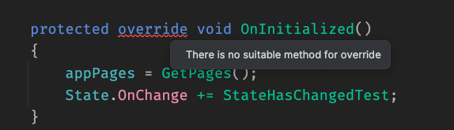

# 12.5 `@implements`

Hérité d'une interface `@inherits IDisposable`  remplace le lien vers `ComponentBase` et du coup nous n'avons plus accès aux :

- `OnInitialized`
- `OnParametersSet`
- `StateHasChanged`
- etc.




À la place on utilise `@implements` :

```ruby
@implements IDisposable

// ...

@code {

    protected override void OnInitialized()
    {
        // ...
    }
    

    public void Dispose()
    {
        Console.WriteLine("Disposing something ...");
    }

}
```

