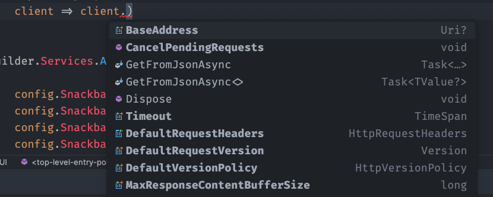
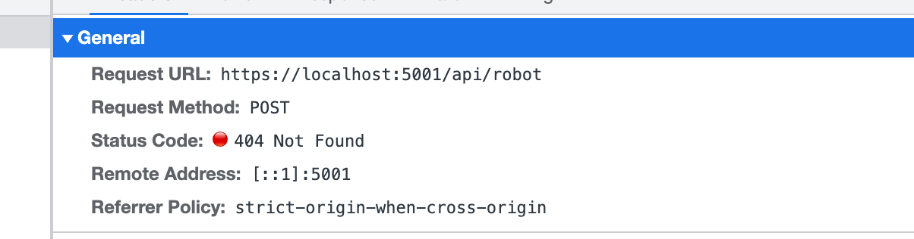

# 06 `HttpClient`

# `Server`

## Dans `Program.cs`

```cs
builder.Services.AddHttpClient(
    "eprolexapi", 
    client => client.BaseAddress = new Uri("http://localhost:8080")
);
```

On utilise un client nommé pour pouvoir donner une valeur à certaines propriétés du client, ici l'adresse de base.




## Utilisation dans un `Repository` : `CreateClient`

```cs
public class DelegueRepository(IHttpClientFactory clientFactory) : IDelegueRepository
{
    public async Task<IEnumerable<Delegue>> GetForDemandeAvis(int demandeAvisId)
    {
        var httpClient = clientFactory.CreateClient("eprolexapi");

        return await httpClient.GetFromJsonAsync<IEnumerable<Delegue>>(
            $"demande-avis/{demandeAvisId}/delegue"
        ) ?? [];
    }

    public async Task Create(Delegue delegueToCreate)
    {
        var httpClient = clientFactory.CreateClient("eprolexapi");
        
        var response = await httpClient.PostAsJsonAsync(
            $"demande-avis/{delegueToCreate.DemandeAvisId}/delegue",
            delegueToCreate
        );
        
        var newDelegue = await response.Content.ReadFromJsonAsync<Delegue>();
        
        if(newDelegue is null) 
            throw new CreateDelegueException("Delegue not created");
    }

    public async Task Update(int DemandeAvisId, Delegue delegueToUpdate)
    {
        var httpClient = clientFactory.CreateClient("eprolexapi");
        
        await httpClient.PutAsJsonAsync(
            $"demande-avis/{DemandeAvisId}/delegue/{delegueToUpdate.Id}", 
            delegueToUpdate
        );
    }

    public async Task Delete(int DemandeAvisId, int delegueToDeleteId)
    {
  		var httpClient = clientFactory.CreateClient("eprolexapi");
        
        await httpClient.DeleteAsync(
            $"demande-avis/{DemandeAvisId}/delegue/{delegueToDeleteId}"
        );
    }
}
```

Pour utiliser les méthodes `GetFromJsonAsync`, `PostAsJsonAsync`, `ReadFromJsonAsync` et `PutAsJsonAsync`, il faut la bibliothèque :`System.Net.Http.Json`

`GlobalUsings.cs`

```cs
// ...
global using System.Net.Http.Json;
```


# `WebAssembly`

## Poster des données : `PostAsJsonAsync`

### Dans la `page` : `MyPage.razor`

Enhaut de notre fichier on injecte `HttpClient` :

```cs
@inject HttpClient httpClient
```


```cs
private async Task HandleFormSubmit()
{
  var response = await httpClient.PostAsJsonAsync("/api/robot", robotModel);

  if(response.IsSuccessStatusCode)
  {
    showSuccess = true;
  }
}
```

Dans notre formulaire on a :

```html
<form @onsubmit="HandleFormSubmit">
  // ...
</form>
```

On voit que le `service` est déjà injecté dans le fichier `Program.cs` :

```cs
using System.Net.Http;

builder.Services.AddScoped(sp => new HttpClient { BaseAddress = new Uri(builder.HostEnvironment.BaseAddress) });
```

La `BaseAddress` étant celle du serveur de dev de `Blazor` on a :



On a un `payload` en `json` :


### En utilisant une classe `static` pour gérer les `Endpoints`

```cs
@page "/vehicle/Create"

@inject HttpClient httpClient
@inject NavigationManager navigationManager

<h3 class="card-title">Create New Vehicle</h3>

<EditForm Model="@vehicle" OnValidSubmit="CreateVehicle">
    // ...
</EditForm>

@code {
    Vehicle vehicle = new();
	// ...
            
    private async Task CreateVehicle()
    {
        await httpClient.PostAsJsonAsync(Endpoints.VehiclesEndpoint, vehicle);
        navigationManager.NavigateTo("/vehicles");
    }
}
```


## Lister des données : `GetAsJsonAsync`

### Injection du service `HttpClient`

```cs
@page "/makes"
@inject HttpClient httpClient
```
### `Template` du tableau
```html

<h3 class="card-title">Makes List</h3>

@if(Makes == null)
{
<div class="alert alert-info">Loading Makes ...</div>
}
else
{
<table class="table table-responsive">
    <thead>
        <tr>
            <th>Name</th>
            <th>Actions</th>
        </tr>
    </thead>
    <tbody>
        @foreach(var make in Makes)
        {
        <tr>
            <td>@make.Name</td>
            <td>
                <a href="/makes/view/@make.Id" class="btn btn-primary">
                    <span class="oi oi-book"></span>
                </a>
                <a href="/makes/edit/@make.Id" class="btn btn-warning">
                    <span class="oi oi-pencil"></span>
                </a>
                <button 
                        class="btn btn-danger" 
                        @onclick="@(() => Delete(make.Id))">
                    <span class="oi oi-delete"></span>
                </button>
            </td>
        </tr>
        }
    </tbody>
</table>
}
```

### Récupération des données

```cs
@code {
    // Créer le model
    private List<Make> Makes;

    protected async override Task OnInitializedAsync()
    {
        Makes = await httpClient.GetFromJsonAsync<List<Model>>("api/makes");
    }
    
    // Implémentation de Delete
}
```

#### ! On récupère les données dans `OnInitializedAsync`

## Suppression des données : `DeleteAsync`

Avec un `prompt` en `javascript`

```cs
@inject IJSRuntime js
```


```cs
private async Task Delete(int makeId)
{
    var make = Makes.First(q => q.Id == makeId);

    if(await js.InvokeAsync<bool>("confirm", $"Do you want to delete {makeId}"))
    {
        await httpClient.DeleteAsync($"api/makes/{makeId}");
        // Reload the Makes list
        await OnInitializedAsync(); 
    }
}
```


