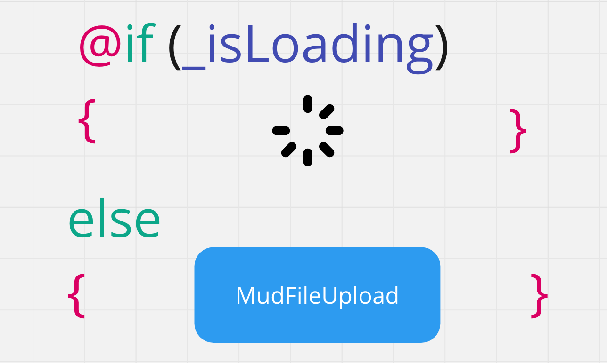

# 11 `File` Upload

## `InputFile`

Le composant `InputFile` nous permet de télécharger un fichier dans Blazor :

```html
<InputFile OnChange="OnChangeHandle"/> <br/>
```

L'événement `onchange` reçoit un `InputFileChangeEventArgs` qui entre autre contient soit un `IBrowserFile` soit une liste `IReadOnlyList<IBrowserFile>`.

### `IBrowserFile`

```cs
public interface IBrowserFile
{
    string Name { get; }
    DateTimeOffset LastModified { get; }
    long Size { get; }
    string ContentType { get; }

    Stream OpenReadStream(long maxAllowedSize = 512000, CancellationToken cancellationToken = default (CancellationToken));
}
```

C'est la méthode `OpenReadStream` qui va nous permettre de récupérer (`uploader`) le fichier.


## `Upload` file : `OpenReadStream`

```cs
public async Task OnChangeHandle(InputFileChangeEventArgs args)
{
    IBrowserFile file = args.File;

    var uploadPath = Path.Combine(
        Environment.CurrentDirectory,
        "UploadedFiles",
        $"{DateTime.Now.Ticks}-{file.Name}"
    );

    await using var fs = File.Create(uploadPath);

    await file.OpenReadStream().CopyToAsync(fs);
}
```


> ## Problème avec `@if`
>
> 
>
> Dans la plupart des cas, lorsqu'une action asynchrone est lancée, un composant `loader` est affiché à la place d'un bouton ou d'une liste le temps que l'action finisse.
>
> ```
> My File Upload Exception: Microsoft.JSInterop.JSException: Cannot read properties of null (reading '_blazorFilesById')
> TypeError: Cannot read properties of null (reading '_blazorFilesById')
> ```
>
> Le problème avec `MudFileUpload`, c'est que la balise `input type=file` sous-jacente contient le lien vers le `stream` du fichier chez le client. En supprimant le composant pour afficher le loader, on supprime également ce lien (cette référence).
>
> ### Solution
>
> Il suffit de réorganiser son code pour ne pas retirer le composant `MudFileUpload` lors du chargement du fichier :
>
> ```html
> <MudFileUpload>
> 
>     <ActivatorContent>
> 
>         @if (_isAdding)
>         {
>             <EpLoader/>
>         }
>         else
>         {
>             <MudButton>
>                 Télécharger un mandat
>             </MudButton>
>         }
> 
>     </ActivatorContent>
> 
> </MudFileUpload>
> ```
>
> 


> ## Gérer les `exceptions`
>
> ### ! Obligatoirement gérer les `exceptions`
>
> Dans `Blazor Server` les `exceptions` ne sont pas automatiquement remontées dans la console, il faut donc gérer manuellement le log des problèmes :
>
> ```cs 
> public async Task OnChangeHandle(InputFileChangeEventArgs args)
> {
>  try
>  {
>      IBrowserFile file = args.File;
> 
>      var uploadPath = Path.Combine(
>          Environment.CurrentDirectory,
>          "UploadedFiles",
>          $"{DateTime.Now.Ticks}-{file.Name}"
>      );
> 
>      await using var fs = File.Create(uploadPath);
> 
>      await file.OpenReadStream().CopyToAsync(fs);
>  }
>  catch (Exception e)
>  {
>      Console.WriteLine("Exception launched " + e);
>      throw;
>  }
> }
> ```
>
> Sans ce traitement on prend le risque de ne pas comprendre les problèmes rencontrés.


## Gérer la taille maximum

Par défaut on a `maxAllowedSize = 512000`, 
on peut facilement modifier cette valeur :

```cs
long maxAllowedSize = 1024 * 1024 * 5; // 5Mo

await file.OpenReadStream(maxAllowedSize).CopyToAsync(fs);
```


## Modifier la taille d'une image

 ### ! Si la méthode n'arrive pas à redimensionner l'image, le programme se bloque et on ne reçoit même pas une `exception`.
> Tente de convertir le fichier image actuel en un nouveau fichier du type spécifié et des dimensions maximales du fichier. Attention : rien ne garantit que le fichier sera converti, ni même qu'il s'agira d'un fichier image valide, que ce soit avant ou après la conversion. La conversion `est demandée dans le navigateur` avant d'être transférée au code .NET, de sorte que les données résultantes doivent être considérées comme non fiables. 


```cs
IBrowserFile file = args.File;

var imageResized = await file.RequestImageFileAsync("image/png", 300, 300);

await using var fsTwo = imageResized.OpenReadStream();

var buffer = new byte[fsTwo.Length];

var bytesReaded = await fsTwo.ReadAsync(buffer, 0, buffer.Length);

imagePreview = $"data:image/png;base64,{Convert.ToBase64String(buffer)}";
```

Puis pour l'afficher :

```react
@if (imagePreview != "")
{
    
}
```

