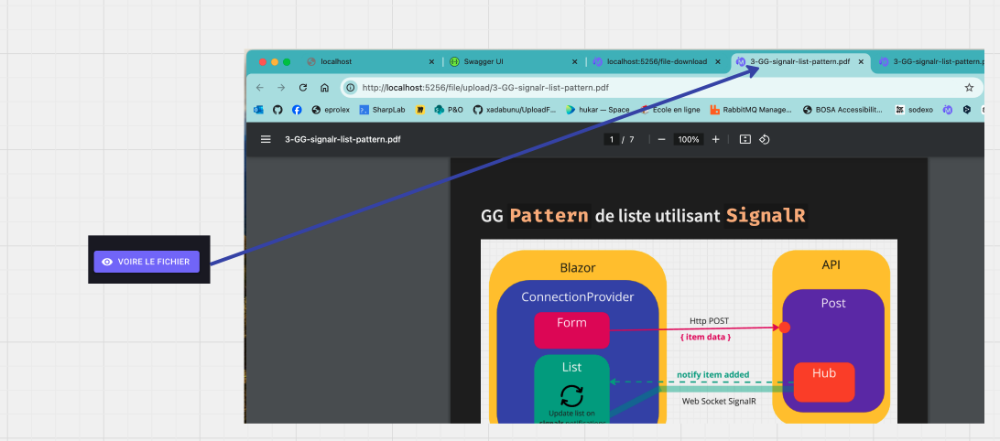
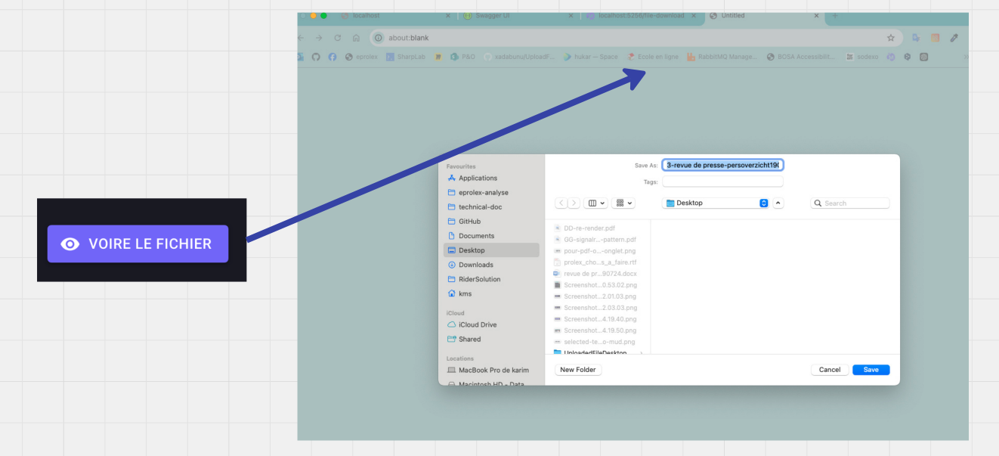
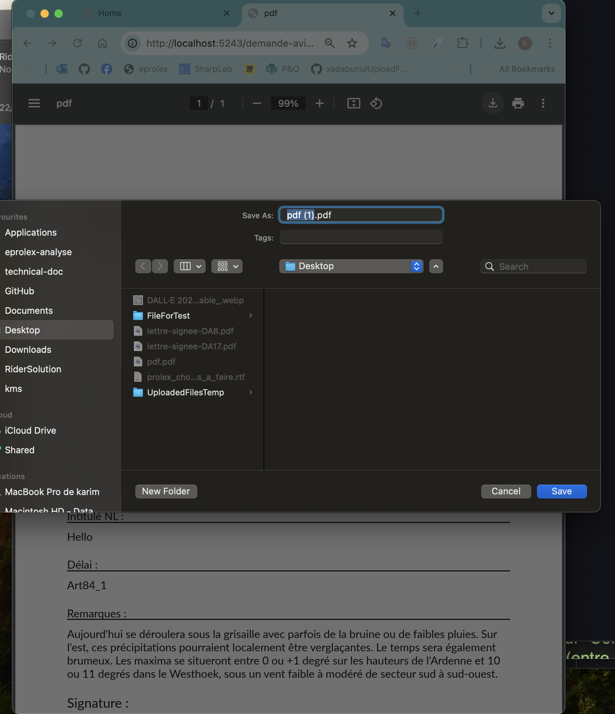
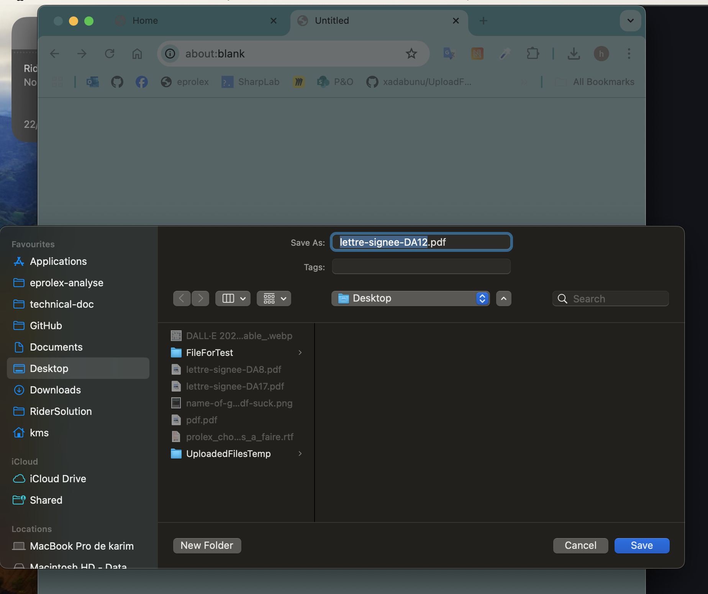
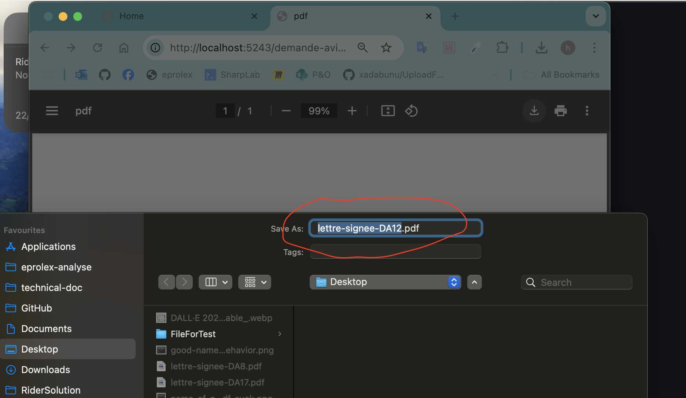

# 12 File `Download`

Il faut un `endpoint` qui recherche et renvoie un `Results.File` et un bouton avec un lien vers un fichier particulier.


## Le `endpoint`

```cs
app.MapGet("/file/dowload/{documentId}", (int documentId, DocumentRepository repo) =>
{
    var document = repo.GetDocumentById(documentId)
    
    var path = Path.Combine(
        "/Users/kms/Desktop/UploadedFileDesktop", document.FileName
    );
    
    // si on enregistre le code MIME 
    // return Results.File(path, document.MIME);
    return Results.File(path, "application/pdf");
});
```

L'implémentation de `Document` et `DocumentRepository` n'a pas d'importance ici.

> ###  ! Différent `Content-Type` différent comportement
>
> Pour un `application/pdf`, le navigateur ouvre une visionneuse, tandis que pour un document `docx` de type `application/vnd.openxmlformats-officedocument.wordprocessingml.document`, le navigateur propose un téléchargement :
>
> ### Pour un `PDF`
>
> 
>
> ### Pour un `docx`
>
> 
>
> Cela ouvre aussi un nouvel onglet (`_blank`), mais cette fois seulement en proposant de sauver le fichier sur son disque.


## Comportement de `Results.File`

Si je passe seulement deux arguments à `File` :

```cs
return Results.File(pdf, "application/pdf");
```

Le navigateur ouvrira un nouvel onglet :



Mais de cette manière, on ne peut donner un nom par défaut, on a ici `pdf.pdf` !

On peut passer un nom par défaut à `File` :

```cs
return Results.File(pdf, "application/pdf", $"lettre-signee-DA{id}.pdf");
```

Mais alors le comportement change et le `PDF` ne s'affiche plus dans le lecteur du navigateur :



Le `PDF` est seulement proposer au téléchargement.

Pour avoir le meilleur des deux mondes, il faut utiliser `HttpResponse` plutôt que le `IResults` de `File` :

```cs
app.MapGet("/demande-avis/{id:int}/pdf", async (int id, IHttpClientFactory factory, QuestPdfService questPdf, HttpResponse response) =>
{
    // ...
    
    response.ContentType = "application/pdf";
    response.Headers.Append(
        "Content-Disposition", 
        $"inline; filename=\"lettre-signee-DA{id}.pdf\""
    );
    
    await response.Body.WriteAsync(pdf);
    
    return Results.Empty;
```



On a ici le nom par défaut et la possibilité d'utiliser le lecteur du navigateur.


## Le bouton (en `MudBlazor`)

```react
<MudButton 
    Variant="Variant.Filled"
    Color="Color.Primary"
    Target="_blank"
    StartIcon="@Icons.Material.Filled.RemoveRedEye"
    Href="@($"/file/download/{MyDocument.Id}")">
    Voire le fichier
</MudButton>                                           
```

```cs
@code {
	[Parameter] public Document? MyDocument { get; set; }
}   
```

