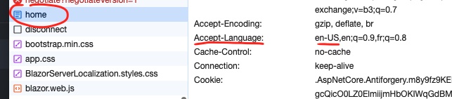
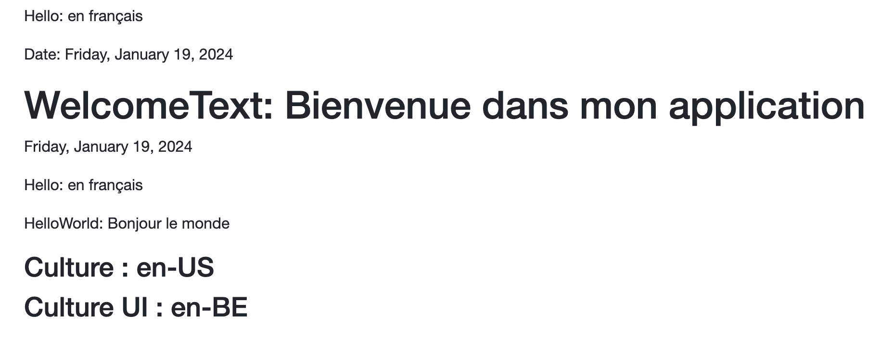
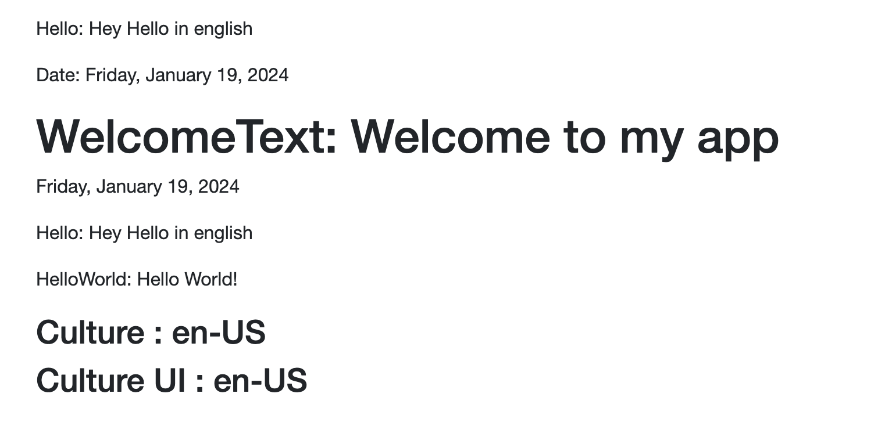
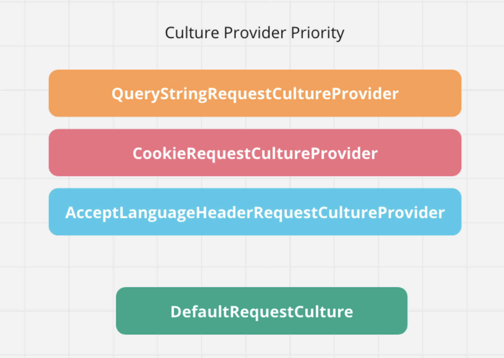

# 16.5 `Localisation` avec `Blazor Server`

## Ce qui est pris en charge

`IStringLocalizer` et `IStringLocalizer<T>`.

L'en-tête `Accept-Language` définit par le navigateur :


## Les termes

`Globalization` : date, nombre et devises.

`Localization` : fichiers de traduction.

Le navigateur parle de `langue` alors que `.net` parle de `culture`.


## Différence avec `Webassembly`

Il semble que pour changer la `culture` on utilise `CultureInfo.CurrentCulture` et non pas `CultureInfo.DefaultThreadCurrentCulture` comme en `wasm`.


## Changer la `Culture`

On peut changer la `culture` seulement en jouant avec `CultureInfo.CurrentCulture` et `CultureInfo.CurrentUICulture` :

```ruby
@page "/"
@using System.Globalization

<p>
    @foreach (var culture in culturesSupported)
    {
        <button @onclick="() => ChangeCulture(culture)">@culture.Name</button>
    }
</p>

<p>Current Culture : @CultureInfo.CurrentCulture</p>
<p>Current Culture UI : @CultureInfo.CurrentUICulture</p>
<p>Default Thread Culture : @CultureInfo.DefaultThreadCurrentCulture</p>
<p>Default Thread Culture UI : @CultureInfo.DefaultThreadCurrentUICulture</p>

@code {
    CultureInfo[] culturesSupported = [
        new CultureInfo("en"), 
        new CultureInfo("fr-BE")
    ];

    void ChangeCulture(CultureInfo culture)
    {
        CultureInfo.CurrentCulture = culture;
        CultureInfo.CurrentUICulture = culture;
    }
}
```


On remarque la légère différence entre `en-BE` et `en` au niveau de la date : `12 january` et `january 12`.

On remarque que `Default Thread Culture` n'est pas utilisé/renseigné côté `server`.

> Jusqu'à présent aucun middleware n'a été ajouté à `Program.cs`

## Fichier `.resx`

On créé un dossier `Resources` (peut importante le nom, le plus souvent `Resources`) et dedans un fichier `HomeRsx.resx` par exemple (attention de ne pas donner le nom d'une classe existante). 


`Rider` créé un fichier `.Designer.cs` pour nous.

>  ! attention aux Settings de `Rider`,  `ResX Genrator` doit être `enable` et il est `disabled` par défaut.
>
> 

On ajoute une nouvelle `culture` dans l'interface de `Localization Manager` :


## Exemple avec du texte des fichiers `.resx`

```cs
@page "/"
@using System.Globalization

<PageTitle>@HomeRsx.PageTitle</PageTitle>

<h1>@HomeRsx.HelloEvery</h1>

<h3>Date : @DateTime.Now.ToLongDateString()</h3>

<p>
    @foreach (var culture in culturesSupported)
    {
        <button @onclick="() => ChangeCulture(culture)">@culture.Name</button>
    }
</p>

<p>@HomeRsx.TextToLocalize</p>

<p>Current Culture : @CultureInfo.CurrentCulture</p>
<p>Current Culture UI : @CultureInfo.CurrentUICulture</p>

@code {
    CultureInfo[] culturesSupported = [new CultureInfo("en"), new CultureInfo("fr-BE")];

    void ChangeCulture(CultureInfo culture)
    {
        CultureInfo.CurrentCulture = culture;
        CultureInfo.CurrentUICulture = culture;
    }
}
```

On utilise la classe `HomeRsx` généré automatiquement par `Rider` pour facilement accéder à la traduction.

`HomeRsx.Designer.cs`

```cs
internal class HomeRsx {
// ...

    internal static string TextToLocalize {
        get {
            return ResourceManager
                .GetString("TextToLocalize", resourceCulture);
        }
    }
}
```


Au chargement la `culture` est celle de l'ordinateur où tourne `Blazor Server`.


## `Settings` dans `Program.cs`

On doit juste ajouter :

```cs
builder.Services.AddLocalization();
```

Par défaut la `culture` de l'application `Blazor Server` est celle du système d'exploitation :


Dans `Home.razor`

```ruby
<h1>Culture : @CultureInfo.CurrentCulture</h1>
<h1>Culture UI : @CultureInfo.CurrentUICulture</h1>
```


> Sans `culture` par défaut on voit que plus haut les textes sont ceux du fichier `.resx` par défaut et le reste est déterminé par la culture de l'ordinateur sur lequel l'application tourne, ici `en-BE`.


### Activer la `Localization`

Pour qu'une culture soit chargée, il ne suffit qu'elle soit demandée par un `CultureProvider` (par exemple `Accept-Language`), elle doit être ajoutée aux `supported cultures`.
```cs
// dans Program.cs
builder.Services.AddLocalization();

var localizationOptions = new RequestLocalizationOptions();

app.UseRequestLocalization(localizationOptions);
```

Le navigateur est réglé sur `en-US` et il existe un fichier `AppRsx.en-us.resx`.

Le `header Accept-Language` est bien envoyé :



Par contre `Culture` et `CultureUI` reste sur `en-BE` les réglages de la machine serveur


Par contre si je passe les `supported cultures` je prends alors bien en compte la `culture` passé par `Accept-Language` :

```cs
var localizationOptions = new RequestLocalizationOptions()
    .AddSupportedCultures(supportedCultures);

app.UseRequestLocalization(localizationOptions);
```



On voit que la date est formatée différemment mais que la bonne traduction n'est pas chargée.

```cs
var localizationOptions = new RequestLocalizationOptions()
    .AddSupportedCultures(supportedCultures)
    .AddSupportedUICultures(supportedCultures);

app.UseRequestLocalization(localizationOptions);
```




### Définir la culture par défaut

Dans `Program.cs` avant `app.MapRazorComponents`

```cs
var localizationOptions = new RequestLocalizationOptions()
    .SetDefaultCulture(supportedCultures[0]);

app.UseRequestLocalization(localizationOptions);
```

Voici une configuration complète :

```cs
string[] supportedCultures = ["fr-FR", "en-US", "de-CH"];

var localizationOptions = new RequestLocalizationOptions()
    .SetDefaultCulture(supportedCultures[0])
     .AddSupportedCultures(supportedCultures)
     .AddSupportedUICultures(supportedCultures);

app.UseRequestLocalization(localizationOptions);
```


## Gérer les interférences avec le `header` `Accept-Language`

Les `CultureProvider` par défaut `override` le comportement définit par `DefaultRequestCulture`.

On peut les désactiver comme ceci :

```cs
localizationOptions.RequestCultureProviders.Clear();
```

En fait c'est une question de priorité des `providers` :



`DefaultRequestCulture` n'étant utilisé qu'après avoir regardé une valeur possible chez les `providers`.


