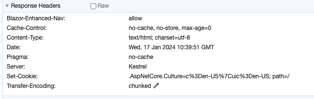
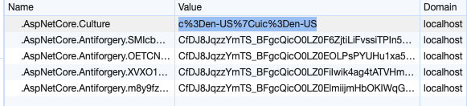

# 16.6 `Localization` avec les `Cookies` dans `Blazor Server`

## Définir la `Culture` avec les `Cookies`

> Ayant essayé sans succès d'utiliser plutôt `LocalStorage` avec `Blazored.LocalStorage`, je n'ai pas réussi à créer un `CustomProvider`  car `LocalStorage` utilisant `JSInterop` doit être appelé uniquement dans le `hook`  (cycle de vie)`OnAfterRender`uniquement.

On va écrire un `cookie` dans le navigateur en se plaçant dans `App.razor` :

```csharp
// App.razor

@code {

    [CascadingParameter] public HttpContext? Context { get; set;  }

    protected override void OnInitialized()
    {
        var cookieName = CookieRequestCultureProvider.DefaultCookieName;
        var cookieValue = CookieRequestCultureProvider.MakeCookieValue(
            new RequestCulture(CultureInfo.CurrentCulture, CultureInfo.CurrentUICulture)
        );

        Context?.Response.Cookies.Append(cookieName, cookieValue);
    }
}
```

Ce code équivaut à :

```ruby
protected override void OnInitialized()
{
    Context?.Response.Cookies.Append(
        ".AspNetCore.Culture", "c=de-CH|uic=de-CH"
        );
}
```

`.AspNetCore.Culture` étant le nom du `Cookie` imposé par `Asp.Net` et la valeur sous la forme `c=%LANGCODE%|uic=%LANGCODE%`.

On injecte le `HttpContext` et on renvoie un `Cookie` dans la `Response`.






## Composant `LangSelector`

```cs
@inject NavigationManager Navigation

<p>
    @foreach (var language in _supportedCultures)
    {
        <button 
        	class="btn btn-primary" 
            @onclick="@(() => ChangeCulture(language))">
            @language
        </button>
    }
</p>

@code {
    private string[] _supportedCultures = ["fr-BE", "en-US", "de-CH"];

    void ChangeCulture(string lang)
    {
        if (CultureInfo.CurrentCulture.Name != lang)
        {
            var uri = new Uri(Navigation.Uri)
                .GetComponents(UriComponents.PathAndQuery, UriFormat.Unescaped);
            
            var uriEscaped = Uri.EscapeDataString(uri);

            Navigation.NavigateTo(
                $"Culture/Set?culture={lang}&redirectUri={uriEscaped}",
                forceLoad: true);
        }
    }  
}
```

On utilise `NavigateTo` pour accéder au `Endpoint` de `localization`.


## Création d'un `Endpoint` pour modifier le `Cookie`

```cs
app.MapGet("culture/set", (HttpContext context, string culture, string redirectUri) =>
{
    var cookieName = CookieRequestCultureProvider.DefaultCookieName;
    var cookieValue = CookieRequestCultureProvider.MakeCookieValue(
        new RequestCulture(culture, culture)
    );
    
    context.Response.Cookies.Append(cookieName, cookieValue);

    return Results.LocalRedirect(redirectUri);
});
```

> `LocalRedirect` est utilisé par sécuriité (consel de la doc `Microsoft`)