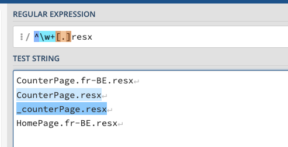
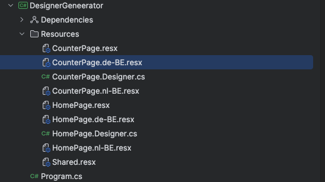
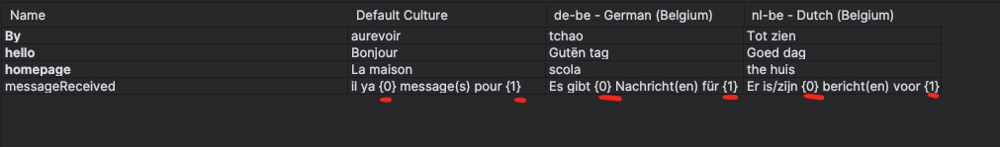

# 16.7 Programme pour générer un fichier `designer.cs`

Suite aux caprices de la génération automatique de fichier `*.designer.cs`, il peut être pratique de les générer manuellement quand nécessaire.


## Programme `console`

```cs
using System.Xml.Linq;
using System.Text;
using System.Text.RegularExpressions;

Console.WriteLine("Designer Generator");

const string @namespace = "DesignerGenerator.Resources";

var projectRoot = Path.GetFullPath(Path.Combine(AppContext.BaseDirectory, "..", "..", ".."));
var resourcesDirectoryPath = Path.Combine(projectRoot, "Resources");

var files = Directory.EnumerateFiles(resourcesDirectoryPath);

var defaultFiles = files.Select(f => Path.GetFileName(f)).Where(HasOnlyOneDot);

foreach (var file in defaultFiles) {
    CreateDesignerFile(file);
}

bool HasOnlyOneDot(string strToTest) => Regex.IsMatch(strToTest, "^\\w+[.]resx$");

void CreateDesignerFile(string fileName) {
    
    var className = Path.GetFileNameWithoutExtension(fileName);
    var resxPath = Path.Combine(resourcesDirectoryPath, fileName);
    
    var outputPath = Path.ChangeExtension(resxPath, ".Designer.cs");
    
    if (!File.Exists(resxPath)) {
        Console.WriteLine($"❌ Fichier .resx introuvable : {resxPath}");
        return;
    }

    Console.WriteLine($"📦 Lecture des ressources depuis : {resxPath}");

    var doc = XDocument.Load(resxPath);
    var entries = doc.Root?
        .Elements("data")
        .Where(e => e.Attribute("name") != null)
        .Select(e => e.Attribute("name")!.Value)
        .Distinct()
        .OrderBy(name => name)
        .ToList();

    if (entries is null or { Count: 0 }) {
        Console.WriteLine("⚠️ Aucun élément trouvé dans le fichier resx.");
        return;
    }

    var sb = new StringBuilder(
        $$"""
         // Auto-generated from {{Path.GetFileName(resxPath)}}

         namespace {{@namespace}};

         using System.Globalization;
         using System.Resources;

         public class {{className}}
         {
             private static readonly ResourceManager resourceManager =
                 new ResourceManager("{{@namespace}}.{{className}}", typeof({{className}}).Assembly);

             private static CultureInfo resourceCulture;

             public static CultureInfo Culture
             {
                 get => resourceCulture;
                 set => resourceCulture = value;
             }

         """
     );

    foreach (var name in entries) {
        sb.AppendLine($$"""
                            public static string {{name}} => resourceManager.GetString(nameof({{name}}), resourceCulture) ?? "";
                        """);
    }

    sb.AppendLine("}");

    File.WriteAllText(outputPath, sb.ToString());
    Console.WriteLine($"✅ Fichier généré : {outputPath}");
}
```

Le `program` va chercher dans le dossier `Resources` tous les fichier n'ayant qu'un point (`.`) et terminant par `resx` :



Seul les fichier par défaut doivent générer un fichier `designer`, les traductions étant dynamiquement chargées.



Il va ensuite générer un fichier `*.Designer.cs` en parcourant les balises `data` du fichier `resx` :

```xml
<root>
    <xsd:schema id="root" xmlns="" xmlns:xsd="http://www.w3.org/2001/XMLSchema" xmlns:msdata="urn:schemas-microsoft-com:xml-msdata">
        
      // ...
        
    <data name="hello" xml:space="preserve">
        <value>Bonjour</value>
    </data>
    <data name="By" xml:space="preserve">
        <value>aurevoir</value>
    </data>
    <data name="homepage" xml:space="preserve">
        <value>La maison</value>
    </data>
</root>
```

Et pour chaque entrée, créer une propriété:

`HomePage.Designer.cs`

```cs
public class HomePage
{
    private static readonly ResourceManager resourceManager =
        new ResourceManager("DesignerGeneerator.Resources.HomePage", typeof(HomePage).Assembly);

    private static CultureInfo resourceCulture;

    public static CultureInfo Culture
    {
        get => resourceCulture;
        set => resourceCulture = value;
    }
    public static string By => resourceManager.GetString(nameof(By), resourceCulture) ?? "";
    public static string hello => resourceManager.GetString(nameof(hello), resourceCulture) ?? "";
    public static string homepage => resourceManager.GetString(nameof(homepage), resourceCulture) ?? "";
}
```


## Utilisation dans un `Component`

Cela permet de ne plus avoir de `magic string` dans le code et d'utiliser la complétion.

```ruby
<h3>hello: @HomePage.hello</h3>
```

Pas besoin de `StringLocalizer<HomePage>` ni de créer une classe vide `HomePage.cs`.


## Version avec paramètres `@HomePage.messageFormatted(5, "Toto")`

Recherche d'éventuel placeholder de la forme `{0}`, `{1}`, ...

```cs
// Détection des placeholders {0}, {1}, ...
var matches = Regex.Matches(entry.Value, @"\{(\d+)\}")
                   .Cast<Match>()
                   .Select(m => int.Parse(m.Groups[1].Value))
                   .Distinct()
                   .OrderBy(i => i)
                   .ToList();

if (matches.Any())
{
    var parameters = string.Join(", ", matches.Select(i => $"object arg{i}"));
    var arguments = string.Join(", ", matches.Select(i => $"arg{i}"));

    sb.AppendLine();
    sb.AppendLine($"    public static string {entry.Name}Formatted({parameters}) =>");
    sb.AppendLine($"        string.Format({entry.Name}, {arguments});");
}
```


Code complet de `Program.cs`

```cs
using System.Globalization;
using System.Resources;
using System.Text;
using System.Text.RegularExpressions;
using System.Xml.Linq;

Console.WriteLine("Designer Generator");

const string @namespace = "DesignerGenerator.Resources";

var projectRoot = Path.GetFullPath(Path.Combine(AppContext.BaseDirectory, "..", "..", ".."));
var resourcesDirectoryPath = Path.Combine(projectRoot, "Resources");

var files = Directory.EnumerateFiles(resourcesDirectoryPath);
var defaultFiles = files.Select(Path.GetFileName).Where(f => Regex.IsMatch(f ?? "", @"^\w+\.resx$"));

foreach (var file in defaultFiles)
{
    CreateDesignerFile(file!);
}


void CreateDesignerFile(string fileName)
{
    var className = Path.GetFileNameWithoutExtension(fileName);
    var resxPath = Path.Combine(resourcesDirectoryPath, fileName);
    var outputPath = Path.ChangeExtension(resxPath, ".Designer.cs");

    if (!File.Exists(resxPath))
    {
        Console.WriteLine($"❌ Fichier .resx introuvable : {resxPath}");
        return;
    }

    Console.WriteLine($"📦 Lecture des ressources depuis : {resxPath}");

    var doc = XDocument.Load(resxPath);
    var entries = doc.Root?
        .Elements("data")
        .Where(e => e.Attribute("name") != null && e.Element("value") != null)
        .Select(e => new
        {
            Name = e.Attribute("name")!.Value,
            Value = e.Element("value")!.Value
        })
        .DistinctBy(e => e.Name)
        .OrderBy(e => e.Name)
        .ToList();

    if (entries is null or { Count: 0 })
    {
        Console.WriteLine("⚠️ Aucun élément trouvé dans le fichier resx.");
        return;
    }

    var sb = new StringBuilder($$"""
        // Auto-generated from {{Path.GetFileName(resxPath)}}

        namespace {{@namespace}};

        using System.Globalization;
        using System.Resources;

        public class {{className}}
        {
            private static readonly ResourceManager resourceManager =
                new ResourceManager("{{@namespace}}.{{className}}", typeof({{className}}).Assembly);

            private static CultureInfo resourceCulture;

            public static CultureInfo Culture
            {
                get => resourceCulture;
                set => resourceCulture = value;
            }

        """);

    foreach (var entry in entries)
    {
        sb.AppendLine($"    public static string {entry.Name} => resourceManager.GetString(nameof({entry.Name}), resourceCulture) ?? \"\";");

        // Détection des placeholders {0}, {1}, ...
        var matches = Regex.Matches(entry.Value, @"\{(\d+)\}")
                           .Cast<Match>()
                           .Select(m => int.Parse(m.Groups[1].Value))
                           .Distinct()
                           .OrderBy(i => i)
                           .ToList();

        if (matches.Any())
        {
            var parameters = string.Join(", ", matches.Select(i => $"object arg{i}"));
            var arguments = string.Join(", ", matches.Select(i => $"arg{i}"));

            sb.AppendLine();
            sb.AppendLine($"    public static string {entry.Name}Formatted({parameters}) =>");
            sb.AppendLine($"        string.Format({entry.Name}, {arguments});");
        }

        sb.AppendLine();
    }

    sb.AppendLine("}");

    File.WriteAllText(outputPath, sb.ToString());
    Console.WriteLine($"✅ Fichier généré : {outputPath}");
}

```


### Utilisation dans un fichier `resx`




### Utilisation dans un `component`

```ruby
<h3>messages: @HomePage.messageReceived</h3>
<h3>messages: @HomePage.messageReceivedFormatted(5, "Toto")</h3>
```


