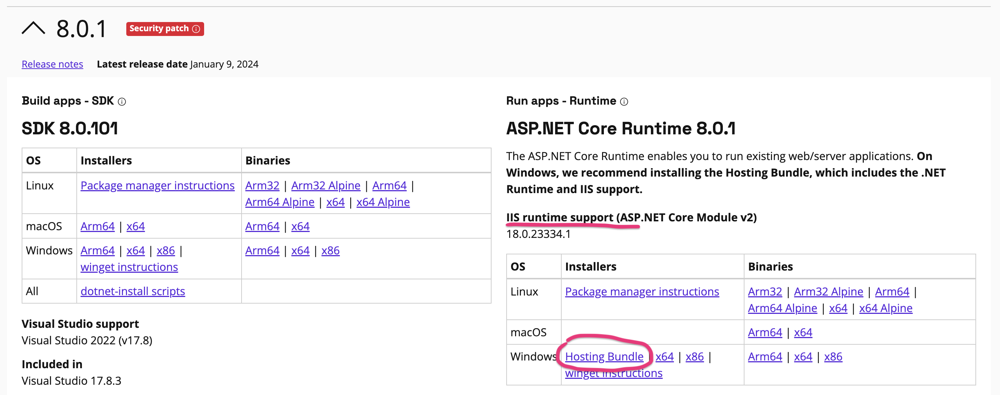
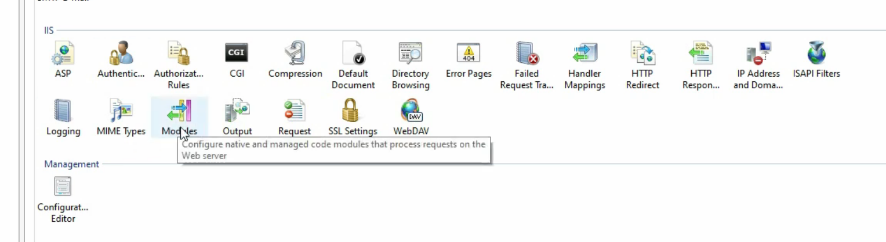
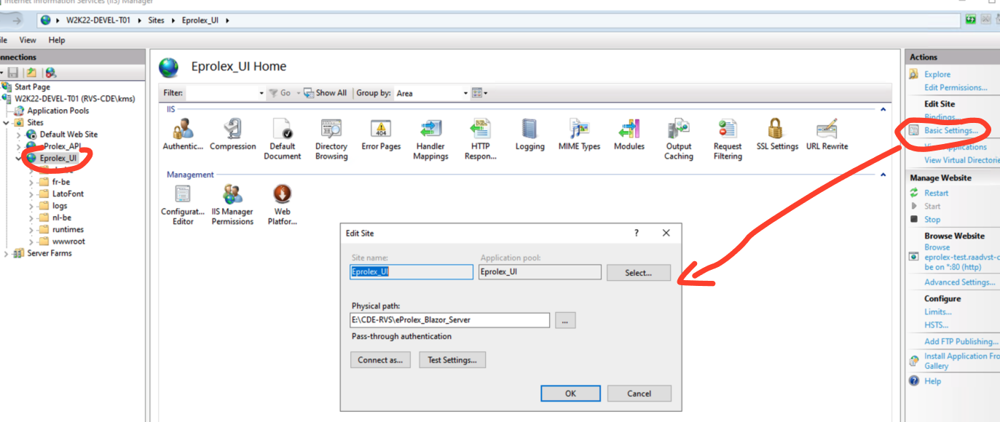
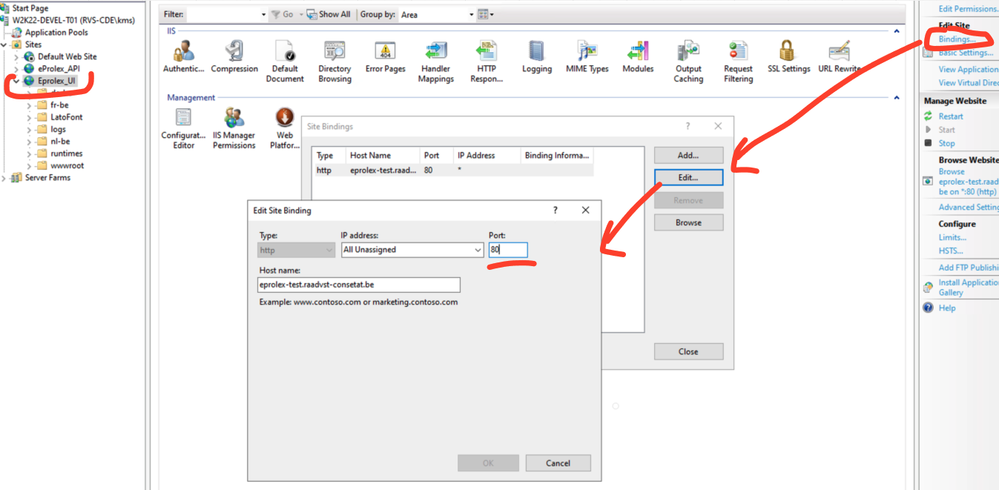

# 17.2 Déploiement d'une application Blazor Server

## Mémoire nécessaire pour `SignalR`

Chiffre pour `.net core 3` :

1 CPU 3.5 GB RAM => 5000 concurrent users

4 CPU 14GB RAM => 20 000 concurrent users


## Installer le bon `Runtime`

Il faut le `Windows Hosting Bundle Installer`.



Ce package installe le `runtime` pour `IIS`.

> On peut vérifier l'installation dans `IIS` en cliquant sur la section `Modules`
>
> 


## Publier l'application

```bash
dotnet publish -c Release
```

On trouve le contenu de l'application dans le dossier `/bin/Release/{TARGET FRAMEWORK}/publish`.

On peut choisir le dossier avec `--output -o` :

```bash
dotnet publish -c Release -o MyPublishFolder
```


### Ajouter un environnement

```bash
dotnet publish -c Release -o C:\Users\kms\Desktop\EprolexUIPublish /p:EnvironmentName=Acc
```

Cela va créer un fichier `web.config` qui contiendra la valeur de `ASPNETCORE_ENVIRONMENT` :

```xml
<?xml version="1.0" encoding="utf-8"?>
<configuration>
  	<!-- ... -->
        <environmentVariables>
          <environmentVariable name="ASPNETCORE_ENVIRONMENT" value="Acc" />
        </environmentVariables>
	<!-- ... -->
</configuration>
<!--ProjectGuid: ECD4D87D-8D6D-4E23-9302-47211B7E0115-->
```


## Pointer sur un dossier



On copie le contenu de `MyPublishFolder` dans le dossier défini dans `Edit Site` (`Basic Settings...`).


## Modifier le port sur `IIS`



`Edition Site` > `Bindings...`

