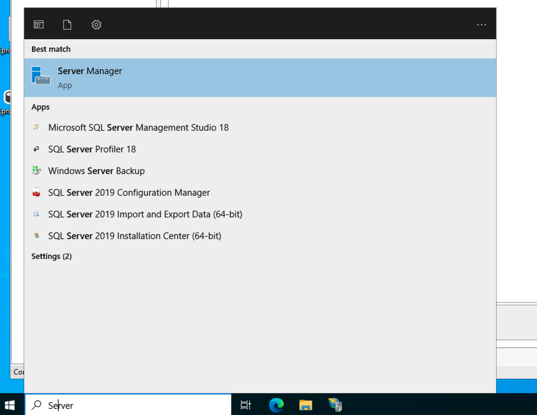
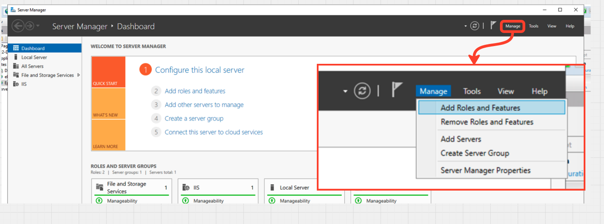
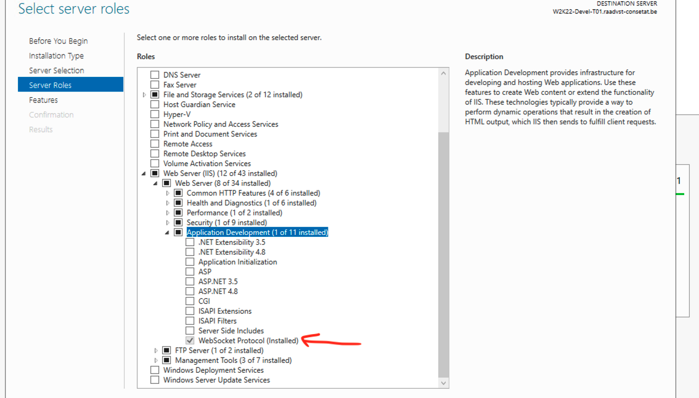
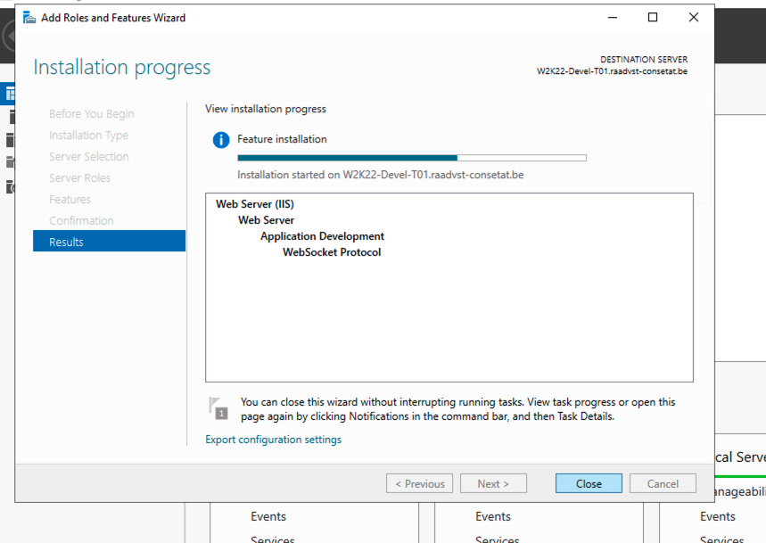
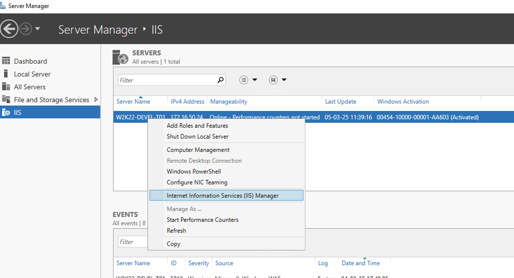
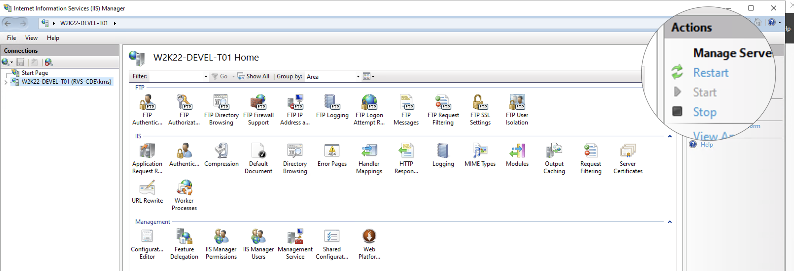

# 17.3 `Websockets` et `IIS`

##  Vérifier que le rôle `WebSocket` est activé dans `IIS`

Sur le serveur Windows où IIS est installé :

1. Ouvre **Server Manager**.

   

2. Va dans **Manage > Add Roles and Features**.
   

3. Dans l’assistant, clique sur **Next** jusqu’à arriver à **Server Roles**.

4. Déroule **Web Server (IIS) > Web Server > Application Development**.

5. Assure-toi que **WebSocket Protocol** est coché.
   

6. Clique sur **Next** puis **Install** si ce n’est pas déjà activé.
   

7. Une fois l’installation terminée, redémarre `IIS` avec la commande suivante :

   ```powershell
   powershell
   
   iisreset
   ```

   ou directement sur l'interface de `IIS`
   

   ---

   

