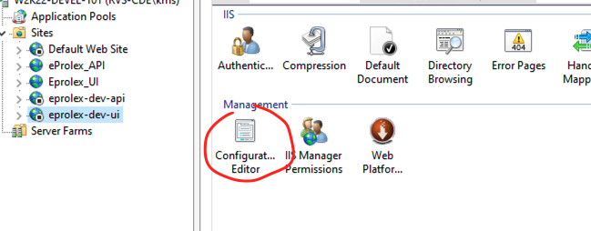
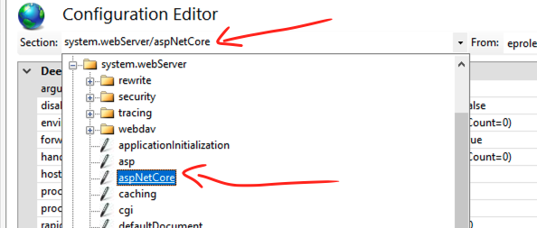
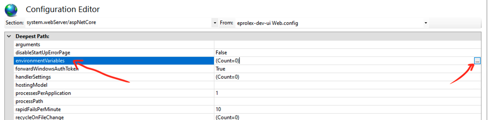
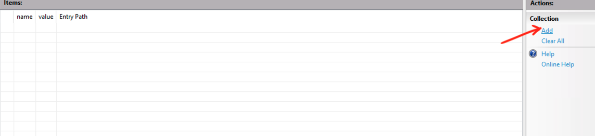
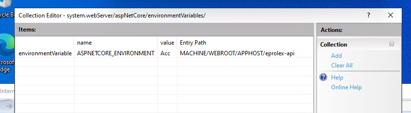

# 17.4 Définir l'environnement dans `IIS`












## Prévalence pour définir l'environnement

1. **Code** (`EnvironmentName` / `UseEnvironment`)

   ```cs
   Host.CreateDefaultBuilder(args)
       .UseEnvironment("Staging");
   ```

2. **Variables d’environnement de l’hôte**

- sous `WebApplication` : `DOTNET_ENVIRONMENT` > `ASPNETCORE_ENVIRONMENT`
- sous `WebHost` : `ASPNETCORE_ENVIRONMENT` > `DOTNET_ENVIRONMENT`

3. **Origine de la variable**

- en local : `launchSettings.json` > variables système
- sous IIS : variable app/App Pool ou `web.config` > variable système

4. **Sinon** : `Production` 


