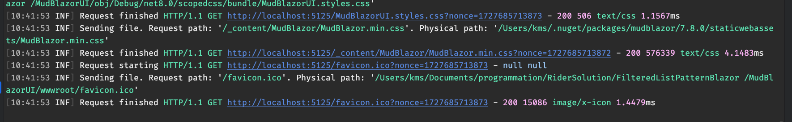

# 18. Ajouter `Serilog`

Pour `Blazor Server`.



Ajouter `serilog` permet d'avoir plus d'informations sur les requêtes dans la `console`.


## Installer

```bash
dotnet add package Serilog.AspNetCore
```


## Activer dans `Program.cs`

```cs
var builder = WebApplication.CreateBuilder(args);

Log.Logger = new LoggerConfiguration()
    .WriteTo.Console()
    .CreateLogger();

// ...

builder.Services.AddSerilog();

var app = builder.Build();
// ...
```

