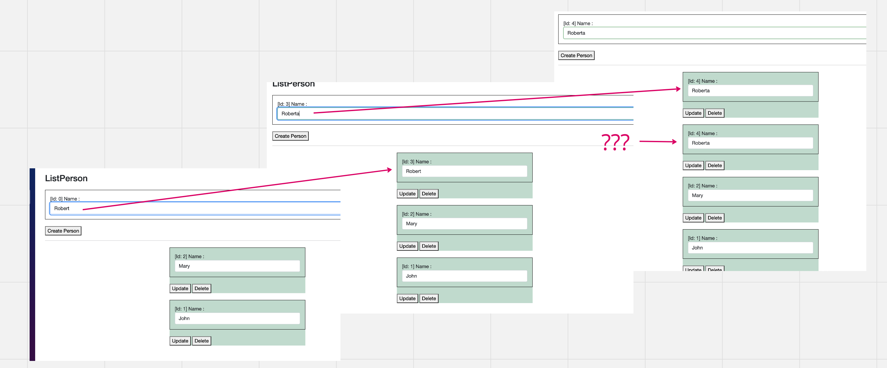

# FF Problème de rendu d'une `list`

## Problème

Parfois (???) on peut avoir un problème au rendu d'une liste.

Les éléments (`composant`) d'une liste peuvent avoir des données incohérente :

On voit que malgré la mise à jour de liste, l'affichage des données n'est pas juste.

## `@key` la solution

Pour un problème de mise à jour d'une liste (dans Eprolex), l'utilisation de `@key` résout le problème.