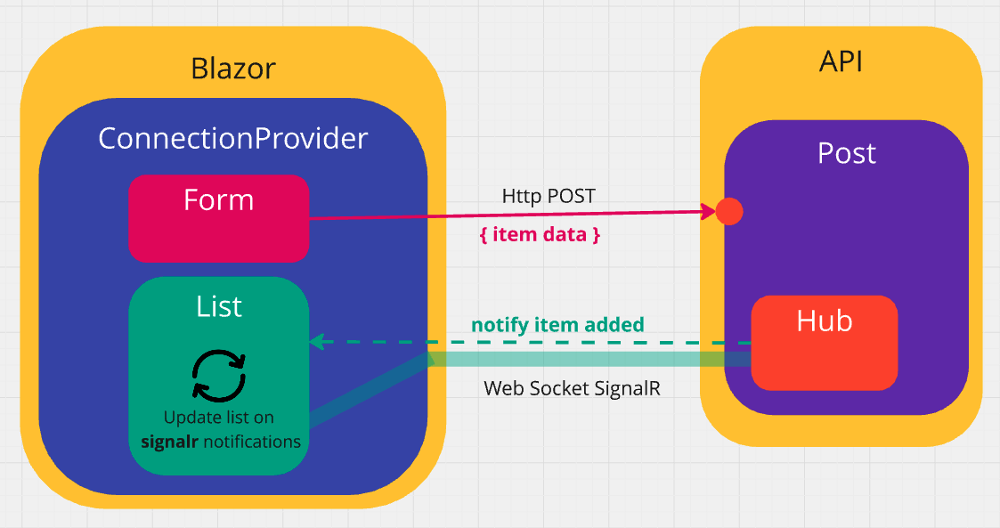
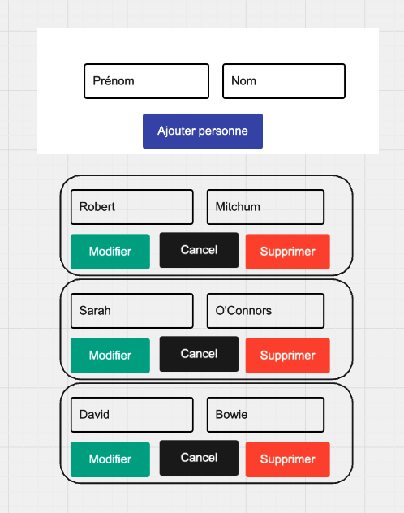
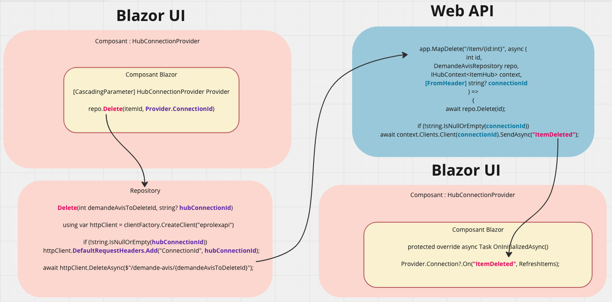

# GG `Pattern` de liste utilisant `SignalR`



## Scénario

Souvent dans `Blazor` on a un `formulaire` d'ajout ou de modification d'item représentés dans une `liste`. Ces items peuvent aussi être supprimés.



L'idée est de mettre à jour la liste uniquement si l'action (`ajouter`, `modifier`, `supprimer`) a bien réussi en `DB`.

Pour ce faire la communication au serveur est une `requête REST HTTP` reçu et prise en charge par un `endpoint`.

Comme un canal `SignalR` est ouvert entre chaque `Client Blazor` et l'`API`, celle-ci peut notifier le client (particulièrement le composant `liste`) que l'opération c'est bien déroulée (ou pas).

La liste se met alors à jour avec les données reçu de l'`API` via `SignalR`.


## Résumé de l'implémentation




## Implémentation simple : Côté `API`

On doit avoir un `Hub` même si celui-ci est vide :

`DocumentHub.cs`

```cs
public class DocumentHub : Hub { }
```

`Program.cs`

```cs
builder.Services.AddSignalR();

// ...

app.MapHub<DocumentHub>("document-hub");
```

`document-hub` étant l'adresse à laquelle le `Hub` est joignable.

Ensuite tout se passe dans le `endpoint` en injectant le `Hub` dans `Request Delegate` :

`DocumentEndpoints.cs`

```cs
group.MapPost("/add/{connectionId}", 
    async (
        DocumentRepository repo,
        Document documentToAdd, 
        IHubContext<DocumentHub> context,
        [FromHeader(Name = "Connection-Id")] string connectionId
    ) =>
{
    var document = await repo.AddAsync(documentToAdd);

    await context.Clients
        .Client(connectionId)
        .SendAsync(DocumentEvent.Added, document);
    
    await context.Clients
        .AllExcept(connectionId)
        .SendAsync(DocumentEvent.ChangeNotifyed);
});
```

Grâce à `SignalR`, le `endpoint` notifie à l'expéditeur (`connectionID` unique attribué à un canal `SignalR`) que le le document a bien été ajouté et renvoie le `document` avec maintenant un `Id` donné par la `DB`.

> Le `endpoint` pourrait traditionnellement renvoyer un `Results.Created`.

> On pourrait aussi passer le `connectionId` par les `headers` de la requête :
>
> ```cs
> group.MapPost("/add", 
>     async (
>         DocumentRepository repo,
>         Document documentToAdd, 
>         IHubContext<DocumentHub> context,
>         [FromHeader(Name = "Connection-Id")] string connectionId
>     ) =>
> ```
>
> Et dans le `client` :
>
> ```cs
>  client = Factory.CreateClient("APIClient");
> 
> client
>     .DefaultRequestHeaders
>     .Add("Connection-Id", Provider?.ConnectionId ?? "0");
> 
> await client.PostAsJsonAsync("/add-item", Item);
> ```
>
> 

## Côté `Client` 

### Mise en place de la librairie `SignalR.Client`

On doit ajouter le package :

```bash
dotnet add package Microsoft.AspNetCore.SignalR.Client
```


### Dans le composant `Document.page.razor`

```ruby
@page "/Document/{demandeId:int}"


<ConnectionProvider DemandeId="DemandeId">

    <ChangeNotification/>

    <DocumentForm FormMode="FormMode.Create"/>

    <DocumentList/>

</ConnectionProvider>


@code {
    [Parameter] public int DemandeId { get; set; }
}
```

### `ConnectionProvider` 

ce composant va partager avec les autres composants de la page la connexion `SignalR` ainsi que le `DemandeId`. Ainsi tous les composants de cette page partageront la même connexion.

```cs
@implements IAsyncDisposable

<CascadingValue Value="this">
    @ChildContent
</CascadingValue>

@code {
    [Parameter] public RenderFragment? ChildContent { get; set; }
    [Parameter] public int DemandeId { get; set; }

    public HubConnection Connection { get; } = new HubConnectionBuilder()
        .WithUrl("http://localhost:5150/document-hub")
        .Build();

    protected override async Task OnInitializedAsync()
    {
        if (Connection.State == HubConnectionState.Disconnected)
        {
            Connection.StartAsync().Wait();
        }

        await Connection.SendAsync("AddToGroup", Convert.ToString(DemandeId));
    }

    public async ValueTask DisposeAsync() => await Connection.DisposeAsync();

}
```

`Connection.StartAsync().Wait()` plutôt que `await Connection.StartAsync()` car dans le deuxième cas les composants enfants sont initialisés avec une `Connection.State` à `Connecting` et non `Connected`.

> ## Différence entre `SendAsync` et `InvokeAsync`
>
> `InvokeAsync` permet de récupérer une réponse du serveur, alors que `SendAsync` ne fait que notifier (`fire and forget`) :
>
> dans un `Hub`
>
> ```cs
> public class DocumentHub : Hub
> {
>     public async Task<string> GetRandomMessage()
>     {
>         string[] messages = ["ouf", "Pschitt", "Bing bang !", "Ola!", "Badaboum"];
> 
>         var random = new Random();
> 
>         await Task.Delay(TimeSpan.FromSeconds(1));
> 
>         return messages[random.Next(0, messages.Length)];
>     }
> }
> ```
>
> Dans un `composant Blazor` :
>
> ```cs
> @code {
>     protected override async Task OnInitializedAsync()
>     {
>         var strRandom = await Connection.InvokeAsync<string>("GetRandomMessage");
>         Console.WriteLine("random string: " + strRandom);
>     }
> }
> ```
>
> Ici on ne peut pas utiliser `SendAsync`.
>
> S'il n'y a pas de réponse à récupérer, `SendAsync` et `InvokeAsync` font la même chose.


### le `formulaire` d'ajout

```cs
// Code du formulaire

@code {
    [CascadingParameter] public ConnectionProvider State { get; set; } = default!;

    [Parameter] public Document DocumentModel { get; set; } = new();

    private HttpClient client = default!;

    protected override void OnInitialized()
    {
        client = Factory.CreateClient("document-api");
    }

    private async Task AddDocument()
    {
        DocumentModel.DemandeId = State.DemandeId;

        await client.PostAsJsonAsync(
            $"/documents/add/{State.Connection.ConnectionId}", 
            DocumentModel
        );
    }
}
```

Dans le `formulaire` on se contente de communiquer avec le serveur via son `API` et `HttpClient`.


### Dans le composant `liste`

```cs
// affichage de la liste

@code {
    [CascadingParameter] 
    public ConnectionProvider Provider { get; set; } = default!;
    
    private List<Document> documents = [];
    private HttpClient? client;

    protected override async Task OnInitializedAsync()
    {
        client = Factory.CreateClient("document-api");

        documents = await client
            .GetFromJsonAsync<List<Document>>($"/documents/{State.DemandeId}") 
            ?? [];

        var connection = Provider.Connection;

        connection.On<Document>(DocumentEvent.Added, async (document) =>
        {
            documents.Add(document);
            await InvokeAsync(StateHasChanged);
        });
    }
}
```

> `InvokeAsync(StateHasChanged)` car l'appelle vient d'un `callback` sur une autre thread que le composant `liste` et `StateHasChanged()` tout court ne fonctionnera pas.
>
> Si je teste la `thread` j'obtiens :
>
> ```cs
> protected override async Task OnInitializedAsync()
> {
>     Console.WriteLine($"Liste Thread : {Thread.CurrentThread.ManagedThreadId}");
>    // ...
> 
>     connection.On<Document>(DocumentEvent.Added, async (document) =>
>     {
>         Console.WriteLine($"Callback Thread : {Thread.CurrentThread.ManagedThreadId}");
>         // ...
>     });
> ```
>
> ```
> Liste Thread : 16
> 
> Callback Thread : 18
> ```
>
> 
