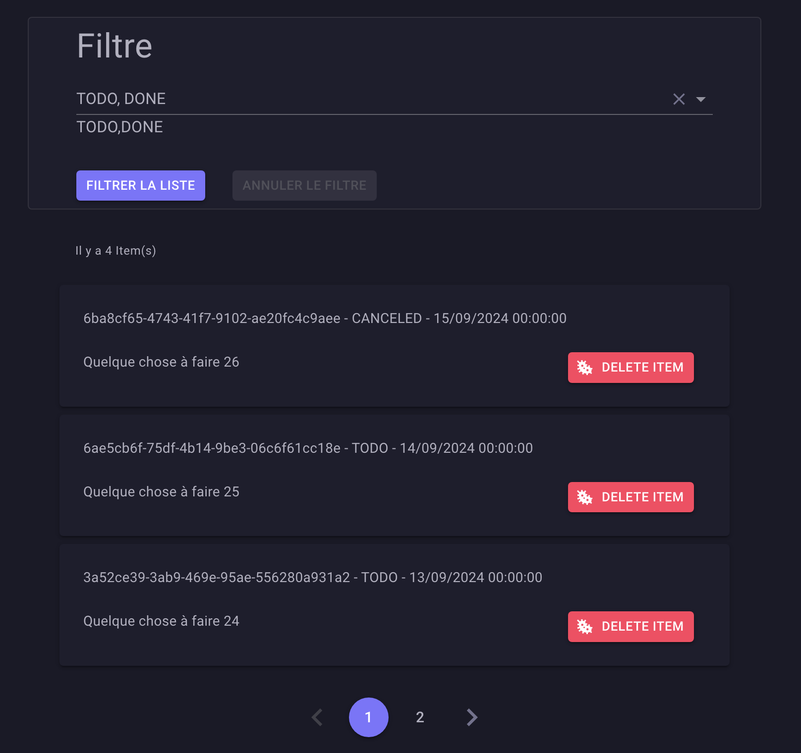
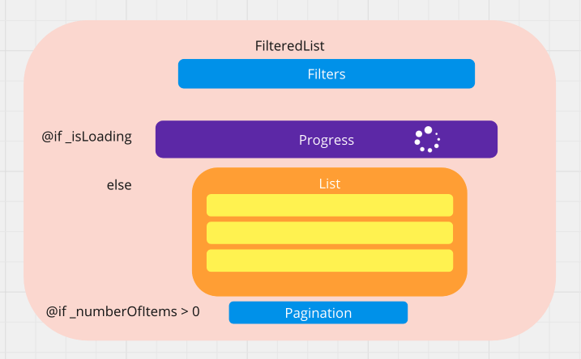
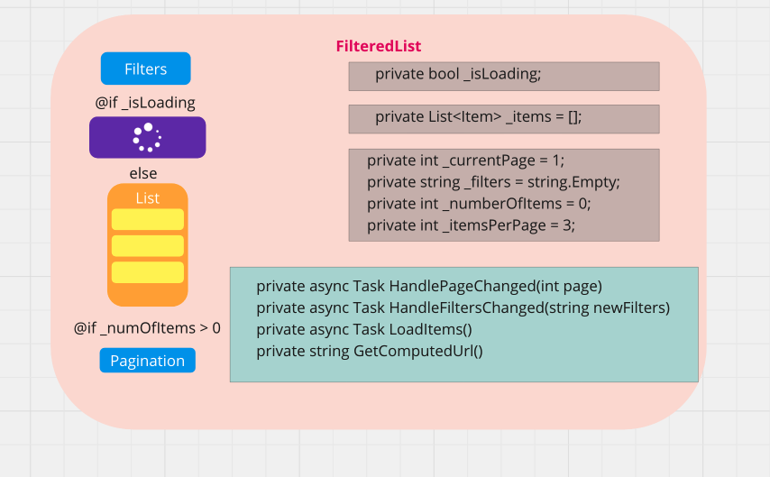

# HH `liste` filtrée

L'utilisation d'un `formulaire de filtre` ainsi que d'une `pagination` est un pattern courant pour une `liste`.



## Architecture

L'idée est de créer un composant *"chef d'orchestre"* contenant à la fois la `liste` le `filtre` et la `pagination` :



L'idée est de n'utilisé aucun système d'événement mais à la place gérer le rendu de la liste grâce au composant conteneur : `FilteredList`


## `FilteredList`



`_items` et `_numberOfItems` sont renvoyés par l'`API` à chaque `call`.

Le composant `FilteredList` récupère `_filters` et `_currentPage` en passant à `Filters` et `Pagination` un `Callback`.

### Le template

```react
<AppFilter OnFiltersChanged="HandleFiltersChanged"/>

@if (_isLoading)
{
    <AppLoader/>
}
else
{
    <MudText Class="d-block mb-6 mx-20" Typo="Typo.caption">
        Il y a @_numberOfItems Item(s)
    </MudText>
    
    <AppList Items="_items"/>
}

@if (_numberOfItems > 0)
{
    <AppPagination
        NumberOfItems="_numberOfItems"
        ItemsPerPage="_itemsPerPage"
        OnPageChanged="HandlePageChanged"/>
}
```

`OnFiltersChanged` et `OnPageChanged` sont des `Callback` passsées aux composant enfants.

### Les champs

```cs
private bool _isLoading;

private List<Item> _items = [];

private int _currentPage = 1;
private string _filters = string.Empty;
private int _numberOfItems = 0;
private int _itemsPerPage = 3;
```


### À l'initialisation

```cs
protected override async Task OnInitializedAsync()
{
    await LoadItems(GetComputedUrl());
    await base.OnInitializedAsync();
}
```

On charge la liste avec `LoadItems`.


### À l'appelle des `Callback`

```cs
private async Task HandlePageChanged(int page)
{
    _currentPage = page;

    await LoadItems(GetComputedUrl());
}

private async Task HandleFiltersChanged(string newFilters)
{
    _filters = newFilters;

    await LoadItems(GetComputedUrl());
}
```

Les `champs` interne `_currentPage` et `_filters` servant à construire `l'url` sont enregistrées. Puis on recharge la liste avec `LoadItems` en lui passant la nouvelle `url` calculée.


### Le chargement de la `liste` : `LoadItems`

```cs
private async Task LoadItems(string url)
{
    _isLoading = true;

    var client = Factory.CreateClient("APIClient");
    var response = await client.GetFromJsonAsync<GetItemsResponse>(url);

    _items = response?.Items ?? [];
    _numberOfItems = response?.NumberOfItems ?? 0;

    _isLoading = false;
}
```

La réponse est formatée avec le `record` `GetItemResponse` :

```cs
public record GetItemsResponse(int NumberOfItems, List<Item> Items);
```

Les `champs` interne `_items` et `_numberOfItems` sont ainsi renseignés.


### Le calcul de l'`url` : `GetComputedUrl`

```cs
private string GetComputedUrl()
{
    var url = "/list-item?";

    if (!string.IsNullOrEmpty(_filters))
    {
        url += $"statuts={_filters}&";
    }

    url += $"page={_currentPage}&pageSize={_itemsPerPage}";

    return url;
}
```

Si on a pas de filtre on obtient quand même une `url` de type :

```ruby
/list-item?page=1&pageSize=3
```


## `Filters`

```react
<MudSelect
    T="string"
    Clearable="true"
    SelectAll="true"
    SelectAllText="Choisir un ou plusieurs statut(s)"
    MultiSelection="true"
    @bind-SelectedValues="_statuts">
    @foreach (var statut in ItemStatut.GetStatuts())
    {
        <MudSelectItem
            T="string"
            Value="statut">
            @statut
        </MudSelectItem>
    }
</MudSelect>

<MudButton OnClick="OnFiltering">
    Filtrer la liste
</MudButton>

<MudButton
    OnClick="CancelFilteringList"
    Disabled="_isNotFiltered">
    Annuler le filtre
</MudButton>
```


### Propriétés et champs

```cs
[Parameter] public EventCallback<string> OnFiltersChanged { get; set; }

private IEnumerable<string> _statuts = new HashSet<string>();
private bool _isNotFiltered = true ;
```

C'est ici qu'on reçoit le `Callback`, on renvoie un `string` d'où le `<string>`.

`@bind-SelectedValues` doit être associé avec un `HashSet<T>`.


## Deux Méthodes associées aux boutons

```cs
public void OnFiltering()
{
    if (!_statuts.Any()) return;

    _isNotFiltered = false;
    OnFiltersChanged.InvokeAsync(ConcatFilters());
}
```

Si un ou plusieurs `statuts` sont sélectionnes on avertit le composant parent  `FilteredLIst` en lui envoyant les `filters`.

```cs
private void CancelFilteringList()
{
    _statuts = new HashSet<string>();
    // remettre à zéro tous les filtres
    
    _isNotFiltered = true;
    OnFiltersChanged.InvokeAsync("");
}
```

On prévient `FilteredList` qu'il n'y a plus de `filters`. Cela affiche la liste non filtrée.


### Récupérer la liste des `filters` : `ConcatFilters`

```cs
private string ConcatFilters() => _statuts.Any() 
        ? string.Join(",", _statuts)
        : "";
```


## `List`

```react
@foreach (var item in Items)
{
   <ListItem Item="item" />
}
```

Je ne détaille pas `ListItem` pour simplifier le `template`.

Ce composant est au final très simple, il possède juste un `[Parameter]` pour écupére la `liste`.

```cs
[Parameter] public List<Item> Items { get; set; } = [];
```


## `Pagination`

```react
<MudPagination
    SelectedChanged="ChangePage"
    Size="Size.Large"
    Color="Color.Primary"
    Count="_numberOfPages"/>
```

Utilisation du gestionnaire d'événement `SelectedChanged`.


### Propriétés et champs

```cs
[Parameter] public int NumberOfItems { get; set; }
[Parameter] public int ItemsPerPage { get; set; }
[Parameter] public int CurrentPage { get; set; }

[Parameter] public EventCallback<int> OnPageChanged { get; set; }

private int _numberOfPages = 1;
```

`NumberOfItems` et `ItemsPerPage` vont servir à calculer dynamiquement `_numberOfPages`.

On reçoit aussi ici un `Eventcallback<int>` pour retourner la nouvelle `current page`.


### À l'initialisation et à la modification des paramètre

Pour que le composant `MudPagination` indique la bonne page en cours, il faut aussi utiliser `OnParameterSet`.

```cs
protected override void OnInitialized()
{
    _numberOfPages = GetNumberOfPages();
}
```

```cs
protected override void OnParametersSet()
{
    _numberOfPages = GetNumberOfPages();
}
```


### Au changement de page

On prévient le composant parent `FilteredList` grâce au `Callback` que la `page` a changé.

```cs
private async void ChangePage(int pageSelected)
{
    await OnPageChanged.InvokeAsync(pageSelected);
}
```


### Calcule du nombre de `Pages` : `GetNumberOfPages`

```cs
private int GetNumberOfPages() => (int)Math.Ceiling((double)NumberOfItems / ItemsPerPage);
```

