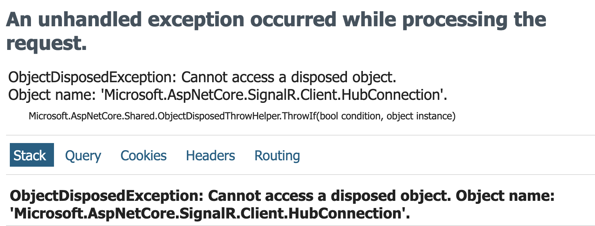

# II Créer un composant `SignalRProvider`

On peut vouloir fournir à une page une `connection` à un `hub SignlaR`.

Je propose un `pattern` utilisant un composant `Provider` un peu construit sur le pattern du composant `State`.

`MySignalRProvider`

```ruby
@implements IAsyncDisposable

<CascadingValue Value="this">
    @ChildContent
</CascadingValue>
```

```cs

[Parameter] public RenderFragment? ChildContent { get; set; }

[Parameter] public int DemandeAvisId { get; set; } = -1;

public HubConnection? Connection { get; private set; }

public string ConnectionId => Connection?.ConnectionId ?? string.Empty;

protected override async Task OnInitializedAsync()
{

    Connection ??= new HubConnectionBuilder()
        .WithUrl("http://localhost:8080/demande-hub"
            ,  options =>
            {
                options.Transports = HttpTransportType.WebSockets;
                // pour passer le middleware UtilisateurMiddleware
                options.Headers.Add("Utilisateur-Id", "2");
            }
        )
        .ConfigureLogging(c => c.AddSerilog())
        .Build();

    if (Connection.State == HubConnectionState.Disconnected)
    {
        await Connection.StartAsync();
        Console.WriteLine($"Connection Id in OnInitilizedAsync {Connection.ConnectionId}");
    }

    // if (DemandeAvisId > 0)
    // {
    //     await Connection.SendAsync(DemandeAvisHubAction.AddToGroup, $"{DemandeAvisId}");
    // }
}


public async ValueTask DisposeAsync()
{
    if(Connection is not null) await Connection.DisposeAsync();
    Connection = null;
}
```

> ### ! Important !
>
> Ne pas utiliser l'`options` : `SkipNegociation = true`, car on perd l'accès à `connectionId` qui apparemment est renvoyé lors de cette phase de `négociation`.

Bien mettre `Connection = null` car sinon on ne peut redémarrer la `connection` sans obtenir cette erreur :



Pour simuler on peut utiliser ce code :

```cs
await Connection.StartAsync();

await Connection.DisposeAsync();

await Connection.StartAsync();
```

