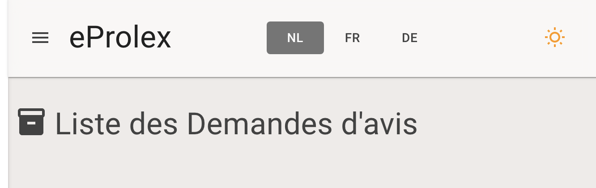
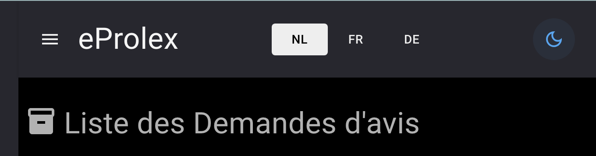

# 01 Thème

## Gérer le thème

```react
<MudThemeProvider IsDarkMode="_isDarkMode"  Theme="_theme"/>
```

```cs
private MudTheme _theme = new()
    {
        PaletteLight = new PaletteLight()
        {
            AppbarText = Colors.Gray.Darken4,
            AppbarBackground = "rgba(255,255,255, 0.6)",
            ActionDisabled = Colors.Shades.White,
            ActionDisabledBackground = Colors.Gray.Darken1,
            Background = Colors.Brown.Lighten5,
            
        },
        PaletteDark = new PaletteDark()
        {
            Dark = Colors.Gray.Lighten3,
            ActionDisabled = Colors.Shades.Black,
            ActionDisabledBackground = Colors.Gray.Lighten3,
            AppbarText = Colors.Gray.Lighten4,
            Primary = Colors.Blue.Lighten1,
            Background = Colors.Shades.Black,
        },
    };
    private bool _isDarkMode;
```


## Couleur du texte et du `background` d'un bouton `disabled`

```cs
PaletteLight = new PaletteLight()
{
    // ...
    ActionDisabled = Colors.Shades.White,
    ActionDisabledBackground = Colors.Gray.Darken1,
```



```cs
PaletteDark = new PaletteDark()
{
    // ...
    ActionDisabled = Colors.Shades.Black,
    ActionDisabledBackground = Colors.Gray.Lighten3,
```




## Enregistrer le mode du thème avec `Local Storage` et un bouton `Toggle`

`.csproj`

```xml
<PackageReference Include="blazored.localstorage" Version="4.5.0" />
```

```react
@inject ILocalStorageService LocalStorage

<MudToggleIconButton
        Toggled="_isDarkMode"
        ToggledChanged="SetDarkModeLocalStorage"
        Icon="@Icons.Material.Outlined.WbSunny"
        ToggledIcon="@Icons.Material.Outlined.DarkMode"
        Color="@Color.Warning"
        ToggledColor="@Color.Primary"
        aria-label="gestion mode sombre et mode clair"/>
```

```cs
private bool _isDarkMode = true;

private async Task SetDarkModeLocalStorage(bool toggled)
{
    _isDarkMode = toggled;

    await LocalStorage.SetItemAsync("isDarkMode", _isDarkMode);
}

protected override async Task OnAfterRenderAsync(bool firstRender)
{
    if (await LocalStorage.ContainKeyAsync("isDarkMode"))
    {
        _isDarkMode = await LocalStorage.GetItemAsync<bool>("isDarkMode");
        StateHasChanged();
    }
    else
    {
        _isDarkMode = true;
        StateHasChanged();
    }
}
```

> Le `Local Storage` n'étant accessible qu'après le rendu, cela provoque un petit bug d'affichage en mode `light` car d'abord `_isDarkMode` prend la valeur `true`, la page est rendu et on récupère la valeur mémorisée dans `local storage`, en mode `light` c'est `false`. On a donc un affichage rapide en `dark` avant de passer en `light`.
>
> Si on initialise `_isDarkMode` à `false`, le bug est juste inversé.
