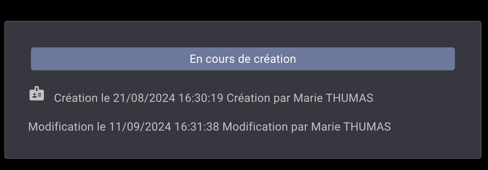
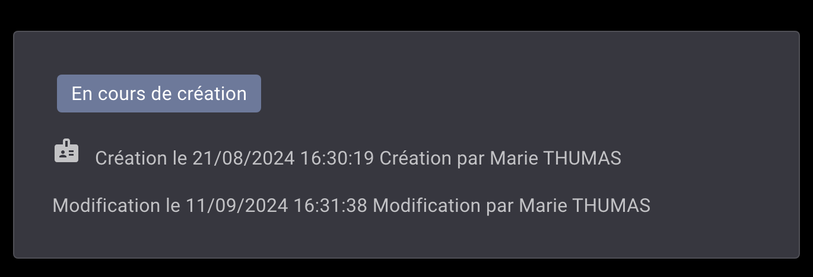
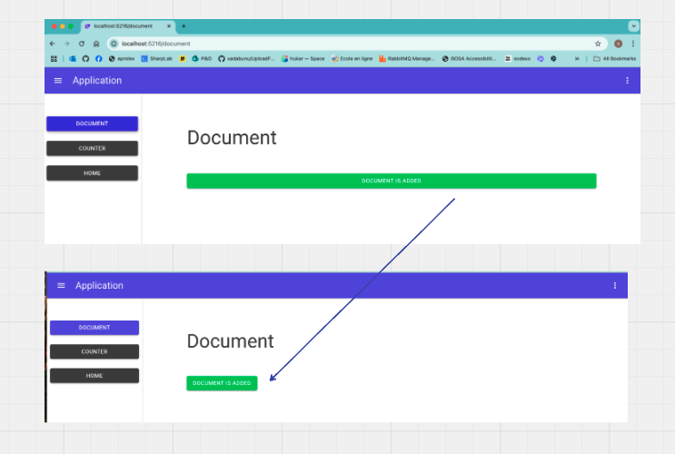

# 02 `MudStack` et `Flexbox`

## `MudChip` et `MudStack`

Si je mets un `MudChip` dans une `MudStack`, celui-ci prend toute la largeur :

```react
<MudStack Spacing="4">     
    <MudChip>
        <MudText Typo="Typo.body1">En cours de création</MudText>
    </MudChip>
            
```



### `align-self-start`

Pour que le `MudChip` ne prennent que la largeur nécessaire, on doit mettre la propriété `CSS` `align-self` à `flex-start`. On peut utiliser la classe `align-self-start` des `CSS utilities` :

```react
<MudStack Spacing="4">     
    <MudChip Class="align-self-start">
        <MudText Typo="Typo.body1">En cours de création</MudText>
    </MudChip>
```



## De même avec un `MudButton` 

###  `align-self-start`

```react
<MudStack>
    
    <MudButton
        Class="align-self-start"
        Variant="Variant.Filled"
        Color="Color.Success"
        OnClick="OnDocumentAdded">
        Document is added
    </MudButton>
```




