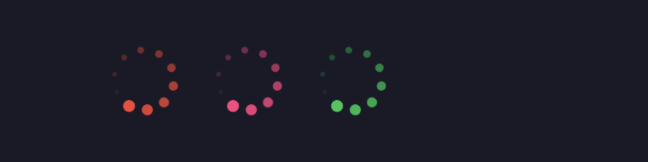

# 03 Créer un `Spinner` personnalisé


## Code du `spinner` personnalisé

Trouvé sur `codepen` : https://codepen.io/sdelaney/pen/wWdxPe et modifié pour être compatible avec `MudBlazor`.

```react
<svg id="svg-spinner" xmlns="http://www.w3.org/2000/svg" width="@_size" height="@_size" viewBox="0 0 48 48">
    <circle cx="24" cy="4" r="4" fill="@_bgColor" opacity="1" />
    <circle cx="12.19" cy="7.86" r="3.7" fill="@_bgColor" opacity="0.9"/>
    <circle cx="5.02" cy="17.68" r="3.4" fill="@_bgColor" opacity="0.8"/>
    <circle cx="5.02" cy="30.32" r="3.1" fill="@_bgColor" opacity="0.7"/>
    <circle cx="12.19" cy="40.14" r="2.8" fill="@_bgColor" opacity="0.6"/>
    <circle cx="24" cy="44" r="2.5" fill="@_bgColor" opacity="0.5"/>
    <circle cx="35.81" cy="40.14" r="2.2" fill="@_bgColor" opacity="0.4"/>
    <circle cx="42.98" cy="30.32" r="1.9" fill="@_bgColor" opacity="0.3"/>
    <circle cx="42.98" cy="17.68" r="1.6" fill="@_bgColor" opacity="0.2"/>
    <circle cx="35.81" cy="7.86" r="1.3" fill="@_bgColor" opacity="0.1"/>
</svg>
```

```cs
@code
{
    [Parameter] public Color Color { get; set; } = Color.Primary;
    [Parameter] public Size Size { get; set; }

    private static MudTheme _theme = new();

    private int _size = 48;
    private string _bgColor = _theme.PaletteLight.Primary.ToString();

    protected override void OnInitialized()
    {
        Console.WriteLine(Color);

        _bgColor = Color switch
        {
            Color.Primary => _theme.PaletteLight.Primary.ToString(),
            Color.Secondary => _theme.PaletteLight.Secondary.ToString(),
            Color.Success => _theme.PaletteLight.Success.ToString(),
            Color.Info => _theme.PaletteLight.Info.ToString(),
            Color.Warning => _theme.PaletteLight.Warning.ToString(),
            Color.Error => _theme.PaletteLight.Error.ToString(),
            _ => _theme.PaletteLight.Primary.ToString()
        };

        _size = Size switch
        {
            Size.Small => 36,
            Size.Medium => 48,
            Size.Large => 66,
            _ => 48
        };
    }
}
```

J'utilise les `enum` de `MudBlazor` pour `Color` et pour `Size`.

J'utilise `MudTheme` pour accéder aux valeurs `CSS` du `thème` de `MudBlazor`.

### `CSS` pour l'animation

```css
#svg-spinner{
    transition-property: transform;
    animation-name: rotate;
    animation-duration: 1.2s;
    animation-delay: 0s;
    animation-iteration-count: infinite;
    animation-timing-function: linear;
}

@keyframes rotate {
    from {transform: rotate(0deg);}
    to {transform: rotate(360deg);}
}
```


## De base


```react
<AppSpinner/>
```


## Changer la couleur : `Color`



```react
<AppSpinner Color="Color.Error"/>
<AppSpinner Color="Color.Secondary"/>
<AppSpinner Color="Color.Success"/>
```


## Modifier la taille : `Size`


```react
<AppSpinner Size="Size.Small" Color="Color.Info"/>
<AppSpinner Size="Size.Medium" Color="Color.Warning"/>
<AppSpinner Size="Size.Large" Color="Color.Error"/>
```

