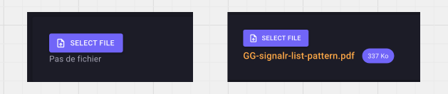

# 04 `MudFileUpload`

```react
<MudFileUpload T="IBrowserFile" FilesChanged="HandleUploadFile">
    
    <ActivatorContent>
        <MudButton Variant="Variant.Filled"
                   Color="Color.Primary"
                   StartIcon="@Icons.Material.Filled.UploadFile">
            Select File
        </MudButton>
    </ActivatorContent>

</MudFileUpload>
```

```cs
public async Task HandleUploadFile(IBrowserFile file)
{
    try
    {
       long maxAllowedSize = 1024 * 1024 * 10; // 10 Mo

        var path = Path.Combine(
            "/Users/kms/Desktop/UploadedFileDesktop",
            $"{Guid.NewGuid()}-{f.Name}"
        );

        await using var fs = new FileStream(path, FileMode.Create);

        await file.OpenReadStream(maxAllowedSize).CopyToAsync(fs);
    }
    catch (Exception e)
    {
        Console.WriteLine("Exception in loading file: " + e);
        throw;
    }
}
```


## `SelectedTemplate`

Permet de styliser les infos du fichier sélectionné grâce à la variable fournie `context` :

```react
<MudFileUpload T="IBrowserFile" FilesChanged="HandleUploadFile">

    <ActivatorContent>
        <MudButton Variant="Variant.Filled"
                   Color="Color.Primary"
                   StartIcon="@Icons.Material.Filled.UploadFile">
            Select File
        </MudButton>
    </ActivatorContent>

    <SelectedTemplate>
        <MudStack Row AlignItems="AlignItems.Center">

            @if (context is not null)
            {
                <MudText Typo="Typo.h6" Color="Color.Warning">
                    @context.Name
                </MudText>

                <MudChip 
                    T="string" 
                    Variant="Variant.Filled" 
                    Color="Color.Primary">
                    @(Math.Floor((decimal)@context.Size / 1024)) Ko
                </MudChip>
            }
            else
            {
                <MudText Typo="Typo.body1">Pas de fichier </MudText>
            }

        </MudStack>
    </SelectedTemplate>

</MudFileUpload>
```




