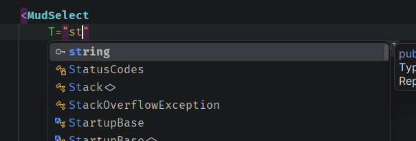

# 05. `ValueChanged`

On peut exécuter une méthode avec la plupart des champs de formulaire.

```react
<MudSelect
    T="string"
    Label="@DemandeAvisFormTranslation.NormeSelectLabel"
    For="() => DemandeAvis.NormeCode"
    Value="DemandeAvis.NormeCode"
    ValueChanged="OnValueChanged">

    @foreach (var norme in normes)
    {
        <MudSelectItem Value="@norme.Code">@norme.Libelle</MudSelectItem>
    }

</MudSelect>

// @code

async Task OnValueChanged(string normeCode)
{
    DemandeAvis.NormeCode = normeCode;
    await OnSave.InvokeAsync();
}
```

`Value` et `ValueChanged` marche en duo.


## On ne peut pas utiliser `@bind-Value` et `ValueChanged` ensemble :

```react
<MudSelect
    T="string"
    Label="@DemandeAvisFormTranslation.NormeSelectLabel"
    For="() => DemandeAvis.NormeCode"
    @bind-Value="DemandeAvis.NormeCode"
    ValueChanged="OnValueChanged">
```

On obtient l'erreur suivante :
```error
  EpNormeField.razor(21, 27): [RZ10010] The component parameter 'ValueChanged' is used two or more times for this component. Parameters must be unique (case-insensitive). The component parameter 'ValueChanged' is generated by the '@bind-Value' directive attribute.
```


## On doit spécifier le type `T="<type>"`

```react
<MudSelect
    Label="@DemandeAvisFormTranslation.NormeSelectLabel"
    For="() => DemandeAvis.NormeCode"
    Value="DemandeAvis.NormeCode"
    ValueChanged="OnValueChanged">
```

On obtient l'erreur suivante :

```
  EpNormeField.razor(20, 27): [CS1503] Argument 2 : conversion impossible de 'groupe de méthodes' en 'Microsoft.AspNetCore.Components.EventCallback'
```

Il faut alors ajouter le type :




## Exemple avec `MudSwitch`

```react
<MudSwitch 
    T="bool" 
    Size="Size.Small" 
    Value="@Demandeur.DeposantEstActif"  
    ValueChanged="OnSwitchEstActif" 
    Color="Color.Primary"/>

// @code
async Task OnSwitchEstActif(bool estActif)
{
    Demandeur.DeposantEstActif = estActif;

    DeposantUpdateDto deposantToUpdate = 
        new() { Id = Demandeur.DeposantId, EstActif = estActif };

    await DeposantRepository.UpadteEstActif(deposantToUpdate);
}
```


