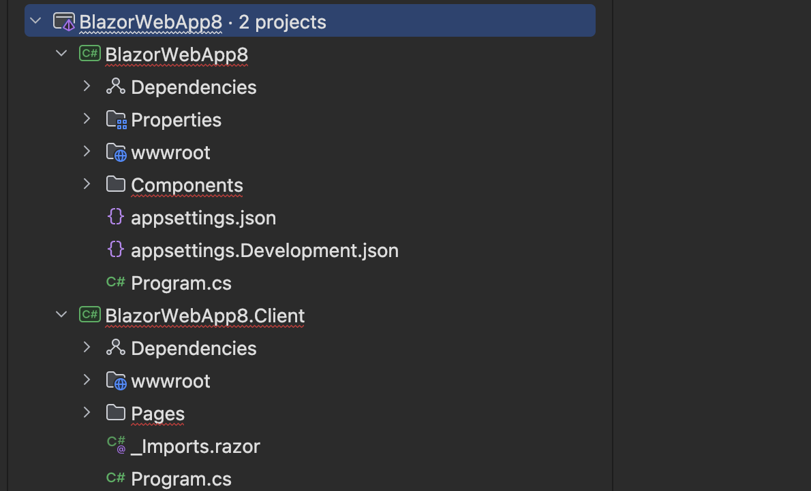

# 01 Créer une application `Blazor Web App`

## Différents modèles

```bash
dotnet new blazor -o BlazorApp
```

Par défaut l'`interactivity` est `server`

On peut préférer `-int WebAssembly` ou rester en `SSR` avec `-int none`.

On peut aussi vouloir le mode hybride `Auto` :

```bash
dotnet new balzor -o BlazorApp -int Auto
```

Par défaut l'`interactivity` est par `page` et par `component`.

Si on veut définir l'`interactivity` pour l'`App` entière on utilise `-ai | --all-interactive` .

Pour avoir un `template` vide `-e`.

```bash
dotnet new blazor -e -o BlazorApp -int server -ai
```


## Le modèle `Auto`

La `solution` se compose de deux projet un `server` et un `webassembly` appelé `Client`.




